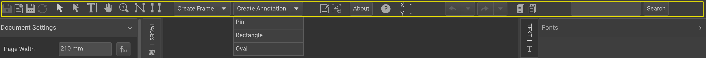
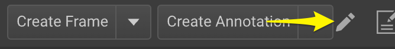
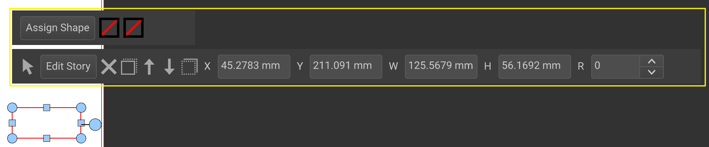

# Editor Workspace Toolbars

Toolbars, vertical elements grouping one or more button groups, are integral to the Workspace. The actions in a toolbar are part of the Workspace settings loaded with a document.

## Organizing Toolbars

A toolbar is visible if at least one set of actions is accessible to the end user. To add actions to a toolbar, click the pencil icon on the far right of the toolbar.

Editing actions within a toolbar can be done by clicking the pencil next to each action. This option is visible when hovering over an action in Administrator mode.

## Inline Toolbars

Inline toolbars, similar to those at the top and bottom of the workspace, display actions directly above the selected frame.

