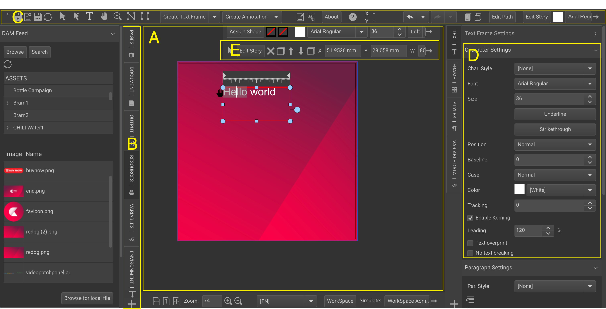

# GraFx Publisher Editor

When you create a new document, or open a document from the backoffice, the GraFx Publisher editor will open.

- **Document Canvas**: The area where the Smart Template lives. (A)
- **Tabs**: The left and right side of the screen has panels (D), grouped in tabs (B).
- **Toolbar**: The top and bottom of the editor holds toolbars (C) with icons for buttons.
- **Panel**: Each tab can have 1 or more panels (D). Panels group functionality around 1 topic.
- **Inline Toolbar**: Similar to the Toolbars (C), an inline toolbar (E) shows functions above the selected frame.

[A](https://chilipublishdocs.atlassian.net/wiki/spaces/CPDOC/pages/1412233/General+concept)