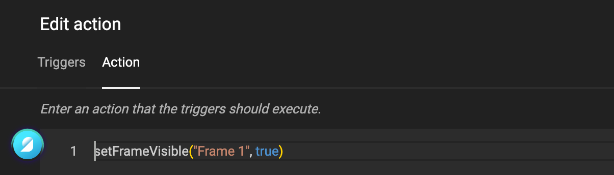

# Actions

## Introduction

"Hi Jane. The customer asked if we can make this price stand out when it's a promotion?"

Jane: "Like this?"

"Yes, perfect! And now let's make this happen automatically for all 76,500 items."

Jane: "I will add a trigger on the 'Promo' variable. If it says 'promo', then I will show a shape behind the price to make it stand out."

## Concept

The concept of an Action in GraFx Studio is simple: What should the GraFx Smart Template do, and when should it do it.

### When: Triggers

"When" is covered by Triggers.

Imagine Triggers as a system that monitors what is happening in the Template. When a predefined change is detected (triggered), an Action will be performed.

### What: Actions

Actions are the scripts that will be executed when this change is detected.

## Triggers

What can be detected?

- Select layout changed
- Frame moved
- Page size changed
- Document loaded
- Variable value changed

If any of the above situations occur, a trigger is called.

It is important to know that a trigger can be called through the manipulation of the template by an end-user. A trigger can also be called if a condition is met through the execution of batch output.

## Actions

The second tab in the Trigger popup screen shows the Action editor.

Enter your JavaScript code that should be executed.

See further [How to create an action](/GraFx-Studio/guides/actions/create/) and [Intro to writing JavaScript](/GraFx-Studio/guides/actions/javascript/)