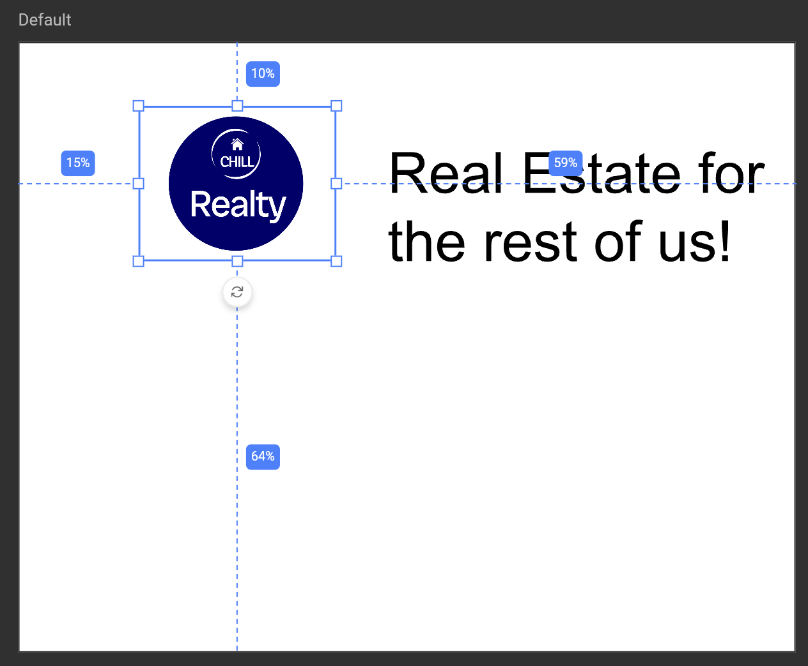
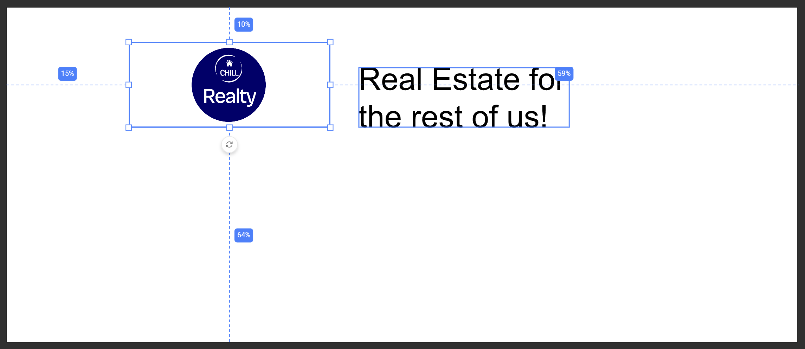
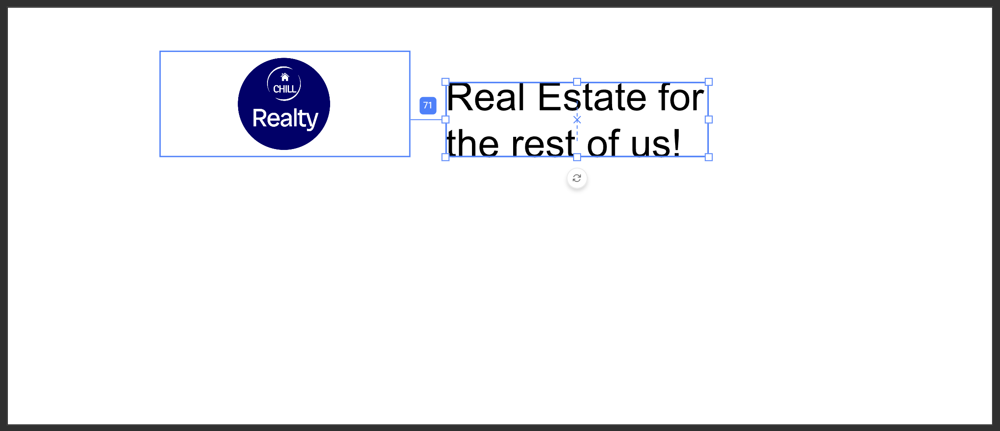
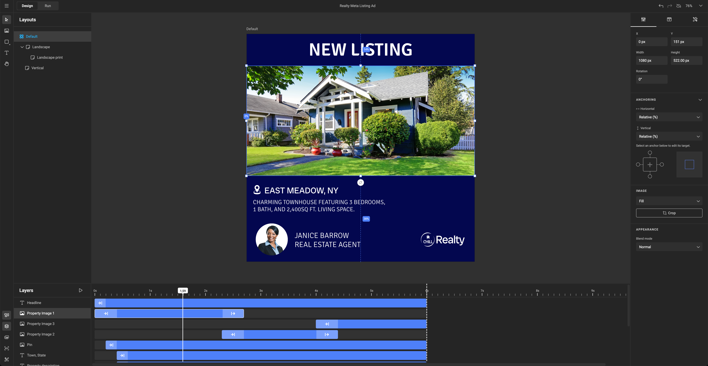
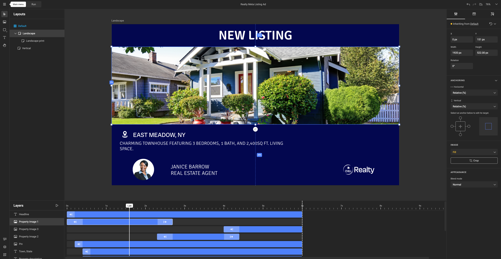
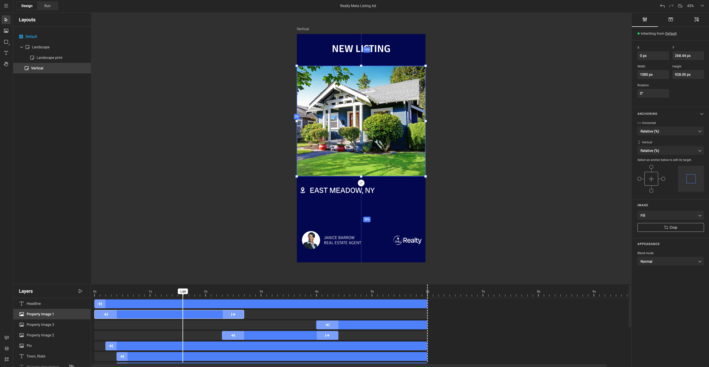
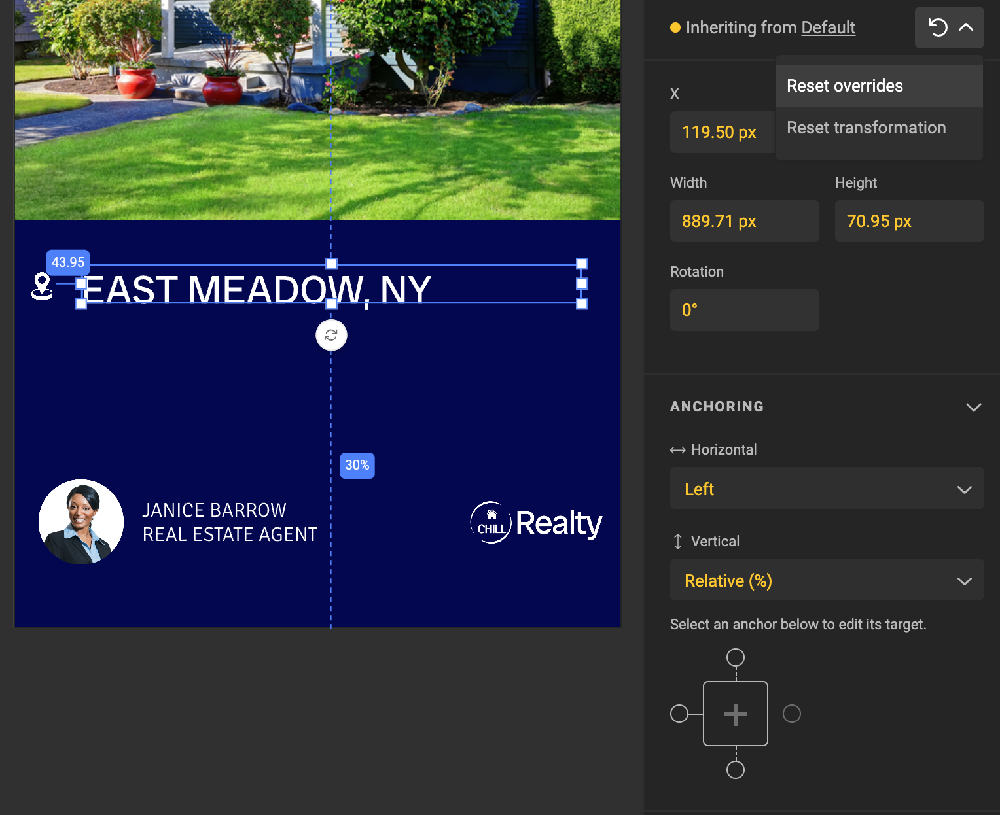

# Anchoring

Anchoring lets you attach frames to the **page** or to other **frames** in your Smart Template, creating a dynamic layout that adapts to different sizes. 

Imagine placing a logo 10% from the top and 15% from the left of your design—anchoring makes this easy to maintain across varying layouts.

## Benefits of Anchoring

Why position a frame relative to the page or another frame? Anchoring is essential in GraFx&nbsp;Studio, where automation is key to generating multiple design variants efficiently. Anchoring allows elements to reposition automatically when layouts change, significantly **speeding up variant creation** and maintaining consistent design.

## Anchor to Page

Anchoring a frame to the **page** is the most straightforward anchoring concept. 

This method anchors a frame to a specific side of the page, usually in a relative position. When you place a frame on the page, anchoring records its position relative to the page, so it remains consistent even if the page size changes.

## Anchor to Frame

Anchoring a frame to **another frame** allows you to set precise relationships between elements.

For example, if a text frame is anchored to a logo frame, the text will maintain the same offset from the logo, even if the page size changes or when the position or size of the logo frame changes.

## Inheritance

Anchoring settings follow the [Inheritance Model](../../../GraFx-Studio/concepts/layouts/#inheritance) across sub-layouts, ensuring consistent positioning. 

When creating sub-layouts, anchoring maintains relative positions across different page sizes. In the example below, a default layout uses a square format where all frames are positioned relative to the page.

For a landscape sub-layout, anchoring automatically adapts frame positions to the new page size, preserving the original layout's relative spacing.

A vertical sub-layout applies the same principle—only the page size changes, while the frames maintain their relative positioning.

If you want to make specific adjustments, you can manually move a frame or change the anchoring type. 

Doing so breaks inheritance with the parent layout, and the new values appear in yellow in the properties panel, indicating overrides.

When moving a frame, these settings will also override the inheritance model:

- X & Y
- Width & Height
- Rotation
- Horizontal & Vertical anchoring + all its settings
- Auto-grow + all its settings [^1]

[^1]: Available soon! Mentioned here because it will also override inheritance when available.

## What’s Next?

See the [How To set Anchoring page](../../../GraFx-Studio/guides/anchoring/) in the Guides section

Anchoring is powerful on its own, but it becomes even more effective when combined with other Smart Template features:

- [Actions](../../../GraFx-Studio/concepts/actions/)
- Autogrow
- [Copyfitting](../../../GraFx-Studio/guides/text-frame/#auto-resize)
- [Inheritance](../../../GraFx-Studio/concepts/layouts/#inheritance)
- [Layouts](../../../GraFx-Studio/concepts/layouts/)
- [Variables](../../../GraFx-Studio/concepts/variables/)