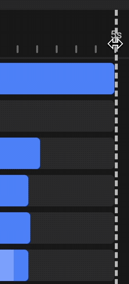
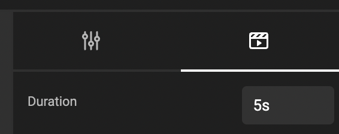

# Animation

## Static vs Animated content

### Timeline by default

Any new GraFx studio document has a timeline.

From the birth of a document a timeline is created. To start the timeline is 5 seconds long.

### Static is the default

(And we're not talking about electricity)

By default, frames are static. This means, they don't have an animation, and appear from frame 1 up to the last frame of the timeline.

Even when you "play" the animation, this frame will appear static in on stage. (on the page).

Exporting the "animation" to a static file format, will only export the first frame of the timeline.

## Timeline

### 5 seconds of f(r)ame

To start, the length of the timeline will be 5 seconds long.

Show the timeline by enabling the "Layers / Animation" panel in the [bottom quicktools panel](/GraFx-Studio/overview/bottom-quicktools/).

### Adjust the length of the timeline

Drag the vertical divider to the left or right.

You can always make the duration longer.

Dragging to the left will work up to the longest blue bar. I.e. if a frames shows up to 5 seconds point, you will not be able to reduce the duration below 5 seconds.

As soon as you adjust the length of the timeline, and add frames, they will take the new length of the timeline.

You can also adjust the length of the animation in the animation panel, changing the length.

### Move the scrubber

You can play the animation (in real time) by clicking the play button.

You can drag the white white left and right.

Each second is divided in 100 [centiseconds](https://en.wikipedia.org/wiki/Orders_of_magnitude_(time)#Less_than_one_second){target="_blank"}.

!!! Alert
	The actual frames per second in the animated output, will define how many frames will be output to the rendered file.

## Frames on the timeline

The blue bar represents the frame in the timeline.

The frame will appear "immediately", and will stay all the way to the end.

### Adding new frames to the timeline

All frames added to the page, will take the full length of the current timeline.

If you resize the timeline, newly added frames will take this new length by default.

### Move the start - or end point of a frame

Scroll all the way to the left (horizontal scroll), and select the edge (when your cursor changes into a double sided arrow). Now drag the edge to the left or right. (left won't work, if it's at the beginning)

You can do the same, for the end of the bar for that frame in the timeline.

## 3 Animation segments of a frame

By default, no animations are set. By selecting the animation panel in the properties, you can set the **intro**, **emphasis** and **outro** for the selected frame.

### Intro

As the name suggests, the **intro** changes how the animation starts.

Choose 1 or all 4 animations

- Easing type
- Fade
- Rotation
- Scale

Each of the animation types has settings that will appear when you select them. (Except fade, it will just fade in)

### Emphasis

The behaviour in the middle section.

Set the style

- Bounce
- Flash
- ...

Set the Ease Type

- Ease in
- Ease out
- Both

Set the Tween type (how the movement is calculated). Tweening, is how the movement between start and end point is calculated.

This website describes what several Ease types do.

[See easing types for more info](https://easings.net/){target="_blank"}

### Outro

Similar to the intro, you can set the 4 animation properties for the end of the animation.

### Length of the intro, outro & emphasis

Control the length and position of each element (lightblue bar), by dragging their respective start- and endpoints.

Intro (start) — Emphasis (middle) - Outro (end)

