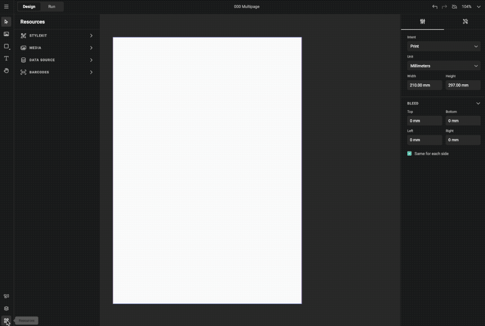
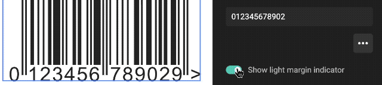
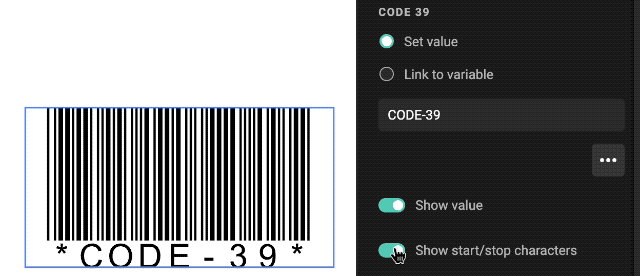
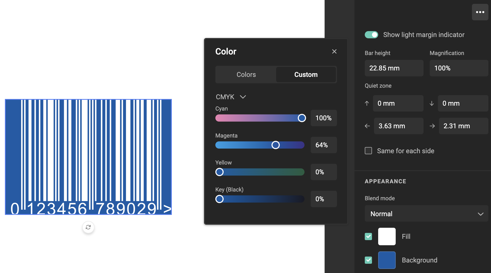

# Barcodes

Barcodes, including QR codes, are a crucial part of modern identification and data management. They represent data visually using patterns of lines, squares, or other shapes. 

Traditional barcodes consist of parallel lines, which encode data that scanners can read.

QR (Quick Response) codes are two-dimensional and offer greater storage capacity, allowing for encoding of URLs, text, and more.

In GraFx Studio, barcodes empower smart templates by seamlessly integrating identification and information-sharing capabilities into designs. Template designers can include barcodes to automate processes, ensure product traceability, and enhance end-user experiences.

Barcodes can hold static values and have variables linked to them.

## Configuration

Barcodes are created and configured in GraFx Studio (different than in GraFx Publisher).

- Click a barcode from the Barcode library
- Configure using the properties panel

## Barcode-specific settings

Depending on the specification and characteristics of the barcode, different settings are available.

## Layout Inheritance

The barcode type and settings are not inherited. It is the content of the frame. It is persistent across all layouts, similar to image or text.

## Bar height

The Bar height property is a decimal number in the unit of the layout

- The value is converted to the unit of the layout
- The minimum value is 1 px

## Light margin indicator

Show the character that indicates the light margin

## Start and Stop characters

Show the start and stop character

## Quiet zone

The Quiet zone properties are decimal numbers in the unit of the layout

- The values are converted to the unit of the layout
- The default values are also the minimum values
- DataMatrix & QR codes (2-dimensional types) → Changing the quiet zone resizes the code
- All other barcode types (1-dimensional types) → Changing the quiet zone resizes the frame

## Appearance

The appearance is the color for a specific part of the barcode.

- Fill represents the actual (bar)code
- Background represents the background color
- Blend mode: apply [blend modes](/GraFx-Studio/concepts/blendmodes/), similar to image frames

## Magnification

The Magnification property is an integer (not decimal) number that specifies the scaling of the frame, in horizontal and vertical directions

- 100% means no scaling is applied
- Min: 10%, Max: 1000%
- Scaling happens on the complete frame, including the barcode, the value, and the quiet zones
- Scaling happens from the top left of the frame (only Width and Height properties are updated, X and Y properties are not touched because it could cause issues with overrides on sub-layouts)

## Font

The default Arial Regular font is used for the barcode value inside the frame, it is one of the recommended typefaces for EAN/UPC.

- The glyph placement uses a monospaced layout
- The font size is calculated so that the font height is 2,75 mm at 100% magnification (this is an EAN/UPC Symbol Reference recommendation, but we use it for all barcode types)

## Barcode value

For each barcode, you can either set a fixed value or link it to a text or list variable (similar to the media connector settings for image variables):

Set value: you get a text input field

Link to variable: you get a dropdown menu with a list of all available text and list variables

### Checksum

When the barcode type contains a checksum character:

- If the given value does not include the checksum → The checksum is calculated, the value stays as is
- If the given value includes the checksum → If the checksum is incorrect, the value is invalid 

If the value is invalid, an error message is shown next to the text input field, and no barcode is rendered.

## Bar Width Reduction

Bar Width Reduction (BWR) is used in barcode printing to compensate for ink spread or "dot gain." It involves reducing the barcode bars' thickness so that after printing and ink spreading, they remain scannable. The actual adjustment amount depends on various factors like ink, paper, and printer conditions. To get the right value, print a sample, measure the bar width, and compare it to the original file. The difference helps adjust the bar width to compensate for the printing process.

The reduction width depends on the printer, so it’s configured in the [PDF output settings](/GraFx-Studio/guides/output/settings/) and not in the barcode settings:

- The “Bar width reduction” setting is added to the output settings for the PDF output format
- It’s a decimal number and can be positive or negative
	- Positive values make the bars smaller
	- Negative values make the bars wider
- The unit is mm or inch
- The default is 0 mm

The bar width of all barcodes that are placed in the PDF is adjusted, based on this setting.

## How to?

See [how to add](/GraFx-Studio/guides/barcodes/add/) for a guide how to add a barcode to your template.