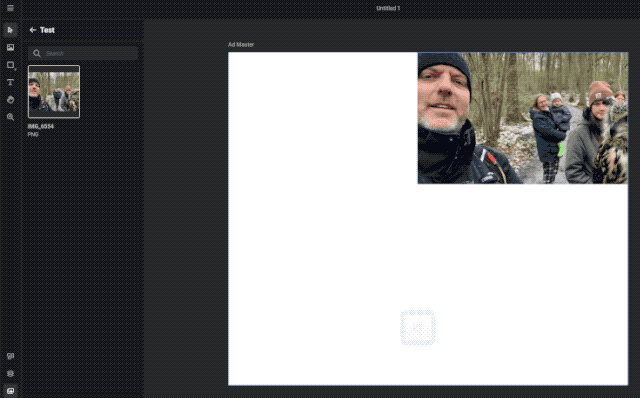

# Bleed (in context of printing)

In printing, bleed is printing that goes beyond the edge of where the sheet will be trimmed.[^1]

This is done to allow some tolerance when trimming (cutting) the printed material.

A 3mm bleed is considered good practice.

[^1]: Source [Wikipedia](https://en.wikipedia.org/wiki/Bleed_(printing))

The bleedBox is the rectable surrounding the area defined by the paper (document) added with the bleed sizes on each side.[^2]

[^2]: See [Prepressure](https://www.prepressure.com/pdf/basics/page-boxes) for a more detailed explanation.

## Set the bleed

In the Layout properties (Print Intent only) set the 4 bleed dimensions.

By default, all 4 dimensions will be linked. You can set them individually by unchecking the "Same for each side" checkbox.

## Preview mode

To view the bleed, toggle preview mode on/off.

You can use the shortcut "W", or select the "Preview mode" under the hamburger menu > view.

In this example the "Eye" of the Owl will be cut off when trimming after being printed.