# Blend modes

## Blend who?

Blend Modes determine how two graphics or colors blend together. Each blend mode has a different effect on the resulting blend.

## Overview of supported blend modes

| Examples      | | | |
| -- | -- | -- | -- |
| Normal              | Screen             | Overlay             | Darken |
|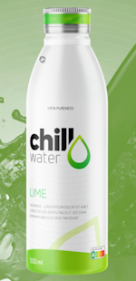{.screenshotsmall}| 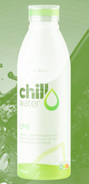{.screenshotsmall}|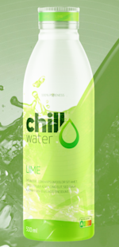{.screenshotsmall}|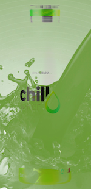{.screenshotsmall}|
| Lighten             | Color Dodge             | Color Burn            | Hard light |
|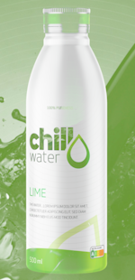{.screenshotsmall}| 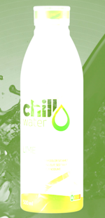{.screenshotsmall}|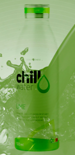{.screenshotsmall}|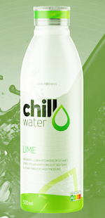{.screenshotsmall}|
| Soft light            | Difference              | Exclusion             | Multiply |
|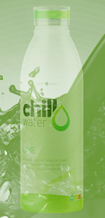{.screenshotsmall}| 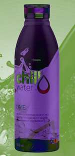{.screenshotsmall}|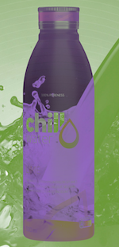{.screenshotsmall}|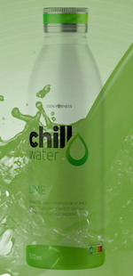{.screenshotsmall}|
| Hue             | Saturation              | Color             | Luminosity |
|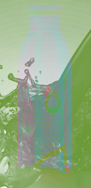{.screenshotsmall}| 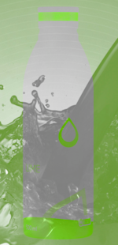{.screenshotsmall}|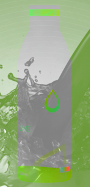{.screenshotsmall}|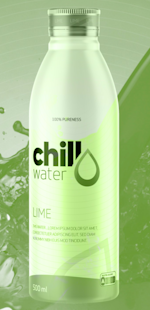{.screenshotsmall}|

The above examples show blend modes in action on a graphic. You can also apply them to a frame with text.

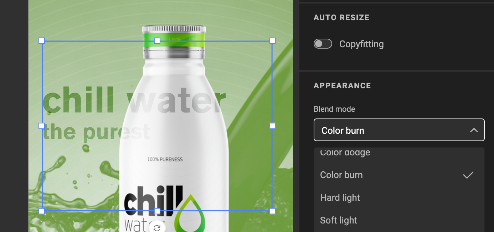{.screenshot-full}

### Normal
The default blend mode which draws the new graphics over the existing graphics.

### Screen
Lightens the colors in the bottom layer by blending them with the inverse of the colors in the top layer.

### Overlay
Combines the multiply and screen blend modes. It darkens the bottom layer where the top layer is dark, and lightens it where the top layer is light.

### Darken
Compares the colors in both layers and selects the darker color for the resulting blend.

### Lighten
Compares the colors in both layers and selects the lighter color for the resulting blend.

### Color Dodge
Lightens the bottom layer color depending on the color of the top layer. It produces a brighter and more vibrant effect.

### Color Burn
Darkens the bottom layer color depending on the color of the top layer. It produces a darker and more contrasted effect.

### Hard Light
Multiplies or screens the colors, depending on the top layer's color value. It produces an intense and dramatic effect.

### Soft Light
Darkens or lightens the colors, depending on the top layer's color value. It produces a soft and subtle effect.

### Difference
Subtracts the bottom layer's color from the top layer's color. It produces an inverted effect.

### Exclusion
Subtracts the bottom layer's color from the top layer's color, but with less intensity than the difference blend mode. It produces a softer inverted effect.

### Multiply
Multiplies the colors in the top and bottom layers. It produces a darker effect.

### Hue
Uses the hue of the top layer with the saturation and luminance of the bottom layer. It produces a hue-based color effect.

### Saturation
Uses the saturation of the top layer with the hue and luminance of the bottom layer. It produces a saturation-based color effect.

### Color
Uses the hue and saturation of the top layer with the luminance of the bottom layer. It produces a color-based effect.

### Luminosity
Uses the luminance of the top layer with the hue and saturation of the bottom layer. It produces a luminosity-based effect.