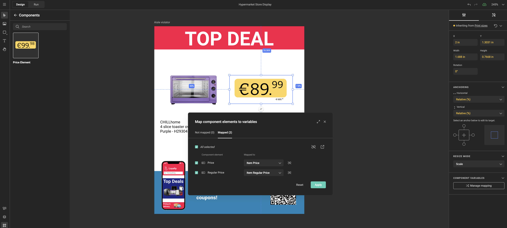
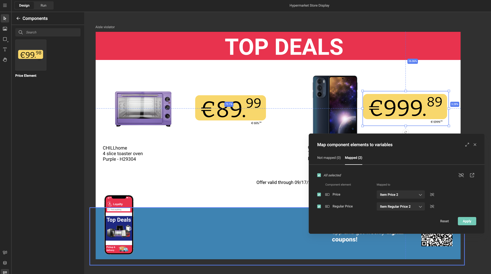
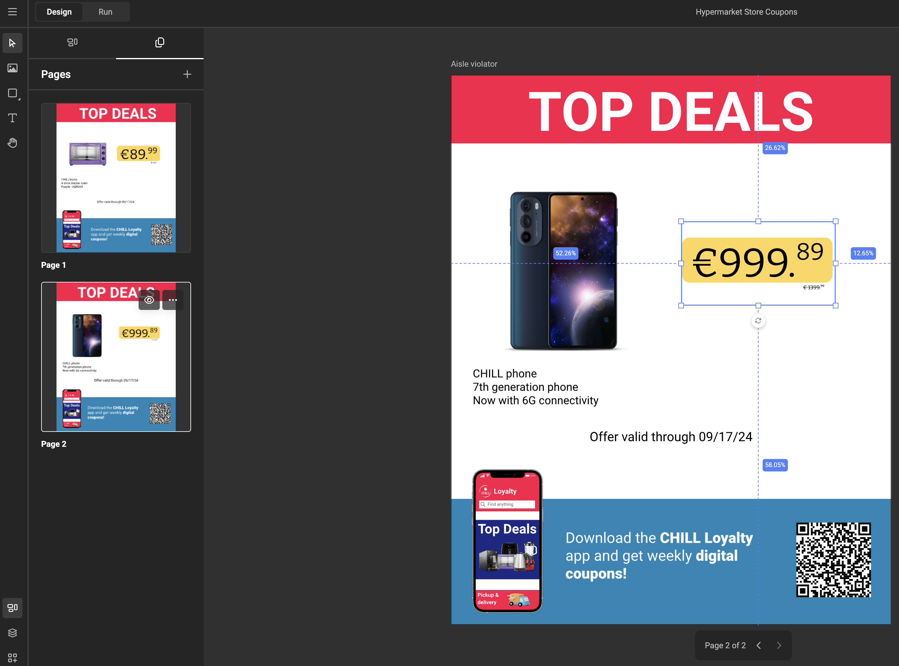

# Component variable mapping

Think of a component as a design stamp. You design it once — layout, brand rules, logic — then place it on a template as many times as you need. Each placement is independent: same design, but each one can show different content.

**Variable mapping** is how you tell each placement what to show. You connect the component's own variables — like `price` or `product_image` — to variables that live in the template. The template holds the actual values; the component displays them.

This page walks through the most common design scenarios, from the simplest single placement to full leaflet layouts.

---

## Before you start

Ask yourself two questions before you place a component:

1. **How many times does this component appear?** Once per template, twice, six times?
2. **Should each placement show different content, or the same?**

The answer shapes how many template variables you'll need and how you set up the mapping. The scenarios below cover each combination.

See [Use components in a template](/GraFx-Studio/guides/use-components/#variable-mapping) for the step-by-step workflow in the UI.

---

## Scenario 1 — One component, one page

You're designing a product card template. There's one price tag in the design — one component, placed once. Each component variable connects to one template variable.



When you open **Manage mapping** for the component, you see three component variables: `price`, `product_name`, and `product_image`. You map each one to a new template variable with the same name.

That's it — three connections, and the component shows whatever the template variables contain.

??? note "The structure behind this"
    ```mermaid
    flowchart LR
        subgraph Template
            T1["price"]
            T2["product_name"]
            T3["product_image"]
        end
        subgraph "Price tag (instance 1)"
            C1["price"]
            C2["product_name"]
            C3["product_image"]
        end
        T1 --> C1
        T2 --> C2
        T3 --> C3
    ```

---

## Scenario 2 — Two placements, one page

You're now building a coupon sheet. Two coupons sit side by side on the same page. Both use the same price tag component, but each coupon shows a different product.



You place the component twice. Then you open **Manage mapping** for each instance separately:

- **Instance 1:** map `price` → `price_1`, `product_name` → `product_name_1`, `product_image` → `product_image_1`
- **Instance 2:** map `price` → `price_2`, `product_name` → `product_name_2`, `product_image` → `product_image_2`

The template now has six variables — a `_1` set and a `_2` set. Each coupon reads from its own set and shows its own product independently.

??? note "The structure behind this"
    ```mermaid
    flowchart LR
        subgraph Template
            T1["price_1"]
            T2["product_name_1"]
            T3["product_image_1"]
            T4["price_2"]
            T5["product_name_2"]
            T6["product_image_2"]
        end
        subgraph "Price tag (instance 1)"
            C1A["price"]
            C2A["product_name"]
            C3A["product_image"]
        end
        subgraph "Price tag (instance 2)"
            C1B["price"]
            C2B["product_name"]
            C3B["product_image"]
        end
        T1 --> C1A
        T2 --> C2A
        T3 --> C3A
        T4 --> C1B
        T5 --> C2B
        T6 --> C3B
    ```

---

## Scenario 3 — Two placements, two pages

The coupon sheet spans two pages — one coupon per page. The setup is the same as scenario 2: two instances, two independent mappings, two sets of template variables. The only difference is that each component lives on a different page of the template.



Mapping doesn't change based on which page a component is on. You still open **Manage mapping** for each instance separately and connect it to its own variable set.

??? note "The structure behind this"
    ```mermaid
    flowchart LR
        subgraph Template
            T1["price_1"]
            T2["product_name_1"]
            T3["product_image_1"]
            T4["price_2"]
            T5["product_name_2"]
            T6["product_image_2"]
        end
        subgraph "Page 1 — instance 1"
            C1A["price"]
            C2A["product_name"]
            C3A["product_image"]
        end
        subgraph "Page 2 — instance 2"
            C1B["price"]
            C2B["product_name"]
            C3B["product_image"]
        end
        T1 --> C1A
        T2 --> C2A
        T3 --> C3A
        T4 --> C1B
        T5 --> C2B
        T6 --> C3B
    ```

---

## Scenario 4 — Same design on front and back

You're designing a brochure. A product badge appears on the front cover and again on the back cover. Both should always show the same product — no separate data per page.


You place the component on page 1 and again on page 2. When you open **Manage mapping** for page 2's instance, instead of creating new variables, you map each component variable to the **existing** template variables — the same ones already used by page 1.

Now both placements read from the same source. Change `product_name` once, and it updates on both pages simultaneously.

??? note "The structure behind this"
    ```mermaid
    flowchart LR
        subgraph Template
            T1["price"]
            T2["product_name"]
            T3["product_image"]
        end
        subgraph "Page 1 (front) — instance 1"
            C1A["price"]
            C2A["product_name"]
            C3A["product_image"]
        end
        subgraph "Page 2 (back) — instance 2"
            C1B["price"]
            C2B["product_name"]
            C3B["product_image"]
        end
        T1 --> C1A
        T2 --> C2A
        T3 --> C3A
        T1 --> C1B
        T2 --> C2B
        T3 --> C3B
    ```

The template only needs three variables, regardless of how many times the component appears — as long as all instances should always show the same thing.

---

## Scenario 5 — Six placements on one page

You're designing a retail leaflet page: six product ads arranged in a grid, all using the same ad component, each showing a different product.


You place the component six times. Then you open **Manage mapping** for each instance and connect it to its own set of product variables: `price_1` through `price_6`, `product_name_1` through `product_name_6`, and so on.

The design is defined once in the component. Six placements, six independent mappings, six different products — all on one page.


When the ad design needs updating — a new font, a different layout, revised promo logic — you change the component once. Every instance on every template that uses it updates automatically.

??? note "The structure behind this"
    ```mermaid
    flowchart LR
        subgraph Template
            direction TB
            T1["price_1 … image_1"]
            T2["price_2 … image_2"]
            T3["price_3 … image_3"]
            T4["price_4 … image_4"]
            T5["price_5 … image_5"]
            T6["price_6 … image_6"]
        end
        subgraph "Ad component — 6 instances"
            direction TB
            I1["Instance 1"]
            I2["Instance 2"]
            I3["Instance 3"]
            I4["Instance 4"]
            I5["Instance 5"]
            I6["Instance 6"]
        end
        T1 --> I1
        T2 --> I2
        T3 --> I3
        T4 --> I4
        T5 --> I5
        T6 --> I6
    ```

---

## Combining scenarios

These patterns work together. A multi-page catalog might combine:

- A **header component** shared between front and back (scenario 4)
- **Six product ads per page** driven by independent variable sets (scenario 5)
- Spread **across multiple pages** (scenario 3)

GraFx Studio groups the template variables by component instance in the variable list, so even a template with many mapped components stays organized.


---

## At a glance

| Design situation | Instances | Pages | Template variables needed |
|---|---|---|---|
| One design element, used once | 1 | 1 | 1× component's variables |
| Multiple same elements, each showing different data | N | 1 | N× component's variables |
| Same as above, spread across pages | N | N | N× component's variables |
| Same element on multiple pages, same data | N | N | 1× component's variables |
| Grid of elements, one page | N | 1 | N× component's variables |

---

## Constraint compatibility

Component variables can carry constraints — a number variable might be restricted to a specific range, a date variable might define a start date, end date, or excluded days. When you map a component variable to a template variable, these constraints apply at every point where a value enters the system.

### At mapping time

If a component variable has a range constraint and the template variable you're mapping to has an incompatible or non-overlapping range, the mapping row shows an error state. The mapping cannot be applied until the ranges are made consistent — by updating either the component variable or the template variable.

### At runtime — manual input (Studio and Studio UI)

If a user manually enters a value that falls outside the component variable's allowed range, the Engine rejects the value and the UI restores the previous valid value. The user cannot save an out-of-range value.

### At runtime — data source

If a data source supplies a value that falls outside the component variable's range, a toast notification informs the user that the value is not valid. The value is replaced with the variable's default.

### In batch output

If a batch row contains a value outside the component variable's range, that row is excluded from the generated output file. The error is recorded in the error report, which can be downloaded from the output task page.

---

## Required component variables

A component variable can be marked as **required**. This signals that a value must be present for the component to render correctly.

When you map a required component variable to a template variable, the template variable is **not** automatically set to required. There is no visual indicator in Run Mode or Studio UI that the template variable feeds into a required component variable.

If output is generated while the mapped template variable is empty, the output fails. The error is included in the error report on the output task page.

> **Tip for template designers:** When working with a component that has required variables, verify with the component author which variables are required. Document this in the template or communicate it to the operators who will fill in the values.

---

## Related

- [Components](/GraFx-Studio/concepts/components/) — what components are and why they exist
- [Use components in a template](/GraFx-Studio/guides/use-components/#variable-mapping) — step-by-step mapping workflow
- [Build a component](/GraFx-Studio/guides/build-component/) — define variables inside a component
