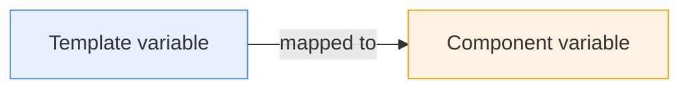
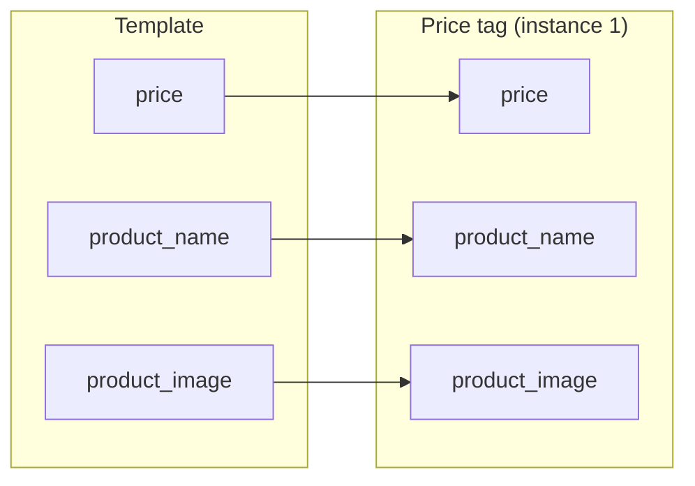
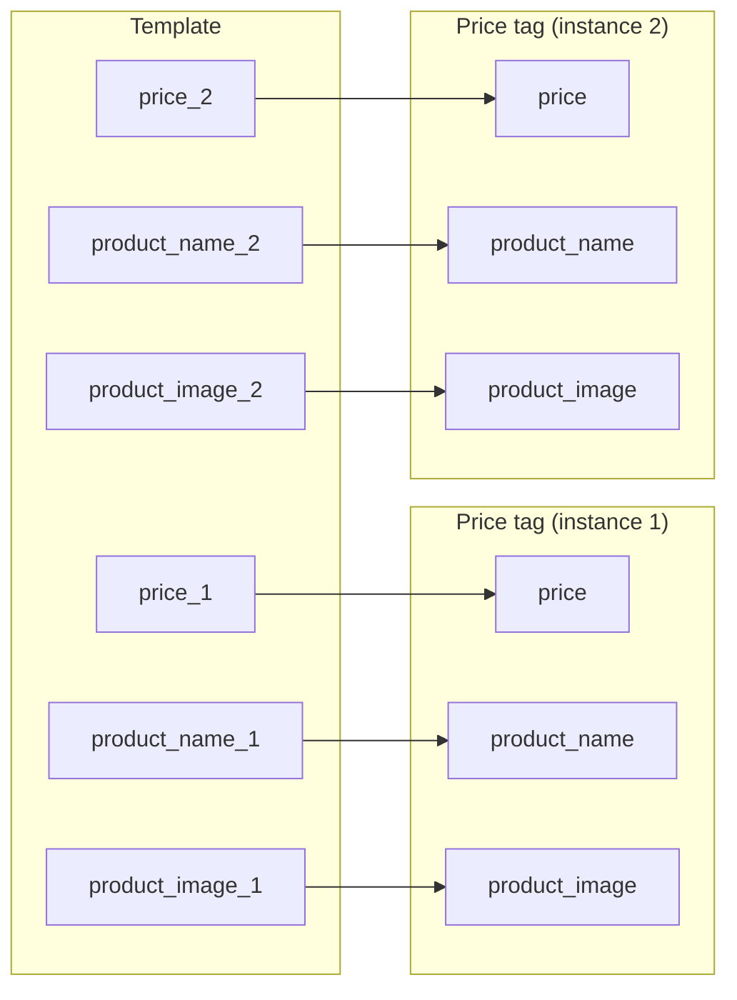
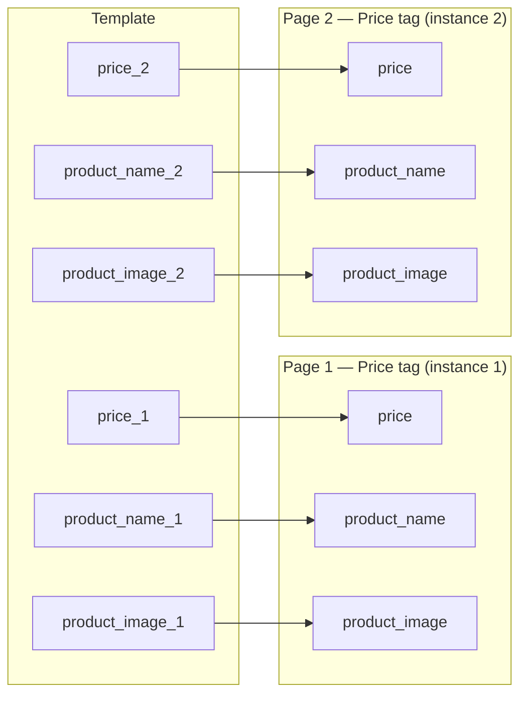
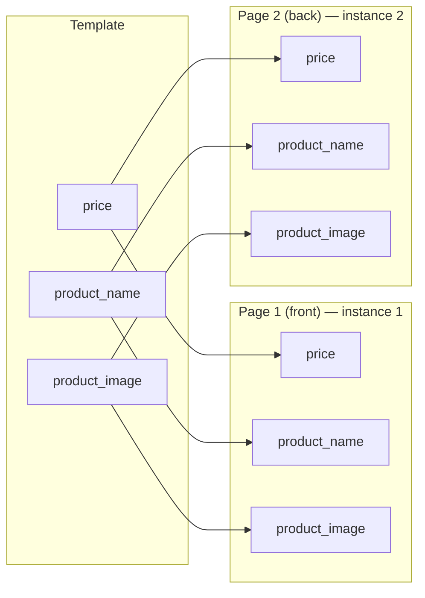
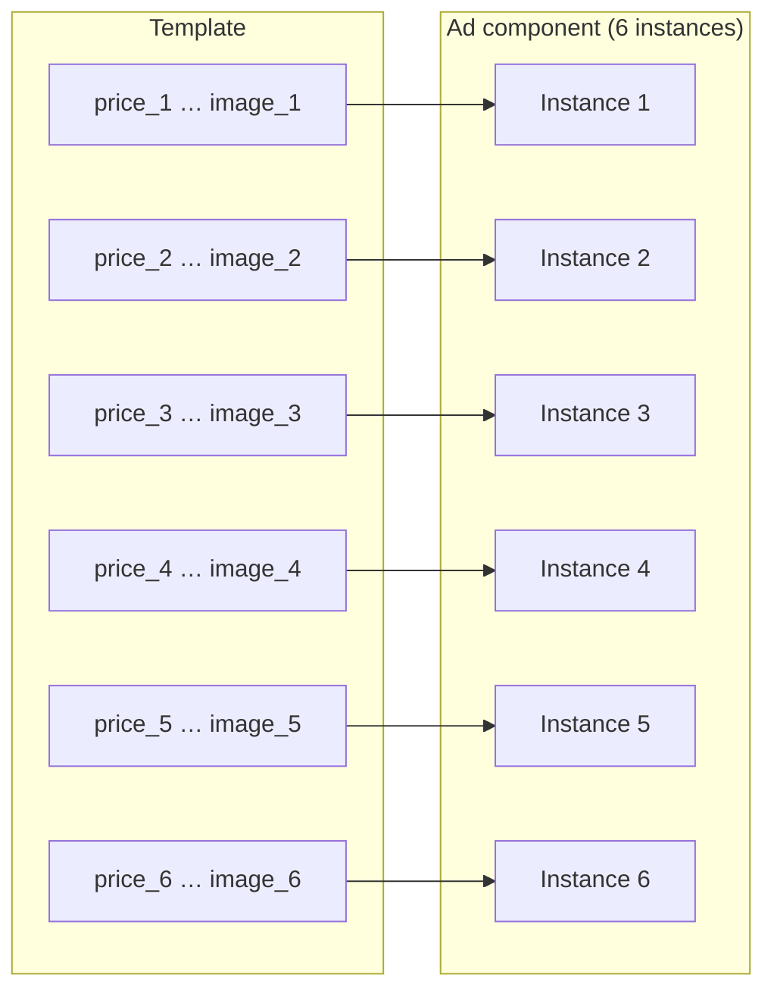

# Component variable mapping

Variable mapping is how a template passes data into a component. Each component instance has its own independent mapping configuration — meaning the same component placed multiple times on a template can carry a completely different set of values, all from the same pool of template variables.

This page walks through the most common mapping patterns, from the simplest one-to-one setup to multi-instance, multi-page configurations.

See [Use components in a template](/GraFx-Studio/guides/use-components/#variable-mapping) for the step-by-step workflow.

---

## How mapping works

Every component exposes its own variables — for example `price`, `product_name`, and `product_image`. These variables only exist inside the component. To give them values from the outside, you connect them to template-level variables through the **Map component elements to variables** modal.

Data flows **one way**: from the template into the component. A component cannot send data back to the template.

Each component instance on the canvas has its own mapping. Mapping is configured per instance, not per component type.

---

## Use case 1 — Single component, single instance

The simplest setup: one component placed once on one page. Each component variable is mapped to one template variable.

**Example:** A template with a single price tag component.

The template has three variables. The component instance maps each of its variables to one of them. This is a 1:1 mapping — one template, one component, three connections.

---

## Use case 2 — Two instances on one page

The same component placed twice on a single page. Each instance maps to a different set of template variables, so each shows different data.

**Example:** A coupon sheet where two coupons appear side by side on the same page.

The template now has six variables — a `_1` and `_2` set for each component variable. Instance 1 maps to the `_1` set, instance 2 maps to the `_2` set. Each coupon shows its own product and price independently.

---

## Use case 3 — Two instances across two pages

The same component placed once per page across a two-page template. This is the natural extension of use case 2 when the design spans multiple pages — for example a two-page coupon spread, or the first two pages of a longer booklet.

**Example:** A coupon booklet where page 1 shows coupon A and page 2 shows coupon B.

The mapping structure is identical to use case 2. The difference is that the two instances live on different pages of the template rather than side by side on the same page. Mapping does not change based on which page a component is on — it is always configured per instance.

---

## Use case 4 — Same data on front and back

Two instances of the same component, on two different pages, both mapped to the **same** template variables. This is useful when a design element must appear identically on both sides of a document — for example a product badge on the front cover and the back cover of a brochure.

**Example:** A product logo component placed on page 1 (front) and page 2 (back), always showing the same product.

The template only needs three variables. Both instances point to the same ones. Changing `product_name` in the template updates the component on both pages simultaneously — without any extra configuration.

---

## Use case 5 — Six instances on one page

Six instances of the same component placed on a single page, each mapped to a different set of template variables. This is the leaflet or catalogue layout pattern: one reusable design, one page, many products.

**Example:** A retail leaflet page showing six product ads side by side.

The template has six variable sets — one per product. The ad component is designed once. Six instances on the page, six independent mappings, six different products — all using the same design.

When the design needs to change (new font, updated layout, revised business logic), only the component needs to be updated. All six instances, on every template that uses this component, reflect the change automatically.

---

## Combining patterns

These use cases are not mutually exclusive. A single template can combine all of them:

- A **front and back** design (use case 4) for a consistent header component
- Combined with **six product ads per page** (use case 5) for the body content
- Spread **across multiple pages** (use case 3) for a multi-page catalogue

The total number of template variables is the sum of all unique mappings. GraFx Studio groups these variables per component instance in the variable list, so they remain organised even when a template contains many mapped instances.

---

## Summary

| Pattern | Instances | Pages | Template variables | When to use |
|---|---|---|---|---|
| Single instance | 1 | 1 | 1× component variables | Simple reuse of one design element |
| Multi-instance, one page | N | 1 | N× component variables | Coupon sheets, leaflet pages, grids |
| Multi-instance, multi-page | N | N | N× component variables | Booklets, multi-page spreads |
| Shared mapping | N | N | 1× component variables | Same data needed in multiple places |
| Combined | Mixed | Mixed | Sum of unique mappings | Full catalogue or document layout |

---

## Related

- [Components](/GraFx-Studio/concepts/components/) — what components are and why they exist
- [Use components in a template](/GraFx-Studio/guides/use-components/#variable-mapping) — step-by-step mapping workflow
- [Build a component](/GraFx-Studio/guides/build-component/) — define variables inside a component
