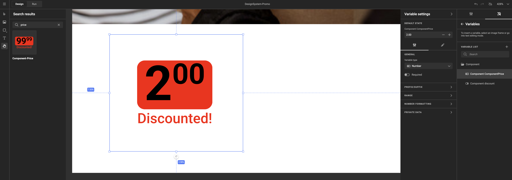
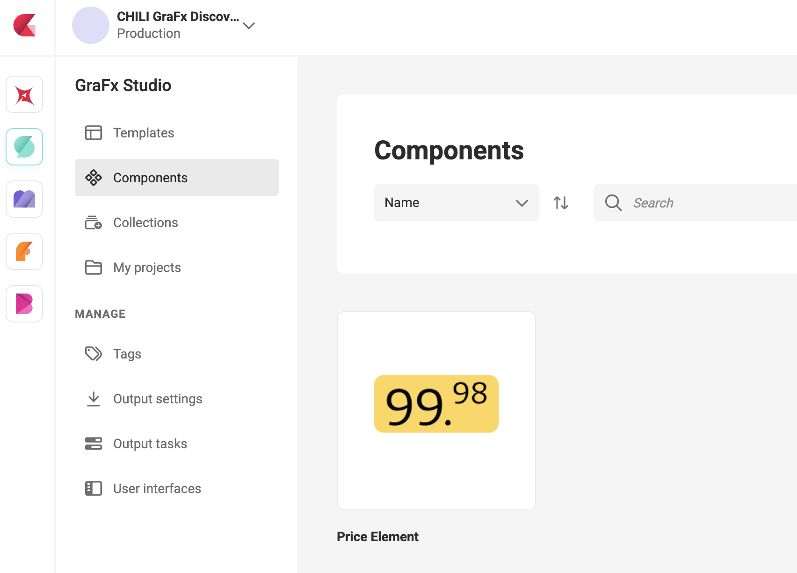
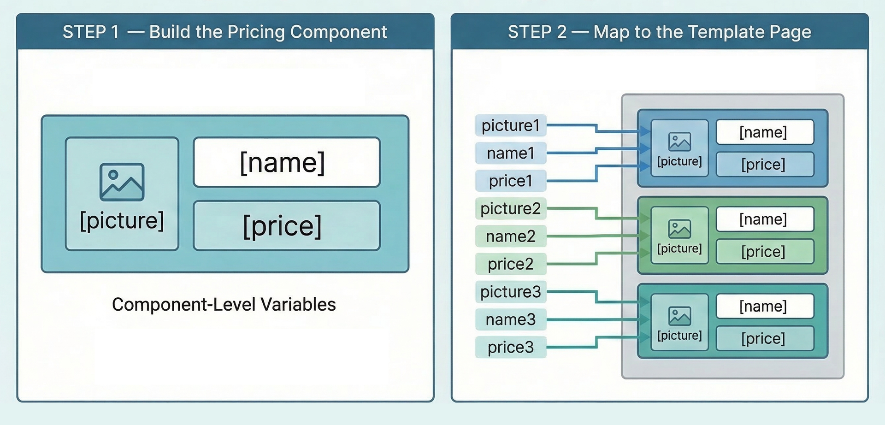

# Components

A Component is a reusable design element that can be placed inside a template. Think of it as a self-contained building block — with its own layout, brand rules, and business logic — that you design once and reuse across as many templates as you need.

{.screenshot-full}

## Why components

In traditional template design, every template carries its own copy of every design element. A pricing block, a product badge, a promotional label — each one is rebuilt and maintained independently per template. When the brand updates the look or the business logic of that element, every template needs to be opened and updated manually.

Components change that. You build the design element once, as a component. Every template that uses it references that single source. When the component is updated, the change flows through to every template automatically.

This means:

- **Faster template design** — place a component rather than rebuilding the same element from scratch
- **Consistent brand execution** — the logic and look live in one place, not duplicated across dozens of templates
- **Faster campaign rollouts** — HQ updates the component once, field teams immediately work with the latest version

## When to use a component

Not every design element needs to be a component. Use one when at least one of these is true:

**The same element appears on more than one template.** A pricing block, a disclaimer footer, a brand badge — if it lives in five templates today, it will need updating in five templates next time the brand changes. A component fixes that.

**The same element is placed more than once on the same page or template.** A coupon sheet with six coupons, a leaflet with six product ads — if you're repeating the same design element, a component lets each instance show different data without rebuilding the element each time.

**The design is owned centrally but used locally.** When a brand or HQ team controls the design and business logic, but local teams or operators just place and populate it, a component enforces that boundary. The local user can connect variables; they cannot edit the design.

**You might not need a component if** the element only appears in one place, will never be reused, and no one else needs to be protected from accidentally changing it. In that case, building it directly in the template is simpler.

## How components relate to templates

A Component is a separate resource in GraFx Studio, alongside Templates and Collections. It has its own workspace, its own variables, and its own Brand Kit.

When a template designer places a component on a template, it behaves like a frame — it can be moved, resized, and positioned on the canvas. The component's internal design and logic remain managed within the component itself.

Data flows **one way**: from the template into the component. The template can pass values to component variables, but a component cannot send data back to the template. This applies to Actions as well — if an Action inside a component changes a variable value, that change stays within the component. The template never sees it, and the output is driven by the template-side value, not the component-side update. See [Actions in a component](/GraFx-Studio/guides/build-component/#actions-in-a-component) for the full implications.

{.screenshot-full}

## What happens when a component is updated

When you save a change to a component, every template that uses it reflects the updated design automatically. You do not need to reopen, republish, or reconfigure the templates.

**Variable mappings are preserved** when you update the component design, adjust layouts, or change actions — as long as the variable names remain the same. Existing connections between component variables and template variables stay intact.

**Adding a new variable** to the component makes it appear in the mapping modal the next time a template designer opens it. Existing mappings are not affected. The new variable shows up under **Not mapped** until the designer connects it.

**Removing or renaming a variable** in the component breaks any existing mapping to that variable. The template variable that was created for it is not deleted, but the connection is lost and will need to be re-mapped.

> **Note:** Verify the exact propagation behavior with your platform administrator or CHILI GraFx support before relying on automatic updates in a production environment.

## Use cases

### Pricing element on a coupon sheet

A grocery retailer runs weekly promotions. Each coupon on a coupon sheet shows a product image, a product name, and a price — with the price element varying depending on the promotion type: *reduced price*, *two for one*, or *lowest price guarantee*. Each promotion type has a slightly different visual treatment.

Without components, that pricing logic needs to be built into every coupon on every template. With a pricing component:

1. The pricing element is designed once as a component, with all promo type logic built in
2. The component is placed once per coupon on the sheet
3. Each instance is mapped to the price and promo type variables for that specific coupon
4. When the brand updates the look or adds a new promo type, only the component needs to change — all templates using it update automatically

A coupon sheet with six coupons uses the same pricing component six times, each showing different data.

### Full product ad on a leaflet page

A retail leaflet page contains multiple product advertisements. Each ad has a header, a product shot, a product name, a price, and a promo type. Rather than building each ad as a standalone section of the template, the entire ad is a component.

The template designer places the ad component as many times as needed on the page, then maps each instance to the relevant product's variables. The result is a complete leaflet page built from one reusable design, driven by variable data.

When the brand updates the ad design or changes the business logic, the update is made once in the component. All leaflet templates immediately reflect the change — without field teams or store owners needing to do anything.

## Component variables

Each component exposes its own set of variables. These are the values a template designer can connect to template-level variables through [variable mapping](/GraFx-Studio/guides/use-components/#variable-mapping).

Variable mapping is done per component instance. This means the same component placed three times on a page can carry three completely different sets of values — one per instance.

{.screenshot-full}

### Variable constraints

Component variables can carry constraints that limit what values are valid:

- **Number variables** can define a minimum and maximum value (e.g. a price component might restrict the range to `[0, 999]`)
- **Date variables** can define a start date, an end date, and excluded days

These constraints are set inside the component and apply at the template level whenever the variable is mapped. If a value falls outside the allowed range — whether entered manually, supplied by a data source, or coming from a batch row — the platform enforces the constraint and reports the error. See [Constraint compatibility](/GraFx-Studio/concepts/component-mapping/#constraint-compatibility) for how this works in each context.

### Required variables

A component variable can be marked as **required**. This means a value must be present for output to succeed.

When you map a required component variable to a template variable, the template variable is **not** automatically set to required. There is also no visual indicator in Run Mode or Studio UI that the underlying component variable requires a value.

If output is generated while a required component variable is empty, the output will fail. The error is reported in the error report, which can be downloaded from the output task page.

See [Variable mapping](/GraFx-Studio/guides/use-components/#variable-mapping) for the full workflow.

## Resize Mode

A component can have multiple layouts — for example a square, a horizontal, and a vertical version of the same design. When a component is placed on a template, the **Resize Mode** setting controls how the component fills its frame and which internal layout is used.

See [Resize Mode](/GraFx-Studio/guides/use-components/#resize-mode) for details on Scale, Resize, and Scale and resize.

## How components differ from templates

Components are intentionally more constrained than templates. This is by design: a component is a building block, not a finished product. The constraints keep it clean, predictable, and safe to reuse across many templates.

| Feature | Template | Component |
|---|---|---|
| Digital animated intent | ✅ | ❌ |
| Multi-page | ✅ | ❌ |
| Output / Export | ✅ | ❌ |
| User Interface settings | ✅ | ❌ |
| Bleed & slug | ✅ | ❌ |
| Private data | ✅ | ❌ |
| List variable type | ✅ | ❌ |
| Add component as a frame | ✅ | ❌ |
| Page size (set via actions) | ✅ | ❌ |
| Brand Kit | ✅ | ✅ |

> A component renders within the space the template provides — the template controls the frame size, not the component. To adapt a component's appearance to different frame proportions, use multiple layouts and Resize Mode. Actions that attempt to change the page size inside a component will not execute.
| Actions | ✅ | ✅ |
| Connectors (media & data) | ✅ | ✅ |
| Design & Run Mode | ✅ | ✅ |

!!! info "Output and animation"
    Templates that use components support print, static digital, and animated digital (GIF, MP4) output. When rendering animated output, the component frame can be animated in the template timeline — but the content inside the component does not animate.

    HTML output is not supported for templates that include components.

## Permissions

Access to components is role-based. Users without edit rights can open a component in read-only mode. The **Create component** button is only visible to users with creation rights.

See [User roles — component access](/CHILI-GraFx/users/roles/#component-access) for the full access matrix.

## Get started

New to components? The tutorial walks you through the complete journey:

- [Tutorial: Build and use a pricing component](/GraFx-Studio/guides/components-tutorial/) — follow a fully working example from blank component to finished coupon sheet

Or go directly to the reference guides:

- [Build a component](/GraFx-Studio/guides/build-component/) — create a component in the component workspace
- [Use components in a template](/GraFx-Studio/guides/use-components/) — place, configure, and map component variables
