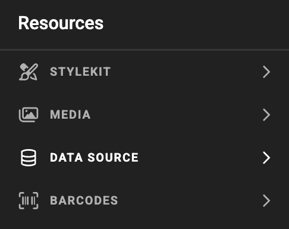
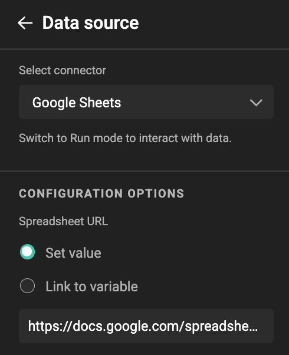

# Data Connectors

A **Data Connector** simplifies the creation of graphics and digital assets by automatically pulling information from an external system into GraFx Studio. This allows you to personalize and scale content without manually entering data.

As an end-user, you can access centrally brand-managed data with ease. Data Connectors also enable fully automated content creation, driving content generation at scale.

Connectors can be used in **[self-service](/GraFx-Studio/concepts/self-service/)** or **[headless](/GraFx-Studio/concepts/headless/)** workflows.

## Making Data Available for the End-User

In the **Data Source** panel (under **Resources**) on the left in GraFx Studio, a Template Designer can browse the available Data Connectors. 

Multiple connectors can be deployed. One setup might require a different authentication method. This can be done by deploying multiple instances of the Google Sheets connector, each with different parameters.

The data of that data source is now available, and will populate the variable values in the document.[^1]

[^1]: See Data Connector specifics on how to setup