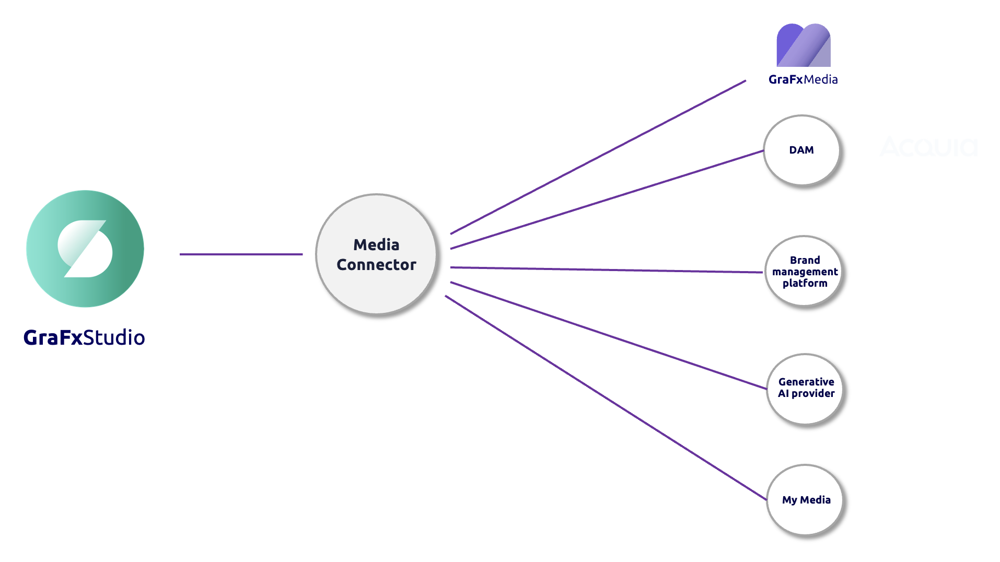
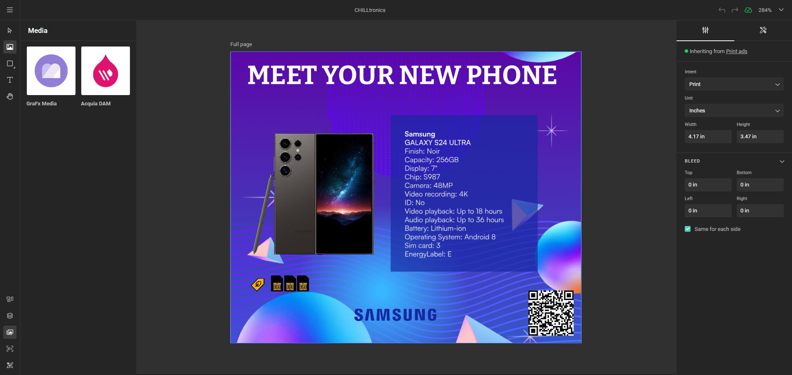
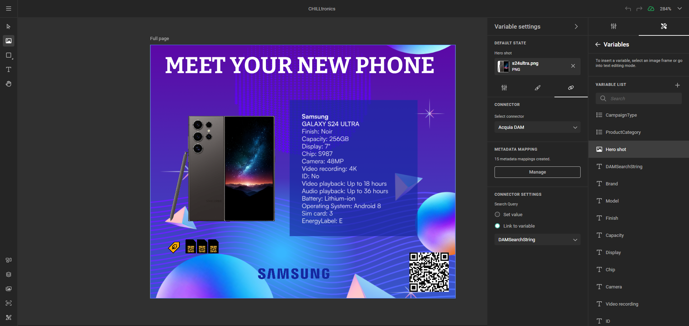
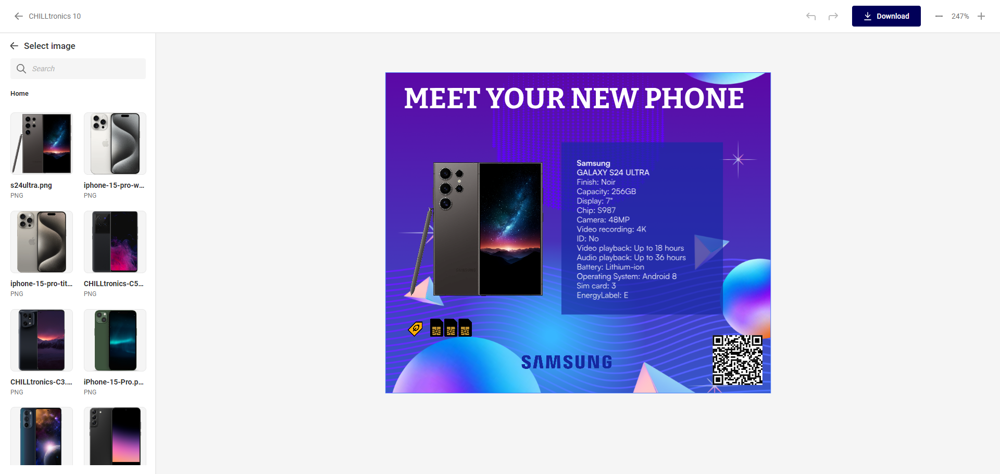
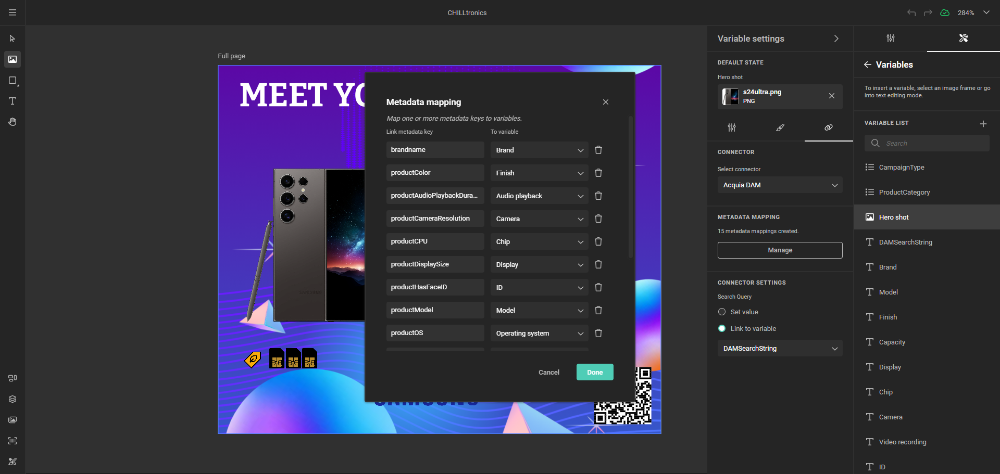

# Media Connectors

A **Media Connector** accelerates collateral creation by bringing assets from an external media repository into GraFx Studio.

The value for end-users lies in accessing brand-managed assets (with corresponding metadata) while respecting the digital rights management of the external system. Media Connectors also enable fully automated content creation, driving content generation at scale.

Connectors can be used in **[self-service](/GraFx-Studio/concepts/self-service/)** or **[headless](/GraFx-Studio/concepts/headless/)** workflows.

## Concepts

If you're considering building your own Media Connector, here are some approaches to consider.

## Concept 1: Making Assets Available for the End-User

In the **Media** panel on the left in GraFx Studio, a Template Designer can browse the available Media Connectors. Multiple media repositories can be connected, and by default, the built-in application GraFx Media is available.

When the Template Designer clicks on a Media Connector, the repository opens, and all assets the user is entitled to access, according to the digital rights governance within the Media Connector, are displayed.

The Template Designer can select and add an asset to the design.

**Challenge**: In the above scenario, the user will see **all** the assets.

### Narrowing Down the Selection

In the Template Designer Workspace, a Template Designer can configure which specific assets are made available to the end-user in the **End User Interface (EU Interface)**. This avoids showing the end-user all assets, including those that are less relevant.

**Solution**: Refine the query to limit the asset view.

For example, assets will be shown to the end-user depending on a chosen category (electronics, household, food, etc.).

This is configured by a **search string** in the Connector Settings.

A Media Connector communicates with a media provider (e.g., DAM). Each of these providers will have different query configurations. For example, in DAM systems, this would be a query.

In the end-user interface, the end-user will see the selected assets. In this example, a category of smartphones:

## Concept 2: Making Assets Available and Exposing Metadata

In this example, we’ve included product information to highlight how seamlessly a DAM system can complement detailed product data, showcasing the potential of a fully integrated approach.

The metadata of an asset can be configured as variables in the Template Designer Workspace and injected into the template. When the end-user changes the assets in the End User Interface, the metadata is updated accordingly.

Leveraging the full Composition Model, you can then define an action to be triggered according to the value of the metadata and execute actions on your document.

## Metadata Mapping

When an asset is fetched from the DAM, metadata is sent alongside. This metadata can be mapped to variables.
