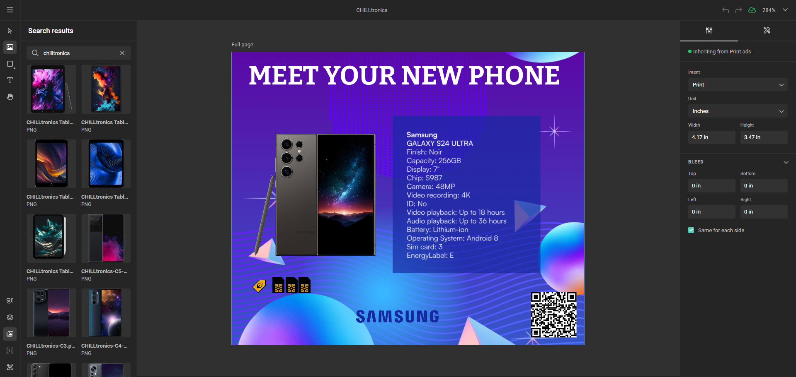

# Media Connectors

A **Media Connector** accelerates collateral creation by bringing assets from an external media repository into GraFx Studio.

The value for end-users lies in accessing brand-managed assets (with corresponding metadata) while respecting the digital rights management of the external system.
Media Connectors also enable fully automated content creation, driving content generation at scale.

Connectors can be used in **self-service** or **headless solutions**.

## Self-Service

Consider a local marketer who needs to create marketing collateral using assets from the corporate DAM system (self-service).

## Headless or Automated

Imagine a process that runs in the background, creating collateral in an automated way, with access to the corporate DAM system.

## Concepts

If you're considering building your own Media Connector, here are approaches to consider.

## Concept 1: Making Assets Available for the End-User

In the 'Media' panel on the left in GraFx Studio, a Template Designer can browse between the available Media Connectors. Multiple media repositories can be connected, and by default, the built-in application GraFx Media is available.

When the Template Designer clicks on a Media Connector, the repository is opened, and all assets the user is entitled to access, according to the digital rights governance within the Media Connector, are shown.

The Template Designer can select and add an asset to the design. 

**Challenge**: In the above scenario, the user will see **all** the assets.

### Narrowing Down the Selection

In the Template Designer Workspace, a template designer can configure which specific assets are made available for the end-user in the EU Interface. This avoids showing the end-user all assets, including those that are less relevant.

**Solution**: Refine the query to limit the asset view.

For example, assets will be shown to the end-user depending on a chosen category (electronics, household, food, etc.).

This is configured by a **search string** in the Connector Settings.

A Media Connector communicates with a media provider (e.g., DAM). Each of these providers will have different query configurations. For example, in DAM systems, this would be a query.

In the end-user interface, the end-user will see the selected assets. In this example, a category of smartphones:

## Concept 2: Making Assets Available and Exposing Metadata

In this example, we’ve included product information to highlight how seamlessly a DAM system can complement detailed product data, showcasing the potential of a fully integrated approach.

The metadata of an asset can be configured as variables in the Template Designer Workspace and injected into the template. When the end-user changes the assets in the End User Interface, the metadata is updated accordingly.

Leveraging the full Composition Model, you can then define an action to be triggered according to the value of the metadata and execute actions on your document.

## Support

CHILI publish categorizes CHILI GraFx Connectors into four categories.

### Built-in

GraFx Studio connects to [GraFx Media](/GraFx-Media/) through the GraFx Media connector, utilizing the same framework as other media connectors. CHILI publish assumes full responsibility for the development and support of the GraFx Media connector and the associated media service, as all elements were built in-house.

### Built by CHILI publish

To facilitate connections to external services, CHILI publish develops Media Connectors for specific applications. For instance, the Media Connector for Acquia DAM is built and supported by CHILI publish. Support for these connectors encompasses their internal workings, including API calls made to external systems. However, issues related to availability, configuration, or API problems on the media provider's side are not covered under support. Our Customer Support team assists in identifying the origin ...

**Example**: The Media Connector for Acquia DAM

### Built by Third Party, Approved by CHILI publish

Our open connector framework encourages developers to [build connectors](/GraFx-Developers/connectors/build-media-connector/) for their unique use cases. If a media provider develops a connector, it can be offered in our Connector Hub. Support for these connectors is provided by the developer.

### Custom (Private) Connectors

In cases where a built-in or readily available connector is unavailable for specific needs, we encourage you to [build custom connectors](/GraFx-Developers/connectors/build-media-connector/). These connectors can be tailored for private use or offered in the Connector Hub for broader application. Building a private connector allows integration with custom media providers and customization to meet specific requirements.

## Metadata Mapping

When an asset is fetched from the DAM, metadata is sent alongside. This metadata can be mapped to variables.
