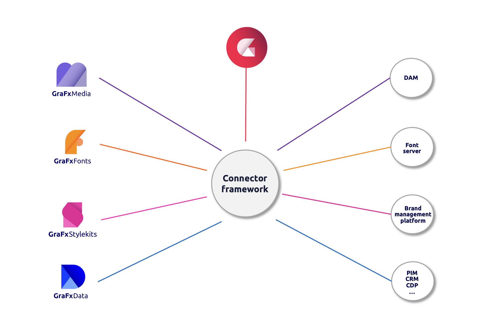

# CHILI GraFx Connectors

The CHILI GraFx Connectors provide a means to seamlessly integrate CHILI GraFx capabilities with third-party systems, facilitating efficient workflow automation and data exchange.

## Types of connectors

### Built-in

CHILI publish develops and supports the connector and the associated service.

As an example, GraFx Studio connects to [GraFx Media](/GraFx-Media/) through the **GraFx Media connector**, utilizing the same framework as other media connectors.

### Built by CHILI publish

To facilitate connections to external services, CHILI publish develops connectors for specific applications. 

E.g. the Media Connector for **Acquia DAM** is built and supported by CHILI publish. 

Support for these connectors encompasses their internal workings, including API calls made to external systems. Issues related to availability, configuration, or API problems on the media provider's side are covered by the third party application. 

Our Support team assists in identifying the origin.

### Built by Third Party, Approved by CHILI publish

Our open connector framework encourages developers to [build connectors](/GraFx-Developers/connectors/build-media-connector/) for their unique use cases. If a media provider develops a connector, it can be offered in our Connector Hub. 

Support for these connectors is provided by the developer.

### Custom (Private) Connectors

In cases where a built-in or readily available connector is unavailable for specific needs, we encourage you to [build custom connectors](/GraFx-Developers/connectors/build-media-connector/). These connectors can be tailored for private use. 

Building a private connector allows integration with custom media providers and customization to meet specific requirements.