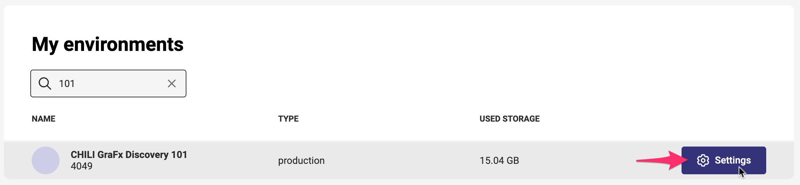
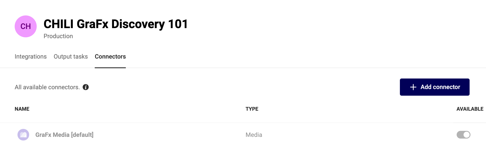

# CHILI GraFx Connectors

CHILI GraFx Connectors provide a seamless way to integrate CHILI GraFx capabilities with third-party systems, facilitating efficient workflow automation and data exchange.

## Connector Hub

The Connector Hub is the central repository where you can find connectors to install into your environment.

As an Environment Admin, navigate to:

My Environments > [Your Environment] > Settings > Connectors

Select the **Connectors** tab.

Here, you will see an overview of the installed connectors.

## Types of Connectors

### Built-in

**CHILI publish** develops and supports built-in connectors and the associated services.

For example, GraFx Studio connects to [GraFx Media](/GraFx-Media/) through the **GraFx Media connector**, utilizing the same framework as other media connectors.

### Built by CHILI publish

To facilitate connections to external services, CHILI publish develops connectors for specific applications.

For example, the Media Connector for **Acquia DAM** is built and supported by CHILI publish.

Support for these connectors encompasses their internal workings, including API calls made to external systems. However, issues related to availability, configuration, or API problems on the media provider's side are covered by the third-party application.

Our Support team assists in identifying the origin of such issues.

### Built by Third Party, Approved by CHILI publish

Our open connector framework encourages developers to [build connectors](/GraFx-Developers/connectors/build-media-connector/) for their unique use cases. If a media provider develops a connector, it can be offered in our Connector Hub.

Support for these connectors is provided by the developer.

### Custom (Private) Connectors

In cases where a built-in or readily available connector does not meet specific needs, we encourage you to [build custom connectors](/GraFx-Developers/connectors/build-media-connector/). These connectors can be tailored for private use.

Building a private connector allows integration with custom media providers and customization to meet specific requirements.