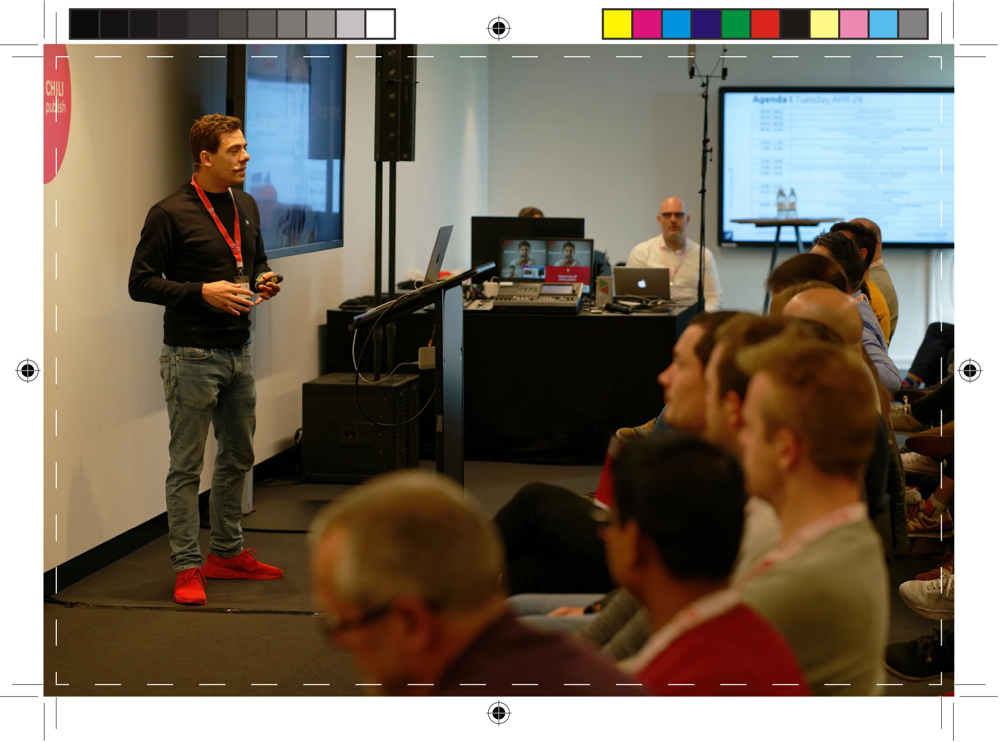

# Crop Marks

To print an image without a blank area around the image, the non-printing areas must be trimmed after printing. Crop marks can be used to show the printer where the printing area ends, and the non-printing area begins. The part which is trimmed off is called [bleed](/GraFx-Studio/concepts/bleed/).

THe crop marks indicate where the cutting machine will cut, and keep the area in the white dotted line (not part of the actual image).

The part of the image outside of the white dotted line, is the bleed.