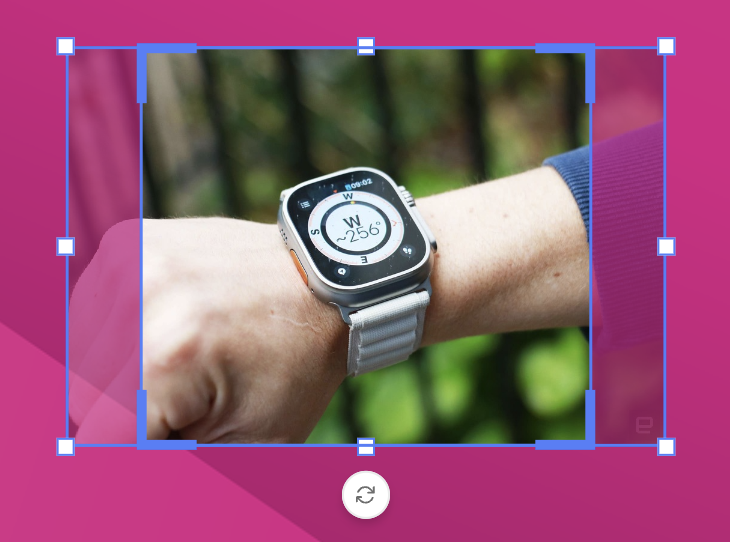
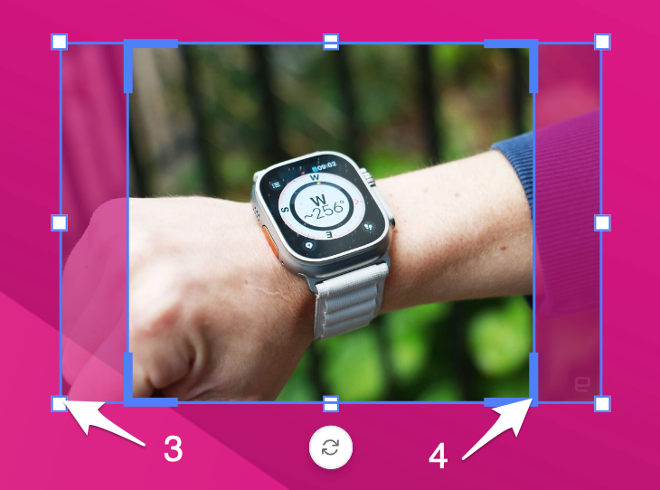
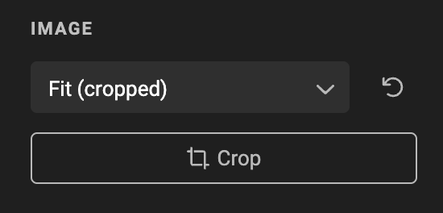

# Crop

## Concept

Cropping enables manually position and scaling the asset within the image frame and allows to resize the frame itself.

## Image frame and Crop frame

The Image frame (1) and the crop frame (2) are 2 element influencing the size & crop of the image.

When your frame and image both have exactly the same aspect ratio, the image frame and crop frame will be the same.

When your image has a different ratio than the frame it fits it, the default crop frame will be different.

Is the example below, the image is landscape while the image frame is square(-ish).

Entering crop mode, enables you to handle both frames independently.

The Image handles (3) allow you to influence the image. The crop handles (4) enable you to change the visible part or crop of the image.

## Inheritance model

See also [Inheritance model](/GraFx-Studio/concepts/layouts/#inheritance)

In the layout inheritance model, changing the image crop or fit mode on a child layout overrides the parent layout. 

Resetting the override restores both the fit mode and image crop to the parent layout's values. 

The reset button next to the fit mode removes the image crop and restores the original fit mode, while the "Reset fit mode" option in the overrides list resets both the fit mode and image crop to the parent layout's values.

## Undo

All image and frame transformations done while in image crop mode are grouped together as one undo/redo item. 

This means that if you apply an image crop and undo it again, you always go back to the state before you clicked the crop button.

## Recalculation

Improvements of cropping algorithms in the future will not affect the document. 

A crop is saved in the document, and will only be trigger and recalculated when

- The frame resizes
- The frame content changes
- A different crop mode is used, or settings of the crop mode are changed