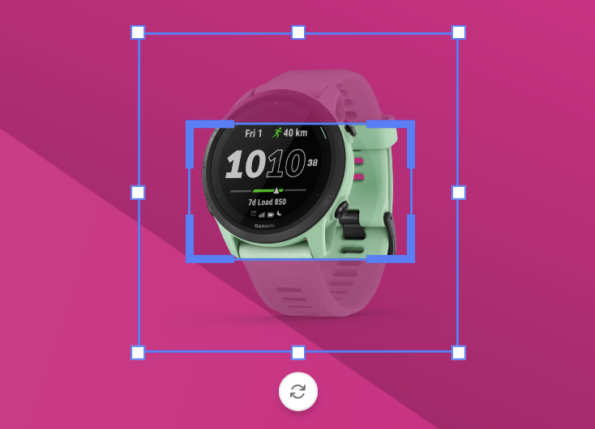
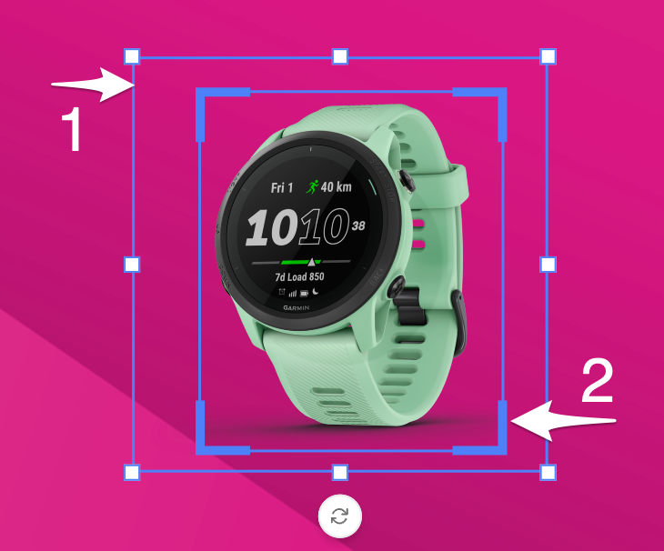
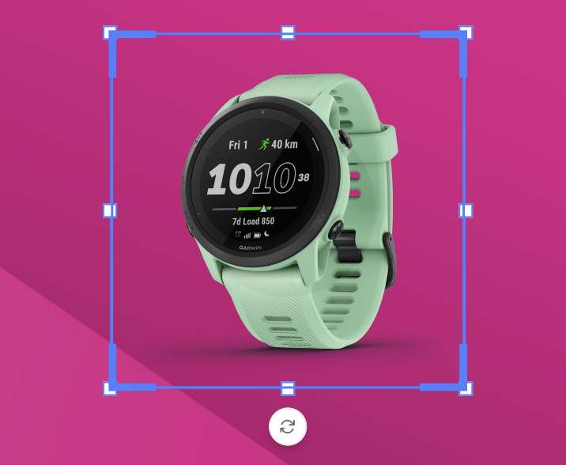

# Crop

## Concept

Cropping enables manual positioning and scaling of the assets within the image frame and allows to resize of the frame itself.

## Image frame and Crop frame

The Image frame (1) and the crop frame (2) are 2 elements influencing the size & crop of the image.

When your frame and image both have the same aspect ratio, the image frame and crop frame will be the same.

When your image has a different ratio than the frame it fits in, the default crop frame will be different.

In the example below, the image is landscape while the image frame is square(-ish).

Entering crop mode, enables you to handle both frames independently.

The Image handles (3) allow you to influence the image. The crop handles (4) enable you to change the visible part or crop of the image.

## Inheritance model

See also [Inheritance model](../../../GraFx-Studio/concepts/layouts/#inheritance)

In the layout inheritance model, changing the image crop or fit mode on a child layout overrides the parent layout. 

Resetting the override restores both the fit mode and image crop to the parent layout's values. 

The reset button next to the fit mode removes the image crop and restores the original fit mode, while the "Reset fit mode" option in the overrides list resets both the fit mode and image crop to the parent layout's values.

## Replacing content

When the asset in an image frame is replaced, the crop settings are reset.

They are reset to the [fit-mode](../../../GraFx-Studio/concepts/frames/#fit-or-fill-mode) of that frame.

Replacing an image can be done by a user, or through integration. In either way, the crop settings are removed, and the fill setting is applied.

## Undo versus reset

### Crop Reset

The crop reset button (reverse arrow) will reset the image fit to the chosen [fit mode](../../../GraFx-Studio/concepts/frames/#fit-or-fill-mode).

All changes made to the cropping, positioning or rotation will be reset to the fit- or fill setting of the image frame.

### Undo or redo

One undo or redo action is the combination of all changes made during 1 crop manipulation.

When you make several changes during one manipulation, they will be stored as 1 undo/redo.

!!! Example
	Consider this scenario
	
	- State 0: Image in a frame in "Fit" mode
	- Enter crop mode
		- Reposition the image
		- Apply the crop
	- State 1: Image is cropped
	- Enter crop mode (again)
		- Rotate the image in the frame
		- Move the image (again)
		- Apply the crop
	- State 2: Image is cropped and rotated

	With Undo, you can return from State 2 to State 1. Click Undo again, and you will go back to state 0.

	Whereas with reset, starting in State 2, you will disregard all crop changes, and go back to State 0.
