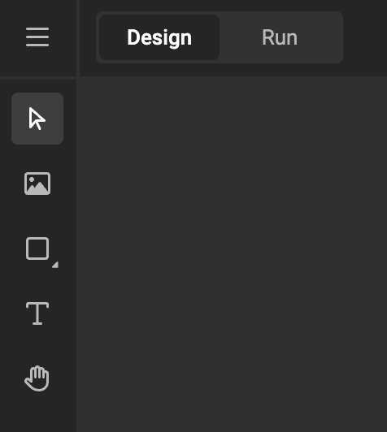
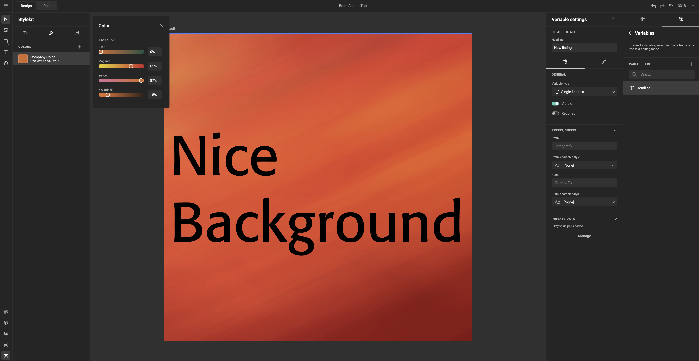
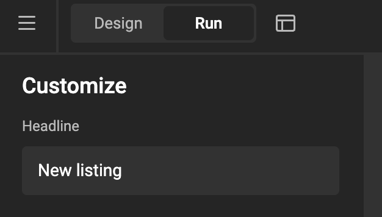
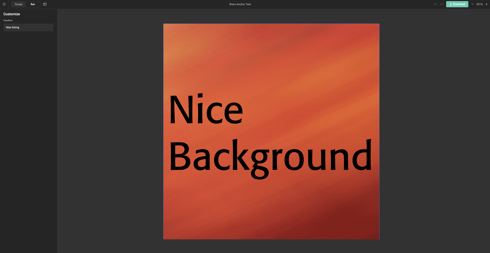
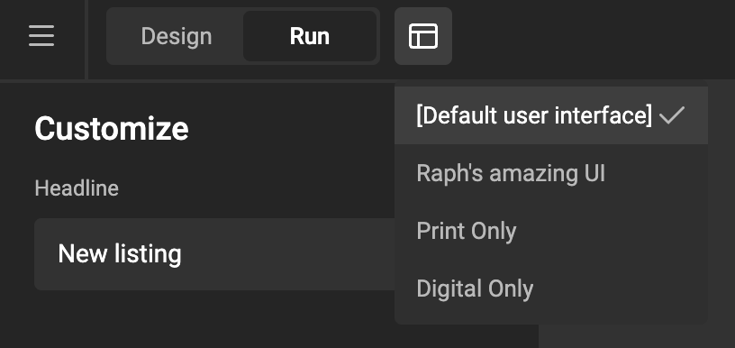
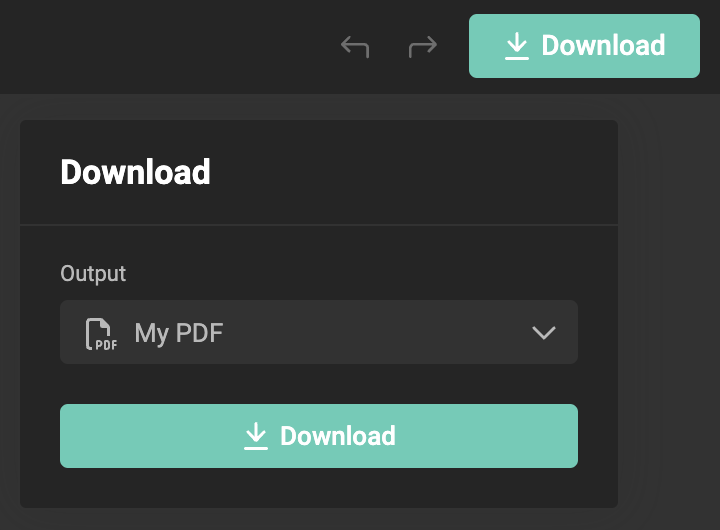

# Design &amp; Run Mode

GraFx Studio provides two modes for creating and testing Smart Templates: **Design Mode** and **Run Mode**. 

These modes allow you to focus separately on designing the smart template and testing business logic.

In **Design Mode**, you can freely arrange and style elements without triggering actions that could alter your original design. This keeps the workspace clean, ideal for setting up and adjusting layouts, styles, and initial logic.

Switching to **Run Mode** simulates the end-user experience (My Projects), showing how the template’s logic behaves live. In this mode, actions behave as they will in a real environment, letting you test how users will experience the template.
Variables set to be hidden, won't show in the end-user experience.

## Feature Channel

<iframe width="690" height="388" src="https://www.youtube.com/embed/u9EGrd-7uTY?si=aezAKjm-gCpENLOg&controls=1&mute=1&showinfo=0&rel=0&autoplay=0&loop=1" title="YouTube video player" frameborder="0" allow="accelerometer; autoplay; clipboard-write; encrypted-media; gyroscope; picture-in-picture; web-share" referrerpolicy="strict-origin-when-cross-origin" allowfullscreen></iframe>

[All feature videos](https://www.youtube.com/playlist?list=PLLHtQ1R6R-B_m7XAVySM9OjbbUscsgBOH)

## Design Mode

**Design Mode** is optimized for layout and style tasks, with actions inactive.

### Key Features in Design Mode:
- **Static Layout**: Actions are inactive, letting you set up without interference  
You can create text, image, barcode, and shape frames
- **Focused Styling**: You can create a Brand Kit with media, fonts, paragraph- and character styles, and define colors

### Elements Active in Design Mode:
- **Anchoring**: Set fixed or relative positions to ensure consistent layout across sizes
- **Animation Setup**: Define and test animations with playback
- **Styling**: Customize text, colors, and layout freely
- **Variables**: Creating, inserting, settings of variables

## Run Mode

In **Run Mode**, the template operates as it would for end users, activating logic and interactions for realistic testing.

### Key Features in Run Mode:
- **Live Actions**: Business logic is triggered in response to changes, reflecting end-user interactions.
- **True Visibility**: Hidden variables and conditional visibility (of frames) behave as configured for end users.
- **User Interface Simulation**: Simulate how different [User Interfaces](/GraFx-Studio/concepts/user-interface/) will appear to end users. In Run Mode, you can switch between different user interfaces to see e.g. which output settings are available to end users, ensuring the final experience matches the intended design.

### Displaying Output Settings by Layout Intent

When a **User Interface** is selected, only the output settings specific to that interface will be shown. 

For example, when viewing a layout with a **Print Intent**, only print-specific output settings (defined in the user interface) will be displayed in the "download" options.

Conversely, when viewing a layout with a **Digital Animated Intent**, only the digital animated output settings will appear. This selective display provides a clear, intent-specific experience that mirrors the end-user environment.

### Elements Active in Run Mode:
- **Actions**: All interactions and business logic execute in real time.
- **Conditional Visibility**: Hidden elements are hidden, showing how visibility rules work.

## Workflow

1. **Design** in Design Mode: Arrange layout, styles, animations and initial logic without active interactions.
2. **Switch to Run Mode**: Test actions, and user interactions.
3. **Refine** by toggling between modes, adjusting design or logic as needed.

By switching between **Design Mode** and **Run Mode**, you can refine interactive templates efficiently without design interference.