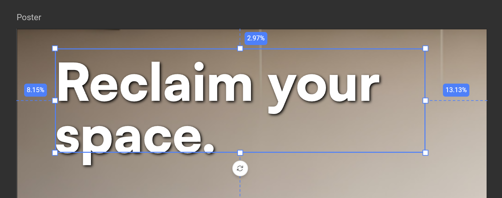
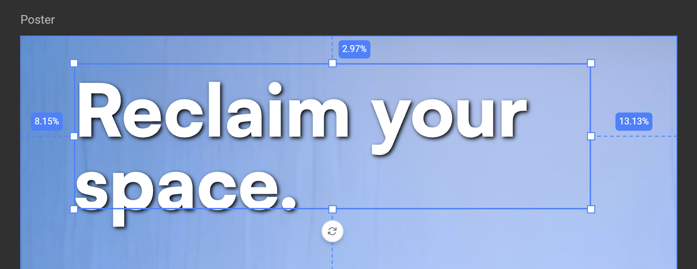
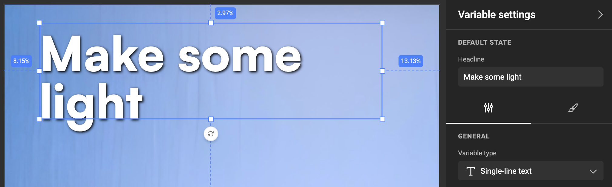
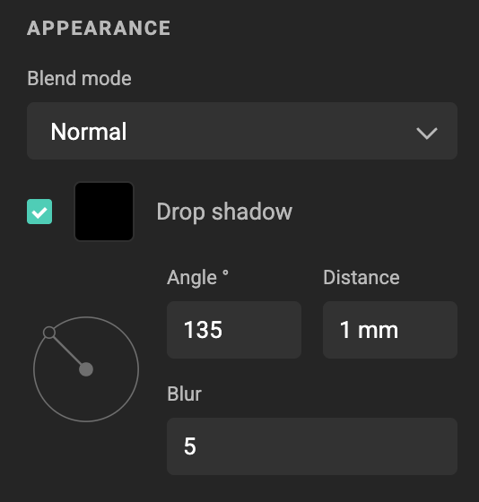
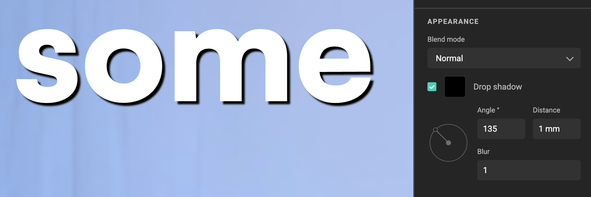
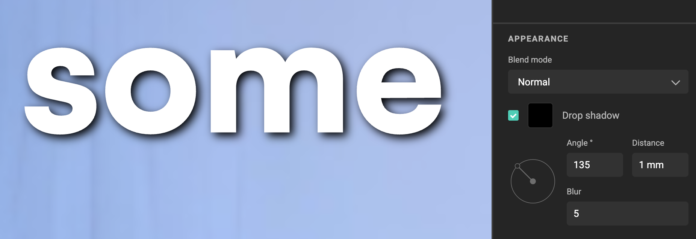
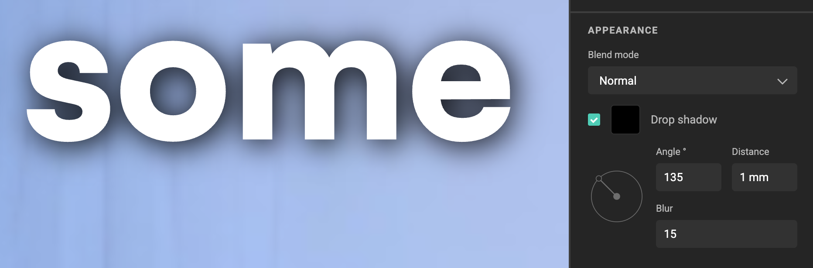

# Drop shadow

For Template Designers: understand what drop shadows are, why they matter, and how they affect object appearance in GraFx Studio.

## What it is

A **drop shadow** is a shadow that appears behind an object or frame. It gives visual depth, separates content from the background, and can be styled to be subtle or dramatic.

{.screenshot-full}

## Why use drop shadows

In self-service or data-driven design, you don’t always know how content will appear:

- **Maintain readability**  
  Text may be placed over variable images or backgrounds. A drop shadow improves contrast, ensuring text remains legible even on light or busy images.  

{.screenshot-full}

- **Consistency across variations**  
  When campaigns generate thousands of output variants, you cannot manually adjust each one. Drop shadows provide a safeguard for readability and design integrity.  

{.screenshot-full}

- **Visual hierarchy**  
  Shadows help foreground elements stand out, drawing attention to important text or graphics.  

- **Depth and realism**  
  Adding a shadow gives flat objects a sense of separation and spatial layering, making layouts feel less flat.  

- **Brand expression**  
  A subtle shadow style can be part of a brand’s visual identity, ensuring consistency across different channels and media.  

## Key settings

{.screenshot}

- **Blend mode**  
  Determines how the frame contents and shadow interacts with the object and its background.  
  See [Blend modes](/GraFx-Studio/concepts/blendmodes/)

- **Color**  
  Define the shadow color from custom or saved swatches. Opacity can be set from 0–100%.  
  See [Swatches](/GraFx-Studio/guides/swatches/)

- **Angle**  
  Defines the shadow direction, in degrees (e.g., `135°` places the shadow bottom-left).

- **Distance**  
  How far the shadow is offset from the object. The unit follows the layout’s current measurement unit (px, mm, in, …) linked to the intent.

- **Blur**  
  Softens the shadow edges. Range: **1–500**.  
  - Low values = sharp edges.  
  - High values = diffused, natural look.
  
{.screenshot-full}

{.screenshot-full}

{.screenshot-full}

## Good to know

- Drop shadows apply per object/frame.  
- Units adapt automatically to the layout’s configured [intent](/GraFx-Studio/concepts/layout-intent/) and units.  
- Only one drop shadow effect can be applied at a time.

## Next

[How to apply Drop Shadow](/GraFx-Studio/guides/drop-shadow/)