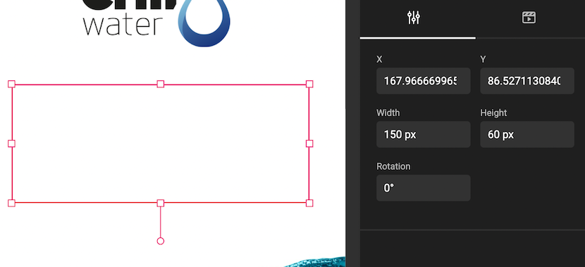
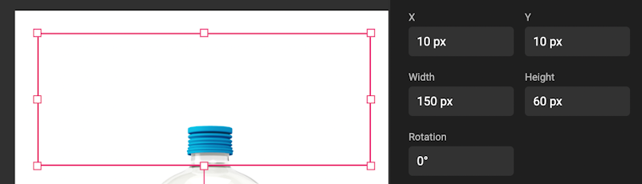
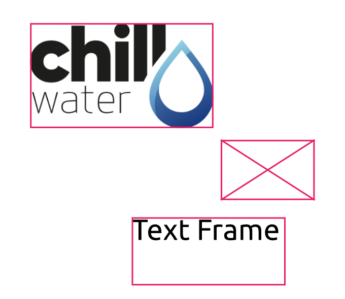
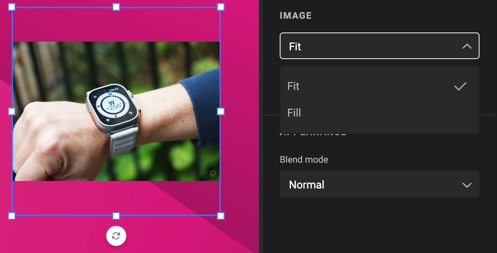
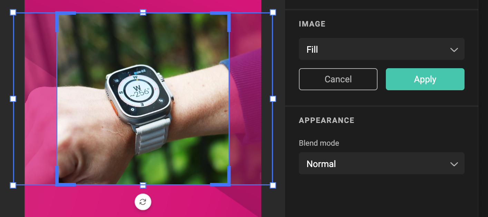
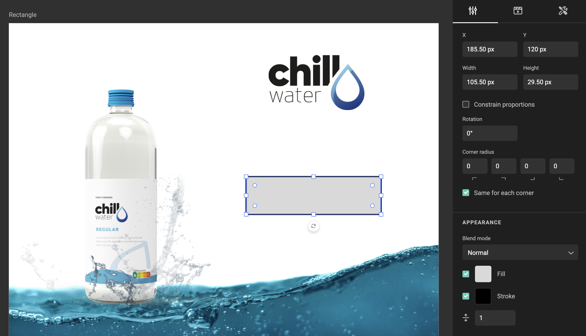
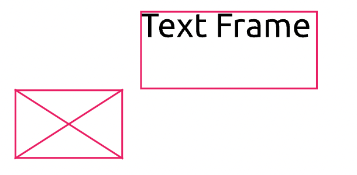
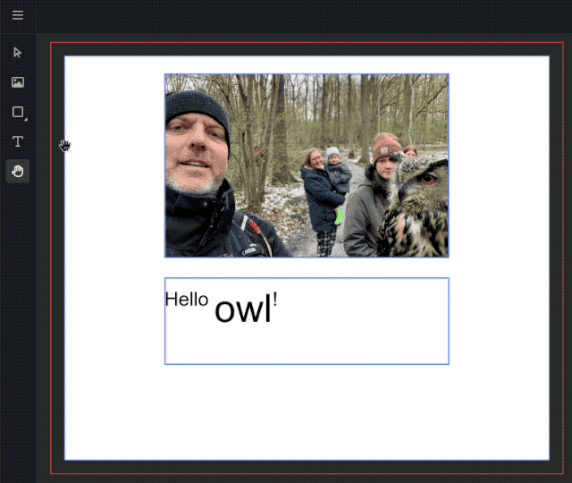

# Frames

A frame is an construct to place elements on a page.

A frame is a rectangular shape that can hold contents, and can have properties of itself.

## Basic Properties

Position is defined by the **top left** corner of the rectangle, relative to the **top left** corder of the document.

The width and height defines the size of the frame.

The rotation property of the frame, is the angle of rotation, relative to the **center** of the frame.

## Image Frame

An image frame is made to hold static images.

An image frame looks like a rectangular box when selected, and has a cross, when no media is available for the frame.

When media is selected / active for the frame, it will show the media.

Look [here](/GraFx-Studio/concepts/crop/) to see how to work with cropping.

### Fit- or Fill mode

BY default, a placed asset is "fitted" in the frame. This means the maximum size of the  picture is shown, maintaining the aspect ration.

This mean that parts of the frame will remain empty.

!!! Remark
	Except when the aspect ratio of the image is exactly the same as the frame. E.g. an image of 100 x 100 pixels, in a frame of 200 x 200 pixels, will not show empty space)

With "Fill" mode, the image is scaled up, so the full frame is used. This (possibly) results in parts of the image hidden outside of the frame.

## Shape Frame

A shape frame draws the selected shape. (Rectangle, Ellipse, Polygon).

The shape can be used as a (dynamic) background for e.g. a button. Since a shape will follow the inheritance model, the size, rotation, position etc, will also be linked to the current sub-layout.

## Text Frame

A text frame is made to hold text.

A text frame looks like a rectangular box when selected.

## Select a Frame

Use the "Select" tool, to select 1 or more frames. You can select multiple frame by holding the shift-key.

When multiple frames are selected, you can move and rotate then together.

## Z-index

Z-depth or Z-index refers to the Z-coordinate in the Cartesian coordinate system. 

!!! Alert
	There is no actual height difference, but Z-axis is used to refer to the relative position to the other frames.

In GraFx Studio z-index is in line with desktop editing tools. Each frame has a z-depth. 