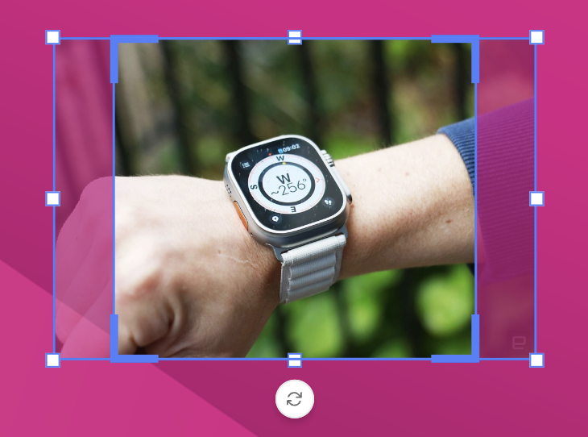

# Frames

A frame is a construct to place elements on a page.

A frame is a rectangular shape that can hold contents and can have properties of itself.

## Basic Properties

Position is defined by the **top left** corner of the rectangle, relative to the **top left** corner of the document.

The width and height define the size of the frame.

The rotation property of the frame is the angle of rotation, relative to the **center** of the frame.

<iframe width="690" height="388" src="https://www.youtube.com/embed/XHcie9Uw_5c?si=mlUAvEq6lD1IsfJX&controls=1&mute=1&showinfo=0&rel=0&autoplay=0&loop=1" title="YouTube video player" frameborder="0" allow="accelerometer; autoplay; clipboard-write; encrypted-media; gyroscope; picture-in-picture; web-share" referrerpolicy="strict-origin-when-cross-origin" allowfullscreen></iframe>

[All feature videos](https://www.youtube.com/playlist?list=PLLHtQ1R6R-B_m7XAVySM9OjbbUscsgBOH)

## Appearance of a frame

Each frame has an appearance panel.

You can set the [Blend mode](/GraFx-Studio/concepts/blendmodes/), Opacity and Drop shadow.

### Opacity

When set to 100% the frame is opake or not transparant. When set to 50%, the frame will be 50% transparent.

{.screenshot}

### Drop shadow

When Drop shadow is selected, you'll see more options, related to [Drop shadow](/GraFx-Studio/concepts/drop-shadow/).

{.screenshot}

## Image Frame

An image frame is made to hold static images.

An image frame looks like a rectangular box when selected and has a cross when no media is available for the frame.

When media is selected / active for the frame, it will show the media.

Look [here](/GraFx-Studio/concepts/crop/) to see how to work with cropping.

### Fit- or Fill mode

By default, a placed asset is "fitted" in the frame. This means the maximum size of the  picture is shown, maintaining the aspect ratio.

This means that parts of the frame will remain empty.

!!! Remark
	Except when the aspect ratio of the image is exactly the same as the frame. E.g. an image of 100 x 100 pixels, in a frame of 200 x 200 pixels, will not show empty space)

With "Fill" mode, the image is scaled up, so the full frame is used. This (possibly) results in parts of the image hidden outside of the frame.

## Manual crop override

To further refine your image layout, GraFx Studio supports **Manual Crop Override**.

This lets you manually adjust the crop position of a specific image inside a frame for a specific layout. This override is remembered, and reapplied automatically when the same asset is used again in that frame and layout.

This is particularly useful for lifestyle images where automated cropping (Fill, Fit, or Smart Crop) doesn't provide the ideal result.

[Learn more about Manual Crop Override](../manual-crop-override/)

## Shape Frame

A shape frame draws the selected shape. (Rectangle, Ellipse, Polygon).

The shape can be used as a (dynamic) background for e.g. a button. Since a shape will follow the inheritance model, the size, rotation, position, etc, will also be linked to the current sub-layout.

## Text Frame

A text frame is made to hold text.

A text frame looks like a rectangular box when selected.

## Select a Frame

Use the "Select" tool, to select 1 or more frames. You can select multiple frames by holding the Shift key.

When multiple frames are selected, you can move and rotate them together.

## Z-index

Z-depth or Z-index refers to the Z-coordinate in the Cartesian coordinate system. 

!!! Alert
	There is no actual height difference, but the Z-axis is used to refer to the relative position of the other frames.

In GraFx Studio z-index is in line with desktop editing tools. Each frame has a z-depth. 
