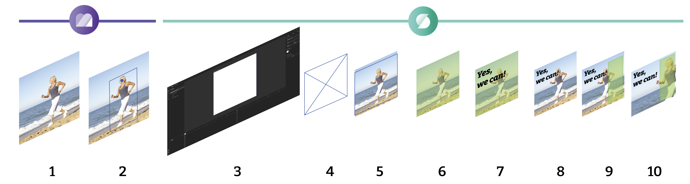
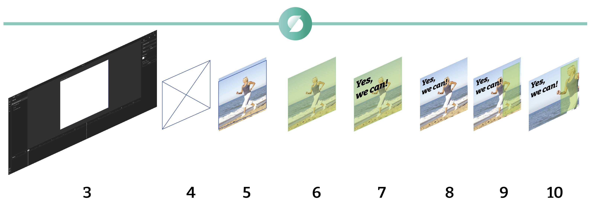

# GraFx Genie Smart Crop

## The full picture

Smart Crop starts in [GraFx Media](../../../GraFx-Media/concepts/genie-smart-crop/) and can then be used in GraFx Studio

For step 1 and 2, see [GraFx Media](../../../GraFx-Media/concepts/genie-smart-crop/)

Continue in GraFx Studio for steps 3 - 10.

## The steps in GraFx Studio

- The Smart Template (3)
- Image frame in the Smart Template (4)
- The image placed in the image frame (5)  
By default, the [Fill mode]((../../guides/image-frame/?h=fill#fill-properties)) is set to "Filled" by default.
- Set the Fill property to "Smart Crop" (6)  
By default, the subject position is the full image frame.
- Add text or other elements to the design (7)
- The image is now overlapped with the text (8)  
Not according to brand guidelines.
- Define the subject position area and apply (9)
- The image repositions according to Smart Crop rules (10)

## Rules of Smart Crop

As we don't want AI to rule the world (yet) we defined rules of engagement for Smart Crop.

- Subject Area should fill the Subject Position
- If the result provides whitespace in the image frame, scale up the Image
- The Point of Interest (blue dot) cannot be outside the (green) Subject Position frame
- The Subject Position frame will resize inside the image frame.

## Tweak the result

If the result is not what you expect, how to tweak?

!!! warning "Handle with care"
    As the tips below involve human intervention, the results will differ than the intended AI recognition of the subject.

In the asseet

- Make sure there is sufficient image area around the subject.  
If no extra picture is available, around the subject, GraFx Genie does not have wiggle room to choose the best position, since this will result in white space.  
Because of the white space, the image will be scaled up, and have a different result, than intended.

In GraFx Media

- Adjust Subject Area
- Adjust the Point of Intereast

in GraFx Studio

- Adjust the Subject position (frame)

!!! tip "Best practices"

    - Subject area should fit as close as possible around the subject
    - Place the Point of Interest on the object / person you want to focus on  
    This could be the eyes of a person, or the bag he/she is carrying
    - Meta data is shared between smart templates: changing the Subject Area will impact all Smart Templates that use that specific image.