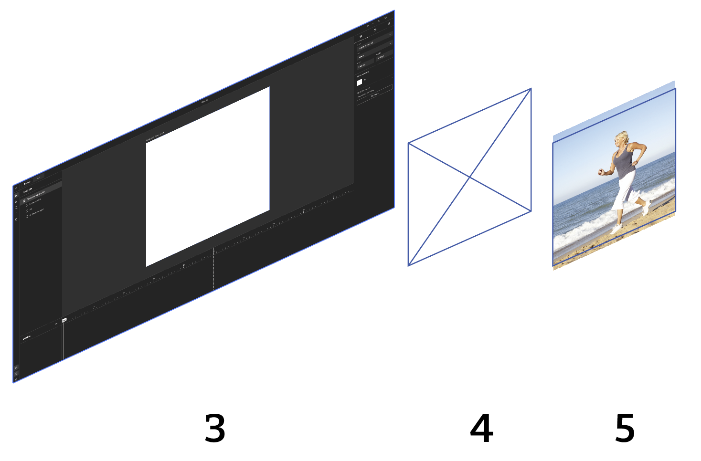
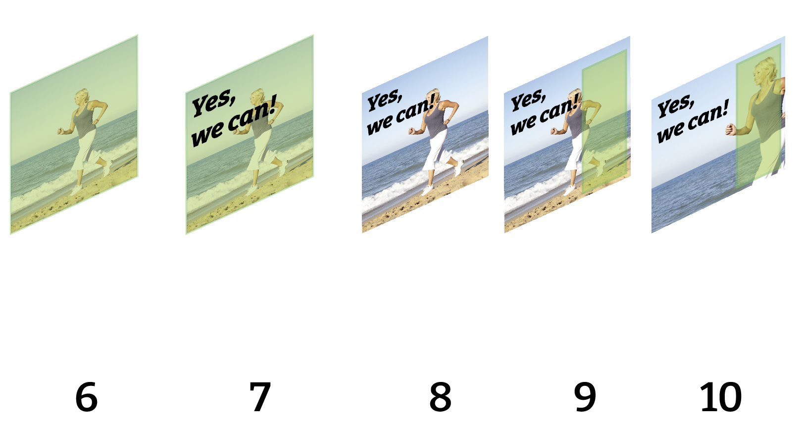
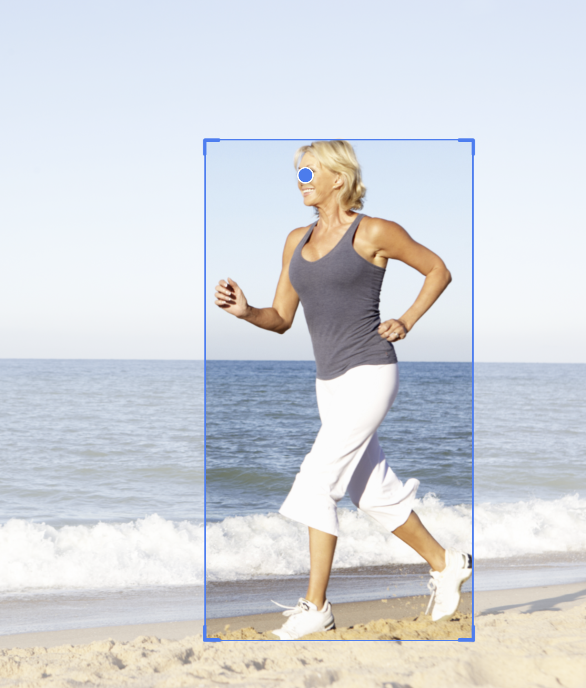

# GraFx Genie Smart Crop

## The Full Picture

Smart Crop begins in [GraFx Media](../../../GraFx-Media/concepts/genie-smart-crop/) and can then be utilized within GraFx Studio.

Smart Crop metadata can also be set within your external asset provider.

## Steps in GraFx Studio

The following steps explain how Smart Crop works within GraFx Studio:

- **Smart Template** (3).
- **Image frame** in the Smart Template (4).
- The image placed into the frame (5).  
  By default, the [Fill mode](../../guides/image-frame/?h=fill#fill-properties) is set to **Fill**.
- Set the Fill property to **Smart Crop**. (6)
- If text or other elements overlap your image frame, you can define a specific **Subject Position** area. (7)
- Click **Subject Position**, adjust the area to indicate where the primary subject should be placed, and apply it. (9)
- The image is repositioned automatically according to Smart Crop rules, respecting the defined Subject Position. (10)

## Rules of Smart Crop

Clear guidelines ensure consistent results:

- The defined **Subject Area** should completely fill the specified **Subject Position**.
- If whitespace appears, the image will scale up to fill the space automatically.

## How to Adjust Smart Crop Results

If the automatic Smart Crop results aren't as expected, you can manually adjust the settings.

!!! warning "Handle with Care"
    Manual adjustments might produce results that differ from the original automated detection.

### Adjusting the Asset
- Ensure there is sufficient space around the main subject in the original asset.  
  Without extra surrounding space, Smart Crop has limited room to adjust, potentially causing unwanted whitespace or scaling.

### Manual Crop Override

In certain use cases—such as lifestyle imagery—automatic cropping may not deliver the desired result.  
**Manual Crop Override** lets you fine-tune how an image appears inside a specific layout and frame.  
This override is stored per **image–layout–frame** combination and ensures that the next time this specific image is loaded in the same layout and frame, your custom crop position is preserved.

[Learn more about Manual Crop Override](../manual-crop-override/)

### Best Practices

- The Subject Area should fit closely around the primary subject.
- Place the Point of Interest exactly on the feature or individual you want to highlight, such as a person's eyes or an important object.

- Remember that metadata adjustments affect all templates using the same image.