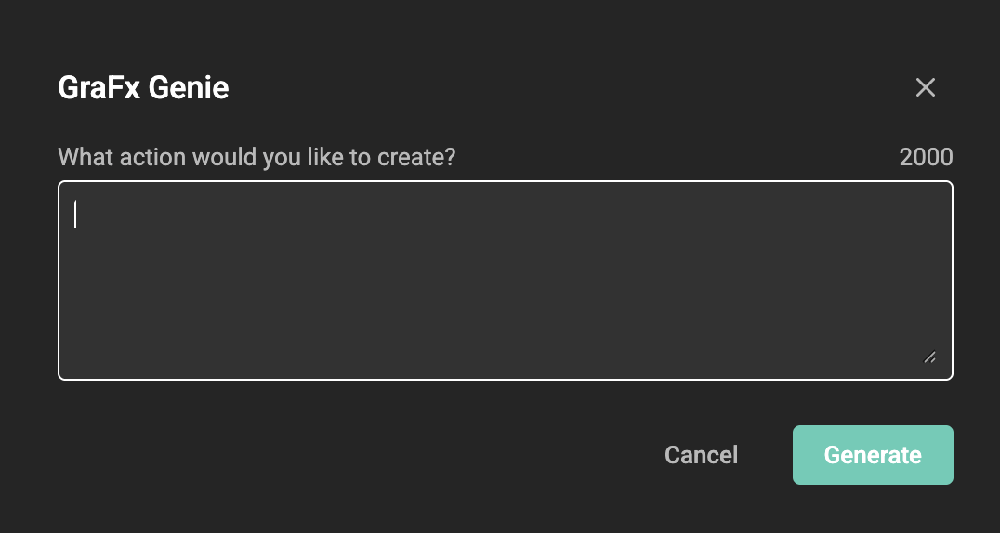

# GraFx Genie for Actions

## Introduction

You need to write an Action, to make your template into a Smart Template.

Challenge: You don't know how to write JavaScript code, to make this happen.

GraFx Genie is your go-to smart assistant for crafting [actions](/GraFx-Studio/guides/actions/create/) to support your templates. 

It's designed to assist you in creating actions, which play a vital role within triggers. See also: [Introduction to Actions](/GraFx-Studio/concepts/actions/)

## Example

You have a retail template. A template variable field allows the users of the template to enter a discount percentage.
When the discount drops below — let's say — 30%, you (as a template designer) want to show an extra asset, to hi-light the steep discount.

A template variable makes sure a user can change the discount.

Now, let's make an action that will be triggered when a template variable value changes.

To create the action, click on the Action tab.

You can now ask GraFx Genie to write the script for you.

Click on the GraFx Genie icon.

Ask GraFx Genie what functionality you need in your Smart Template

GraFx Genie will now suggest a JavaScript you can use to perform the functionality.

As you see, GraFx Genie knows about the context. Without specifying that discount is a template variable name, it will understand and use this information to write the script.

If you're not 100% convinced, you can still tweak the script, or ask a Developer colleague to take a look for the final touches.