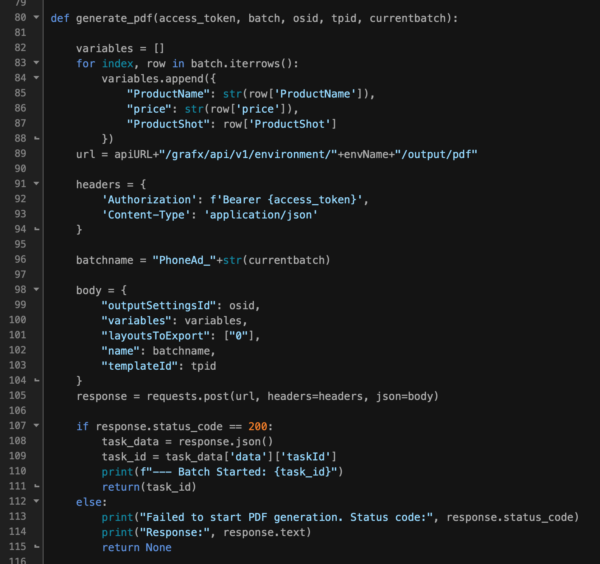

# Headless or automated

In the context of CHILI GraFx, **"Headless"** or **"Automated"** refers to the ability to produce design variants by interacting directly with the API, without using the graphical interface of GraFx Studio.

This approach is ideal for scenarios where you want to automate the creation of large batches of content, integrate with external systems, or streamline workflows that don't require manual input. By leveraging the API, you can:

- **Generate Variants at Scale**: Automatically create hundreds or thousands of variations without manual intervention.
- **Integrate Seamlessly**: Connect GraFx Studio with your existing systems, like DAMs, PIMs, or e-commerce platforms.
- **Run Background Processes**: Initiate batch jobs and monitor output tasks programmatically.

Headless automation empowers you to use the powerful capabilities of GraFx Studio while keeping everything behind the scenes, providing flexibility and efficiency for high-volume or fully automated workflows.

