# Actions Helper Functions

## Introduction

Actions are defined in the Automation panel, Actions & Variable tab.

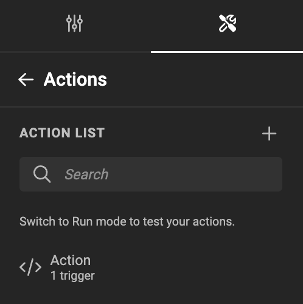

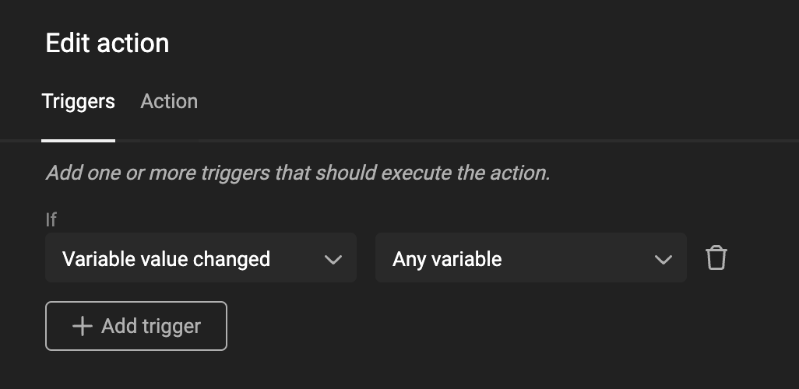
 
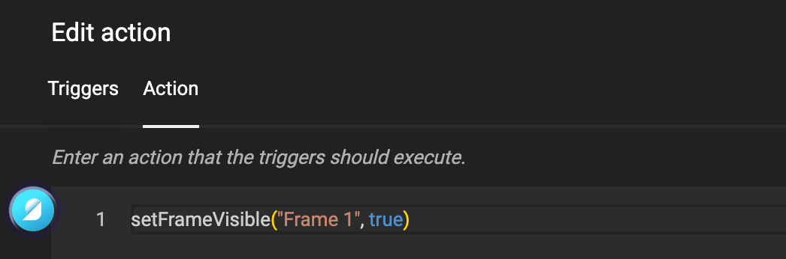

When writing actions, you can start with the base objects, and with the dot-notation drill down to the function or value you're looking for.

To help you with the speed of coding, we added a set of Helper Functions.

E.g. You want to copy the color value of one character style to another.

Without helper functions

```js
studio.stylekit.colors.copy("characterstyle1", "characterstyle2");
```

When writing code, add a dot, and the Action Editor will suggest possible functions that are relevant in this context.

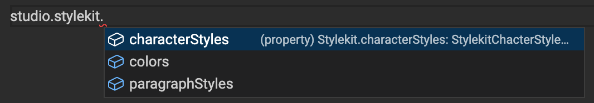

For many often used functions, we created helper functions.

With helper Functions

```js
copyColorFromTo("characterstyle1", "characterstyle2")
```

### How to find the right function?

There are several approaches, to finding the function you might need.

#### Get and Set

For certain objects, you can "set" a parameter or "get" information about an element on the page. When you type "get" or "set", a list of relevant functions will appear.

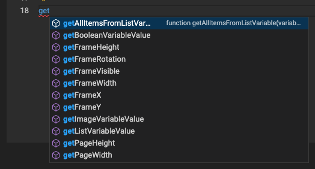

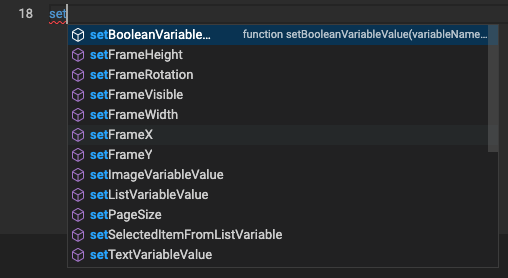

#### Keywords

Another method to identify a helper function is to begin typing a keyword that seems relevant to you, such as: frame, variable, document, page, etc. The Action editor will then suggest a list of related helper functions.

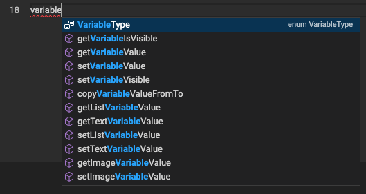

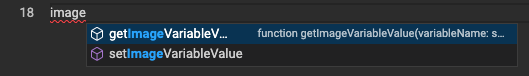

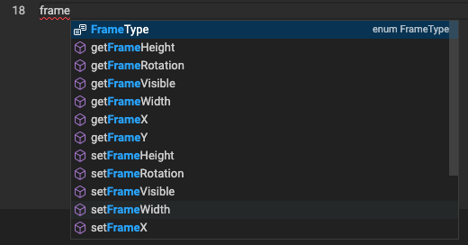

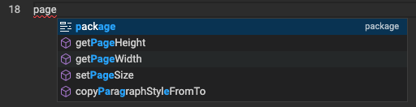

#### Category names

Alternatively, you can start typing one of the [4 categories](#groups-of-functions) of functions (detailed below). The Action Editor will display a list of available functions.

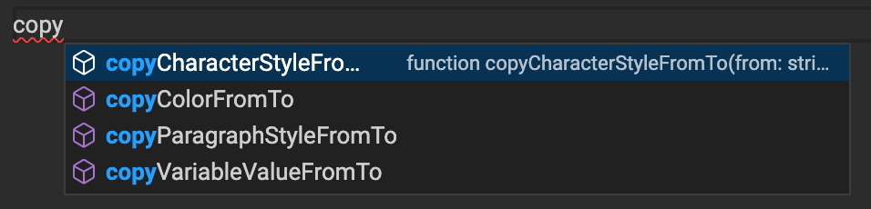

#### Combine methods

If you're unsure about what you're looking for, begin by typing one of the categories. Browse the list, familiarize yourself with the options, and then re-enter using keywords you recognize and deem relevant. This approach will help you navigate more efficiently.

<script src="https://fast.wistia.com/embed/medias/xu3o7hf5hb.jsonp" async></script><script src="https://fast.wistia.com/assets/external/E-v1.js" async></script><div class="wistia_responsive_padding" style="padding:56.25% 0 0 0;position:relative;"><div class="wistia_responsive_wrapper" style="height:100%;left:0;position:absolute;top:0;width:100%;"><div class="wistia_embed wistia_async_xu3o7hf5hb seo=false videoFoam=true" style="height:100%;position:relative;width:100%">&nbsp;</div></div></div>

## Parameters

A function requires info or input to handle your request. This input is sometimes referred to as "**parameters**".

There is no need to learn them by heart. When you start typing a function end with an open bracket "**(**", and the Action Editor will show an info panel what info to expect.

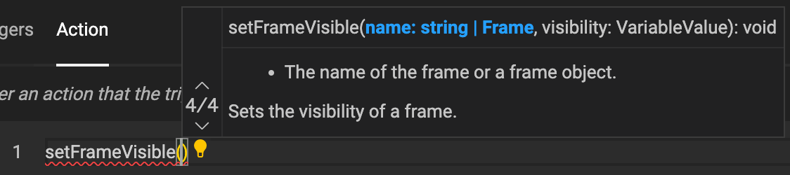

In this case, the function needs the name of a frame (as a String, i.e. text) and also needs the state of visibility: True or False.

Parameters are separated by a comma ","

## Groups of functions

Helper functions are grouped into 4 types:

	- Copy
	- Get
	- Set
	- Select
	
### Copy

A copy function will copy values from one location to another.

	- copyCharacterStyleFromTo
	- copyColorFromTo
	- copyParagraphStyleFromTo
	- copyVariableValueFromTo

### Get

A get function will retrieve a value

	- getAllItemsFromListVariable
	- getBooleanVariableValue
	- getFrameHeight
	- getFrameRotation
	- getFrameVisible
	- getFrameWidth
	- getFrameX
	- getFrameY
	- getImageVariableValue
	- getListVariableValue
	- getPageHeight
	- getPageWidth
	- getSelectedItemFromListVariable
	- getSelectedLayoutName
	- getTextVariableValue
	- getTriggeredFrameName
	- getTriggeredLayoutName
	- getTriggeredVariableName
	- getTriggeredVariableValue
	- getVariableIsVisible
	- getVariableValue

### Select

This specific function sets the active Layout to the specified Layout.

	- selectLayout

### Set

Set functions allow you to set a property of an object.

E.g. If you want a frame to be Invisible, you can 

```js
	setFrameVisible("Frame 1", false)
```

	- setBooleanVariableValue
	- setFrameHeight
	- setFrameRotation
	- setFrameVisible
	- setFrameWidth
	- setFrameX
	- setFrameY
	- setImageVariableValue
	- setListVariableValue
	- setPageSize
	- setSelectedItemFromListVariable
	- setTextVariableValue
	- setVariableValue
	- setVariableVisible
	
	
!!! info "For the JavaScript geeks ..."
	The CHILI GraFx SDK is an open source project. It's a wrapper around the core technology, that enables our GraFx Studio Editor. We keep a list of the Helper Functions, and since it's source code, you will see more details about the function and its requirements. [List of Helper Functions in the SDK](https://github.com/chili-publish/studio-sdk/blob/main/packages/actions/src/ActionHelpers.ts)