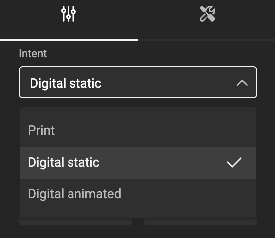
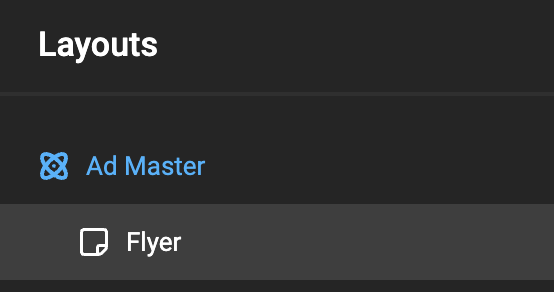
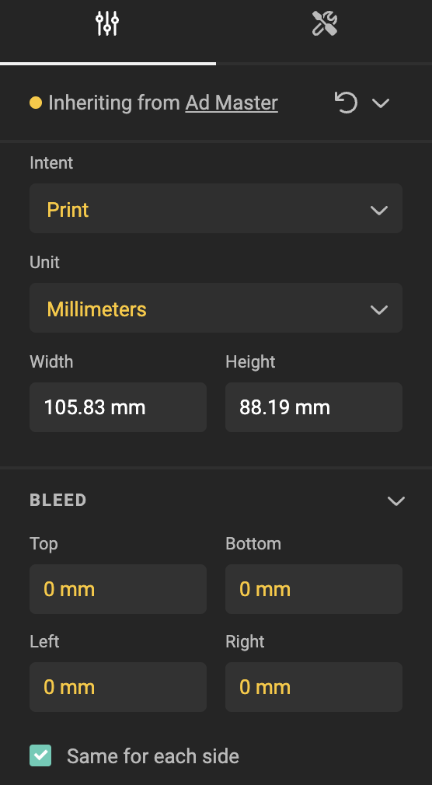
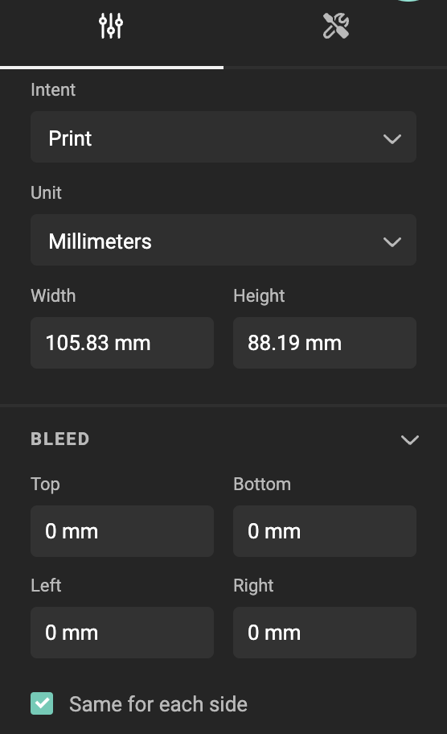
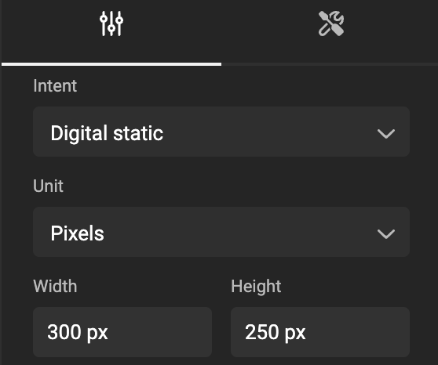
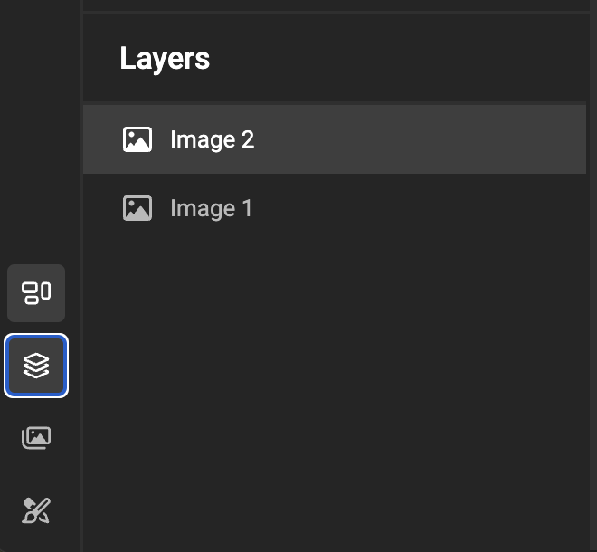
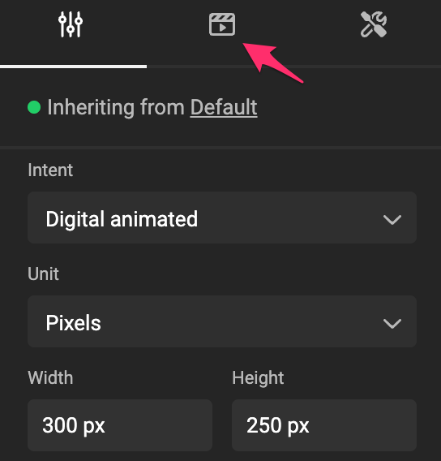
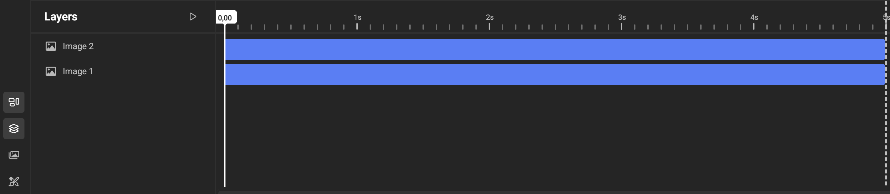

# Layout Intent

Intents enhance the functionality of layouts. Each layout now includes an "Intent" property with three possible values: 

- Print 
- Digital static
- Digital animated

This property provides contextual guidance for both Template Designers and end users.

## Inheritance model

Intents are part of the [Inheritance model](/GraFx-Studio/concepts/layouts/#inheritance).

An Intent defined for a master layout automatically applies to all sub-layouts. If needed, Intent can be individually adjusted for each sub-layout, overriding the inherited default.

Imagine a Layout setup: an Ad Master layout (Digital static), and a Flyer sub-layout intended for Print.

Since the Print layout overrides the intent, the overridden values are colored.
The size did not color, since it's converted from Pixels, and will reflect the same size (converting using 72dpi).

## Print

- Units will default to Millimeters
- [Bleed](/GraFx-Studio/concepts/bleed/) properties are visible
- Animation properties are hidden
- Animation timeline is hidden

## Digital static

- Units will default to Pixels
- [Bleed](/GraFx-Studio/concepts/bleed/) properties are hidden
- Animation properties are hidden
- Animation timeline is hidden

## Digital animated

- Units will default to Pixels
- [Bleed](/GraFx-Studio/concepts/bleed/) properties are hidden
- Animation properties are visible
- Animation timeline is visible

