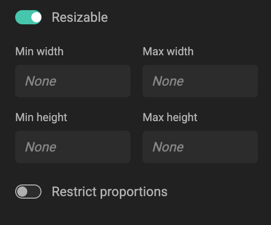
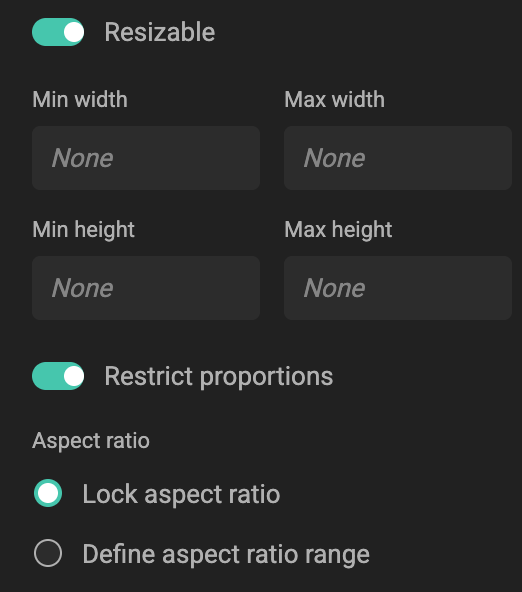

# Template Size Constraints

For Template Designers: understand how size constraints keep templates usable, technically valid, and visually consistent when end users resize them. [Anchoring](/GraFx-Studio/concepts/anchoring/) will make sure that frames reposition according to set rules.

By default, a template can be resized freely in GraFx Studio. To ensure quality and brand integrity, you can add **size constraints**. These constraints define how far resizing can go — both in absolute dimensions and in proportions.

## Why use constraints

### Digital use cases
For most digital channels, the size is fixed and known in advance.  
- Example: Social media platforms require assets in specific pixel dimensions.  
- Result: Constraints are rarely needed, since you usually design to the fixed sizes required.

### Print use cases
In print, some formats are standardized (e.g., Letter, A4, business cards), but in many cases, the final size depends on the end user.  
- Example: A magazine ad may need to adapt to the publisher’s format, or a poster may need to fit a custom frame.  
- Resizing makes this possible — and constraints allows you to set limits to keep the output sensible.

## Two types of constraints

### 1. Dimension limits
When **Resizable** is enabled in layout settings, you can set:
- **Min width / Max width**  
- **Min height / Max height**  

These values define the absolute size range for the layout.

{.screenshot}

### 2. Aspect ratio restrictions (optional)
In addition to dimensions, you can control proportions by enabling **Restrict proportions**.

- **Lock aspect ratio**: Width and height always scale together.  
    - Example: A circular sticker locked at 1:1 always remains round.  

- **Define aspect ratio range**: Allow resizing within a ratio window (width ÷ height).
    - Example: A banner can be resized between 3:2 (1.5) and 3:1 (3.0), but not as a square.  

If users try to resize outside the allowed range, they’ll see a warning.

{.screenshot}

## Related

- [How to set template size constraints](/GraFx-Studio/guides/layout-size-constraints/)