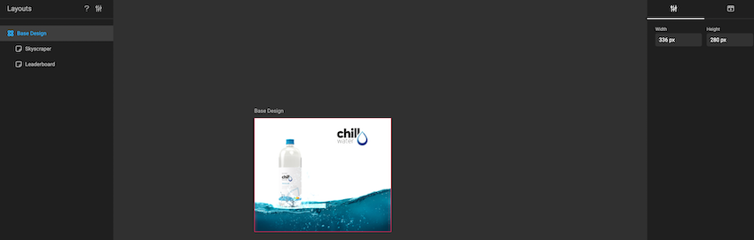
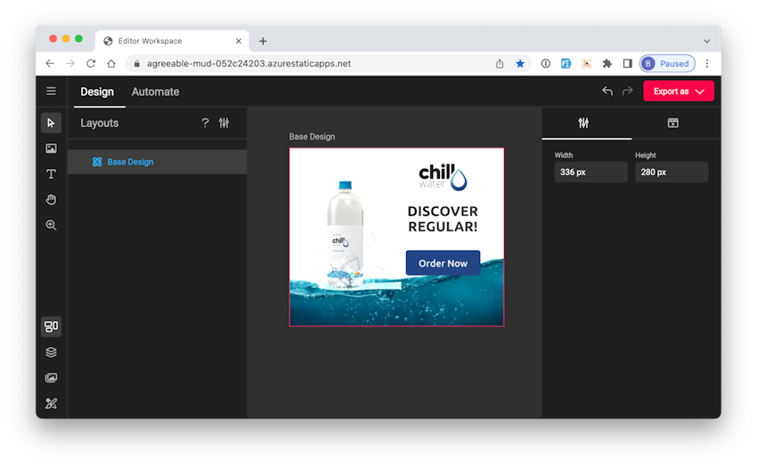
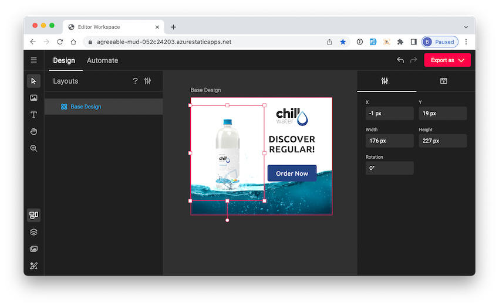
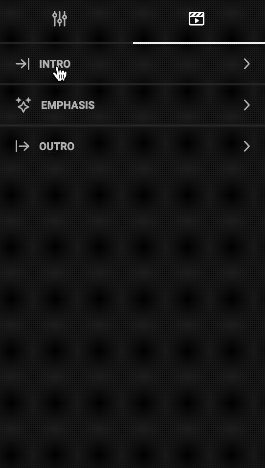
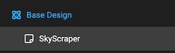
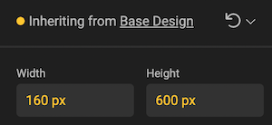
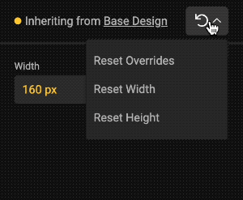

# Layouts

{.screenshot-full}

Layouts is a concept to reduce the time to produce variants, by creating several variants from the same document.

## Think different

Instead of thinking about output in your design, think by grouping concepts.

A leaderboard or skyscraper ad are conceptually very similar. The only difference is the dimensions or proportions. Even a square ad could be derived from the leaderboard design.
If the content is similar, then it's probably a good candidate for a layout.

Even the animation of elements can be different. In a leaderboard you could animate an item from the far left, and in the skyscraper from the bottom. These parameters can be set differently per layout.

## The basic setup

This design could be an abstract version, or a first version of the add.

The properties of the design can be found on the right, in the properties panel.

{.screenshot}

The properties of the elements on the page are shown when you select the element.

{.screenshot}

The properties of the animation of the elements show when you select the animaction icon in the properties panel.

Click on **intro**, **emphasis** and **outro** to expand the respective properties.

{.screenshot-full}

## Inheritance

### Master vs. Sub-layout

In the properties panel you see values "Inheriting from [Layout]".

This means that values for this property have been taken from the master of this layout.

{.screenshot-full}

The master of this layout is the one above the current layout, in the Layout menu.

In this example **Base Design** is the master for **Skyscraper**, and **Skyscraper** is the current layout.

When switching layouts, the document will zoom to fit.

{.screenshot}

When a value is colored (and the bullet next to **inherited** is colored), it means the current value for this layout is different than the master's value.

If it's white, it's the value taken from the master.

### Reset inherited values

{.screenshot-full}

Reset all values, or only individual values by the left-turning arrow. A dropdown will provide you with the options to reset to the master's values.

## Private data

Besides its visual properties, a layout can carry [Private Data](/GraFx-Studio/concepts/private-data/): key-value pairs that are invisible in GraFx Studio and to the end user, but readable by a custom integration. It is how an integration can tell what a format is meant for — a channel, a placement, an identifier in your own system — without that showing up anywhere in the interface.

See [Private data on layouts](/GraFx-Studio/guides/layouts/#private-data) for how to set it.