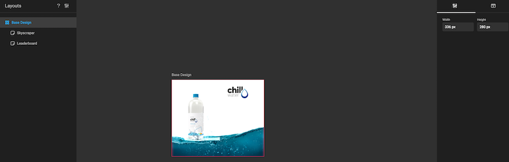
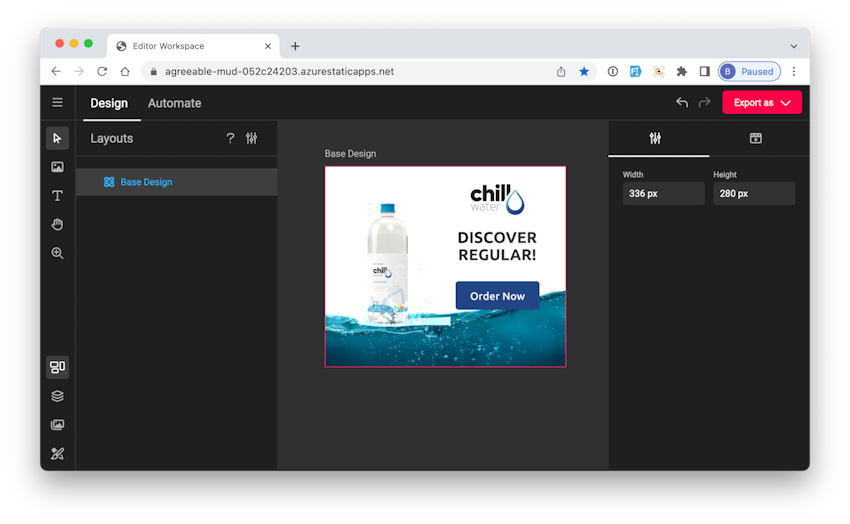
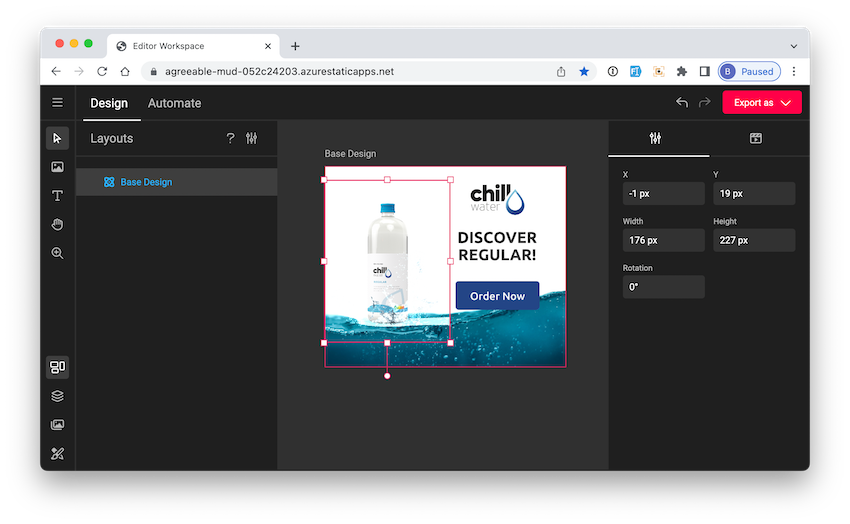
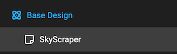
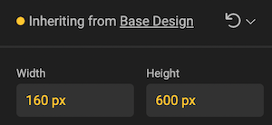
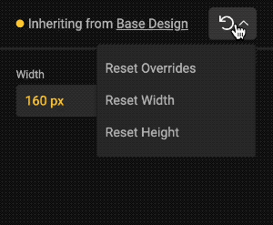

# Layouts

Layouts is a concept to reduce the time to produce variants, by creating several variants from the same document.

## Think different

In stead of thinking about ouput in your design, think by grouping concepts.

A leaderboard or skyscraper add are conceptually very similar. The only difference are the dimensions or proportions. Even a square add could be derived from the leaderboard design.
If the content is similar, then it's probably a good candidate for a layout.

Even the animation of elements can be different. In a leaderboard your could animate an item from the far left, and in the skyscraper from the bottom. These paramaters can be set different per layout.

## The basic setup

This design could be an abstract version, or a first version of the add.

The properties of the design can be found on the right, in the properties panel.

The properties of the elements on the page are shown when you select the element.

The properties of the animation of the elements show when you select the animaction icon in the properties panel.

Click on **intro**, **emphasis** and **outro** to expand the respective properties.

## Inheritance

### Master vs. Sub-layout

In the properties panel you see values "Inheriting from [Layout]".

This means that values for this property have been taken from the master of this layout.

The master of this layout is the one above the current layout, in the Layout menu.

In this example **Base Design** is the master for **Skyscraper**, and **Skyscraper** is the current layout.

When switching layouts, the document will zoom to fit.

When a value is colored (and the bullet next to **inherited** is colored), it means the current value for this layout is different than the master's value.

If it's white, it's the value taken from the master.

### Reset inherited values

Reset all values, or only individual values by the left-turning arrow. A dropdown will provide you with the options to reset to the master's values.