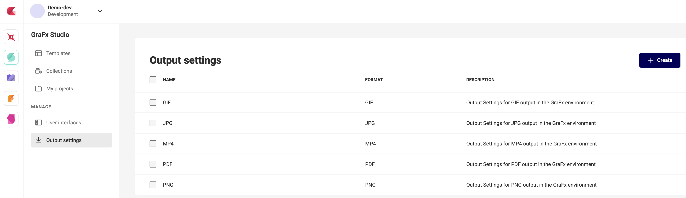

# Output settings

"Output settings" in GraFx Studio allows template designers and admins to tailor settings for various outputs like PDFs, images, and animations. 

Template designers and admins can fine-tune parameters such as scaling and quality, saving these configurations for consistent, efficient production. 

This reduces repetitive setup for diverse output needs, streamlining workflow and minimizing errors. 

## API

Look for the [REST API](/GraFx-Developers/#environment-api) calls in your [Environment API](/GraFx-Developers/#environment-api) to enable integrators to automate the making and managing of settings.

/api/v1/environment/{environment}/output/settings/xxx
