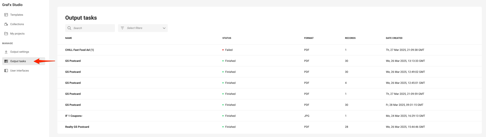

# Output Tasks

## Overview

**Output Tasks** represent each job initiated within that environment to create output for GraFx Studio. This concept applies to both output jobs started from Studio UI, Template Designer Workspace and those triggered through the API.

```sh
/api/v1/environment/{environment}/output/pdf
```

Each output job is listed as an **Output Task** in the system, providing visibility into the status and details of all output jobs. The **Output Task List** allows users to monitor and manage the output tasks.

## Accessing the Output Task List

The **Output Task List** can be accessed through the **Environment Settings**. Here, users (Template Designers, Subscription Admins and Environment Admins) can view all the output jobs associated with the current environment.




## Output Task List Columns

The Output Task List contains several key details for each job, organized in the following columns:

- **Name**: Displays the name of the document associated with the output job.
- **Status**: Shows the current status of the output task. Possible statuses include:
    - *Started*
    - *Pending*
    - *Processing*
    - *Failed*
    - *Finished*
- **Format**: Indicates the output format, such as PDF, PNG, MP4, GIF.[^1]
- **Records**: Reflects the number of records in the current batch. For example, if a batch of 100 records is split into 4 tasks of 25 each, the user will see four separate output tasks listed.
- **Date Created**: The date and time when the output job was initiated.

[^1]: Non-pdf output is listed here if it's a single output, batch output is only for pdf


Behind the "..." menu, you can also 

- Copy Task ID
- Copy User Information
- COpy Row Information
    

    
**Task ID** Copies the unique ID (GUID) used for the task. Using API calls, this task ID is used to poll the status of the task.

```JSON
    84ad7436-f82f-4e87-8cd3-37299e37878c
```

**User Information** provides a JSON structure with the information about the user started the task.

```JSON
{
    "id":"samlp|chili-publish-prd|lfB36OFPlzFI-wKmwAb0cZx4hlL--1234",
    "email":"someuser@chili-publish.com",
    "firstName":"Some",
    "lastName":"User",
    "avatar":"https://example.com/someuser.png",
    "lastSeen":1726227211,
    "status":"Pending",
    "subscriptionRoles":["SA"],
    "environmentRoles":null,
    "createdAt":1689165295,
    "isFederated":true,
    "membershipType":"Invitation"
}
```

**Row Information**
```JSON
{
    "id":"4095149a-745e-465b-95be-5b0518321a14",
    "name":"Businesscard",
    "dateCreated":"2024-09-18T15:35:17.759154",
    "dateProcessed":"2024-09-18T15:35:19.079",
    "format":"PNG",
    "totalRecords":1,
    "status":"Finished",
    "source":"Template",
    "owner":"samlp|chili-publish-prd|lfB36OFPlzFI-wKmwAb0cZx4hlL--qo3J7NqTmSZAu0",
    "outputAvailable":false
}
```

## Understanding Output Tasks

Whenever an output job is created—either manually from the front-end or automatically via an API call—it is tracked as an **Output Task**. This provides users with the ability to track the job’s progress and its corresponding output.

### Output from the Template Designer Workspace

When users create output directly from the CHILI GraFx front-end, a new **Output Task** is immediately added to the list. Users can check the task’s status and see details like format, records, and more.

Output task is accessible for other users.

### Output generated from Project

User cannot access outputs of other Users

### Output from the API

API-triggered output jobs are also listed as **Output Tasks**. Whether triggered through external applications or scripts, all API-based outputs are treated and tracked just like front-end jobs.

### Availability

Tasks remain available for 7 days

Download remains available for 4 hours