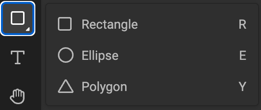
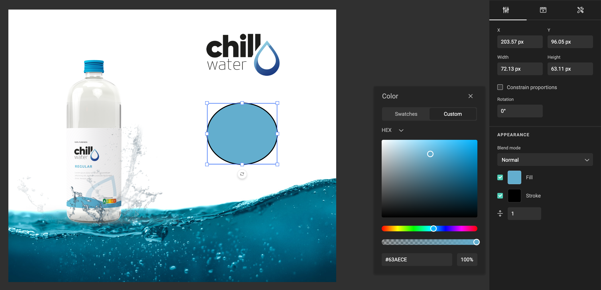
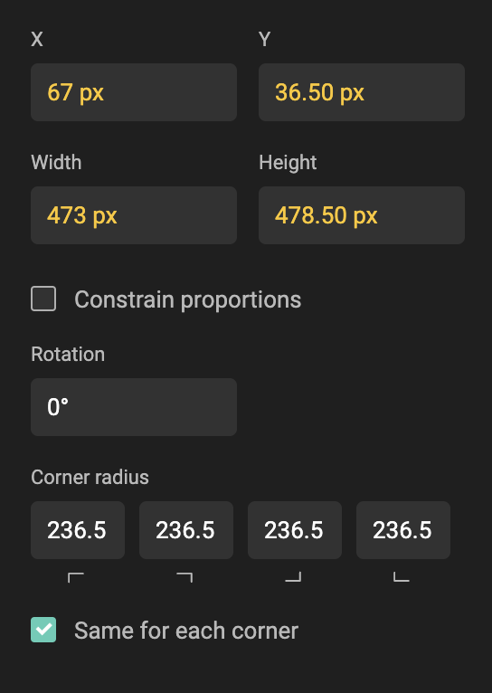

# Shapes

A shape frame can be drawn by holding down the left mouse button click and dragging the cursor as desired or by a single click on the canvas. A single click on the canvas will create a proportional shape. (Always 100 by 100 px).

Select (R) for rectangle

Select (E) for ellipse

Select (Y) for polygon (don't ask Y)

{.screenshot}

{.screenshot-full}

## Shape properties

- X (inherited property)
- Y (inherited property)
- Width (inherited property)
- Height (inherited property)
- Constrain proportions
- Rotation (inherited property)
- Corner radius

{.screenshot}
