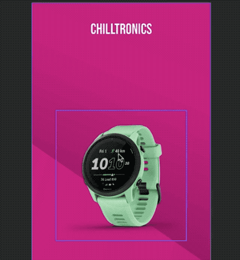

# Snapping

When dragging frames around, you'll see bright lines appear.

These lines are allignment guides, that align with other objects and reference points on the canvas.

## Snap points

The object you drag has several referenes to align to

- Frame borders
- Frame center

Guides appear when allignment to these references is close to

- Layout borders (top, bottom, left, right)
- Other frame references (top, bottom, left, right, center)

## Easter Egg

Have you found the easter egg in the GraFx Publisher snapping settings?