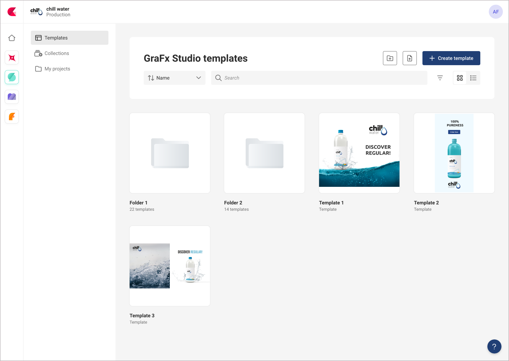
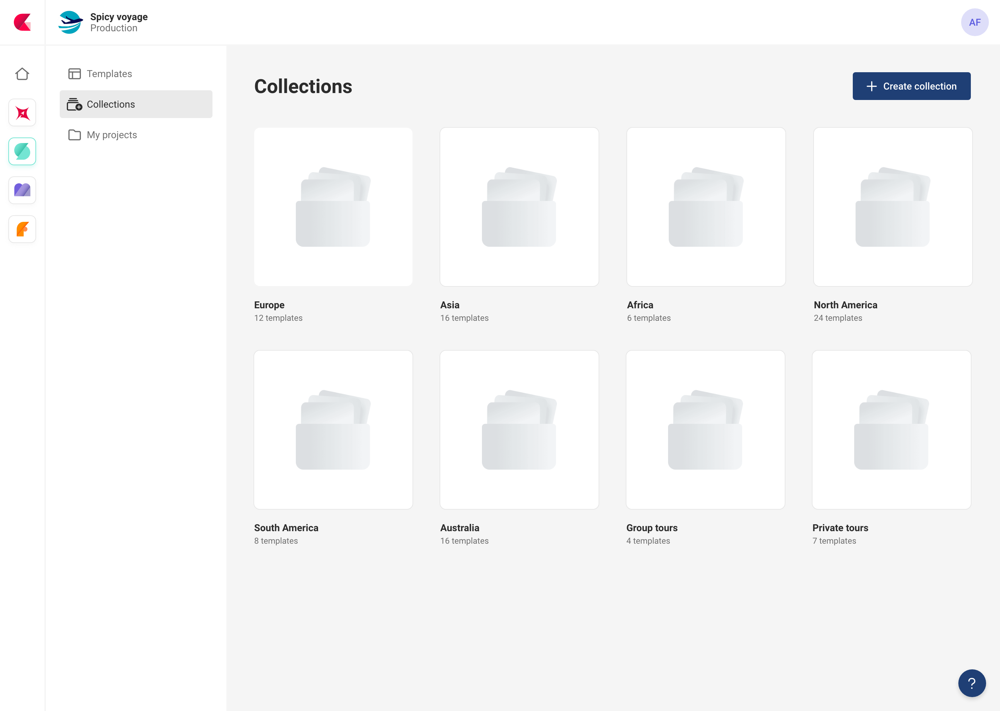
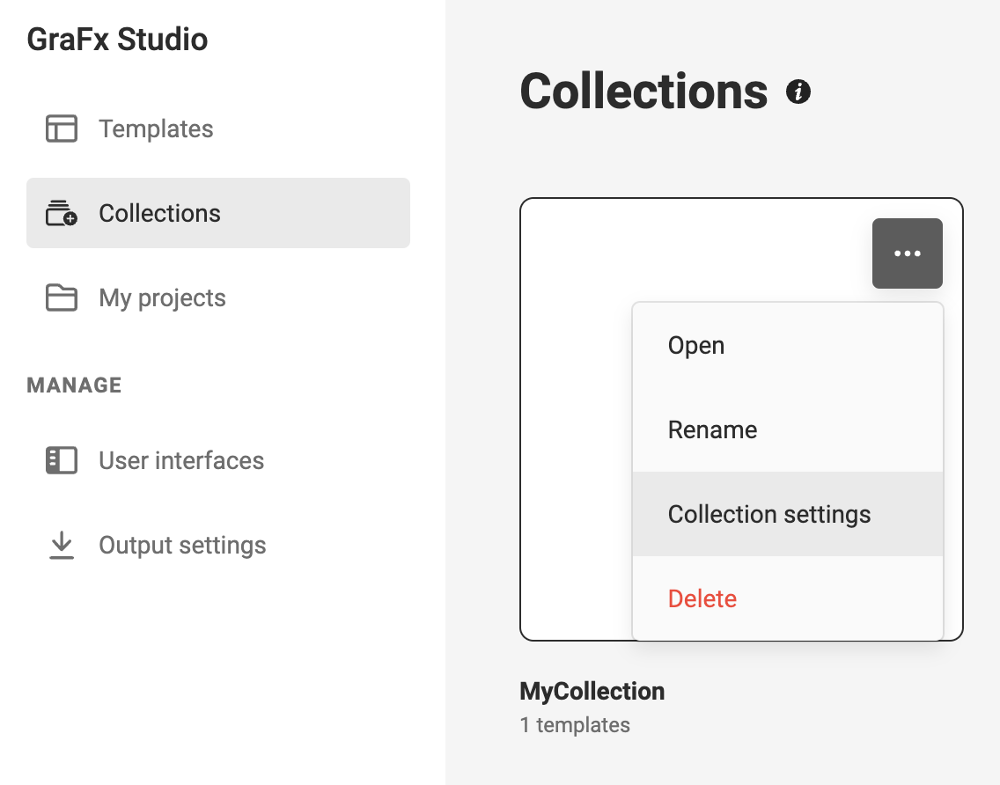
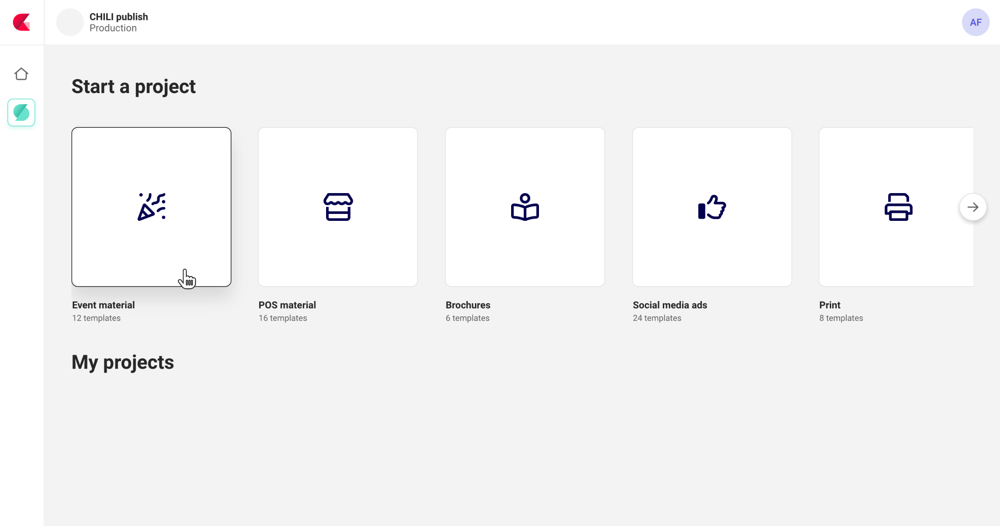

# CHILI GraFx Template Management

This page describes the process of creating a template, making it available for end users, and allowing end users to customize and use the template to create different versions or variants.

## Templates or Composition model

**What is a Template?**

A template refers to a pre-designed document that serves as a starting point for creating multiple **variants** or iterations of a design. It contains **placeholders**, **guidelines**, and **predefined elements**, allowing designers, end users, or automation tools to easily **customize** specific aspects while maintaining consistency and efficiency in the design process.

Templates are typically created by experienced designers who establish the visual and functional framework for a particular type of design, such as brochures, posters, websites, or social media posts. These templates can include various components like typography, color schemes, imagery placeholders, and other design elements that are common to the specific design type.

A GraFx Studio template is created by a template Designer using [GraFx Studio](/GraFx-Studio/).

## User Interface

**What is a User Interface?**

A User Interface is a placeholder to gather settings for each Layout Intent. In stead of having to set different settings to achieve your desired outcome, you can group them in 1 "User Interface"

## Template collection

**What is a Template collection?**

A Template Collection is a group of GraFx Studio templates.

A collection will serve as a basis for end users to start creating "Projects".

## My projects

**What is "My projects"?**

“My projects” is the concept in CHILI GraFx, where an end user can start the creation of a variant, based on a template from a Template Collection.

An end user starts a "project" (document) by choosing a template from a Template Collection. 

The template is saved in "My Projects".

## Studio UI

**What is the Studio UI?**

The Studio UI is the page for end user, with ease of use in mind.

Only limited elements need to be provided to make a variant or version of a template. These elements are offered in an end-user friendly way, we call this the Studio UI.

## Process

With the above elements in mind, this could be the process.

### Create a Smart Template

A Template Designer creates a GraFx Studio template. The template is stored in the Environment, under "Templates".

### Add to collection

In the contextual menu, add the template to a collection.

If the collection does not exist yet, add it via "Collections"

### Set the User Interface

Define the User interface that will be used for this collection.

### End-user

An end user will see the available collections under "My Projects".

(End-user view with no Environment Admin access, nor Template Designer access)

After opening the Collection, the end user chooses a template

The project is opened in the Studio UI interface. This shows only the relevant information to make a variant from the template.

Projects from end users are stored under My Projects

