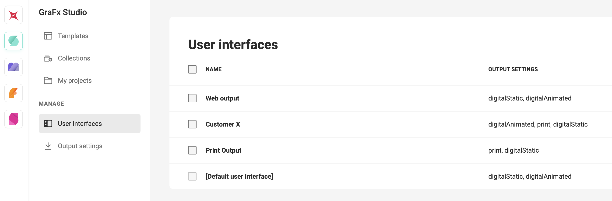
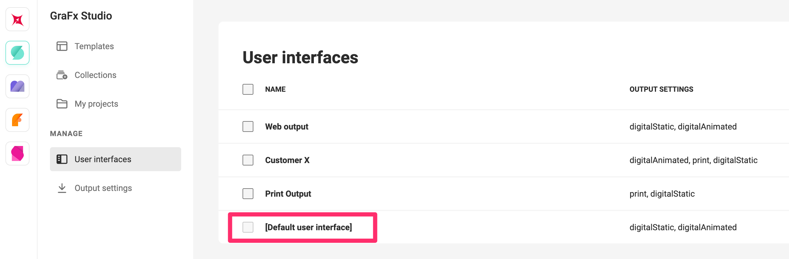

# User Interface

A User Interface is a placeholder to gather settings for each Layout Intent. In stead of having to set different settings to achieve your desired outcome, you can group them in 1 "User Interface"

You can define User Interfaces for specific customers (because they use specific output settings) or for specific intended use cases.

## Output settings

For each of the three [Layout Intents](/GraFx-Studio/concepts/layout-intent/) you can add 1 or more Output Settings.

Before you do, define [Output Settings](/GraFx-Studio/concepts/output-settings/), and then you can add them for the specific Layout Intent.

## Default User Interface

A default User Interface setting is available (recognize by square brackets), and cannot be deleted.

You can change the settings for the default.

## Access

User Interfaces are only accessible for users with one of these roles

- Subscription admins
- Environment admins
- Template designers

See also [Roles](/CHILI-GraFx/users/roles/#roles)