# User Interface

A **User Interface** is a configuration that groups settings for a specific [Layout Intent](/GraFx-Studio/concepts/layout-intent/). Instead of configuring individual settings separately, you can define a single User Interface to apply them together.

{.screenshot-full}

User Interfaces can be created for specific customers (e.g. to match output requirements) or for targeted use cases.

## Output settings

For each Layout Intent, you can add one or more [Output Settings](/GraFx-Studio/concepts/output-settings/).

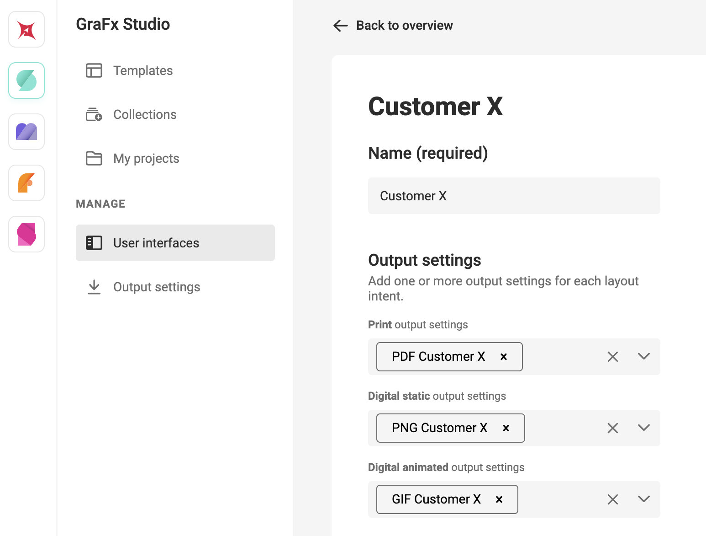{.screenshot-full}

Before assigning them in the User Interface, make sure you’ve defined your Output Settings.

## Default User Interface

A default User Interface is always available. It is recognizable by square brackets and cannot be deleted.

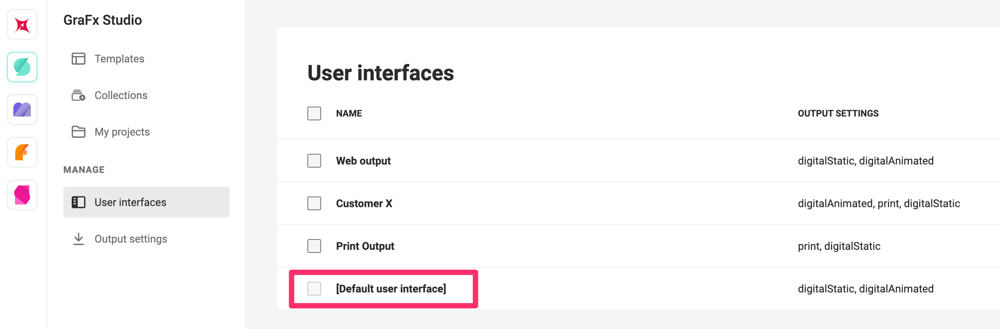{.screenshot-full}

You can still modify its settings.

## Form builder

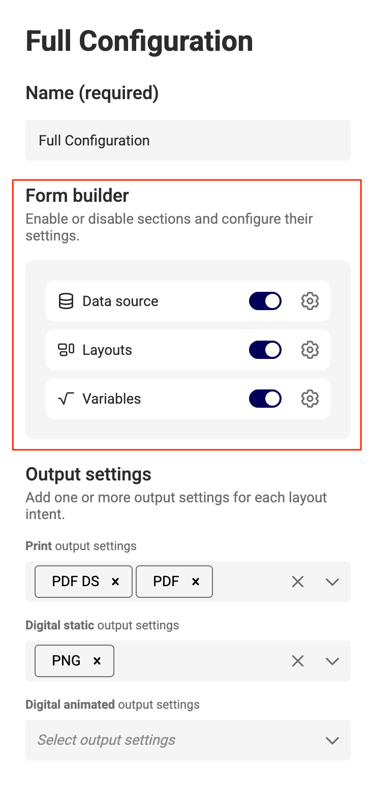{.screenshot-full}

User Interfaces also control the visibility and labeling of the form shown in the [My Projects](/GraFx-Studio/concepts/template-management/#my-projects) area of GraFx Studio. This is where end users create variations of Smart Templates stored in [Collections](/GraFx-Studio/concepts/template-management/#template-collection).

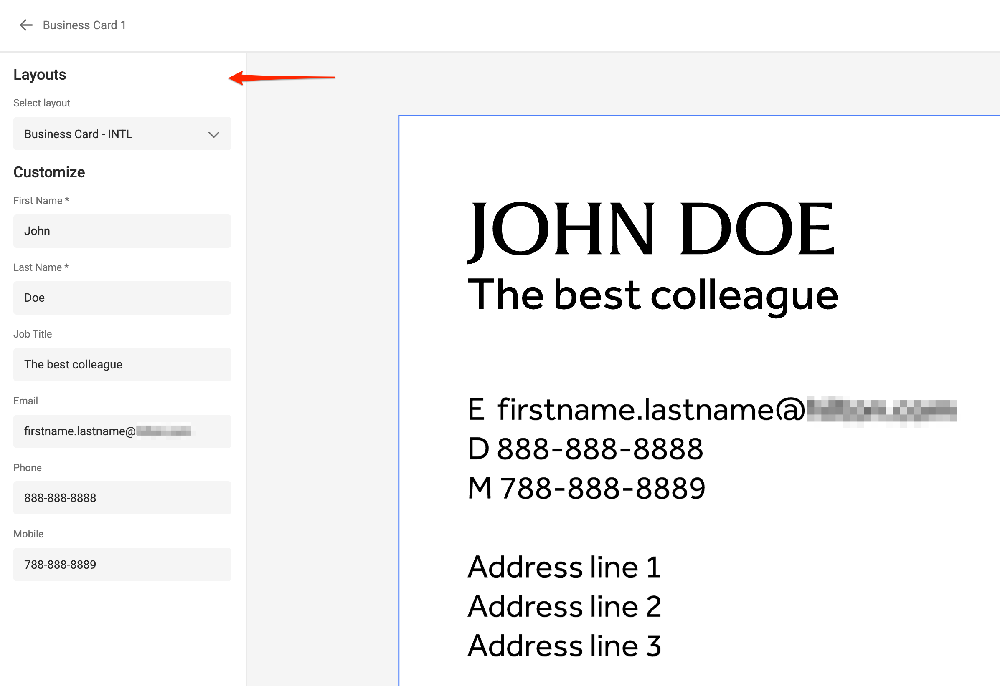{.screenshot-full}

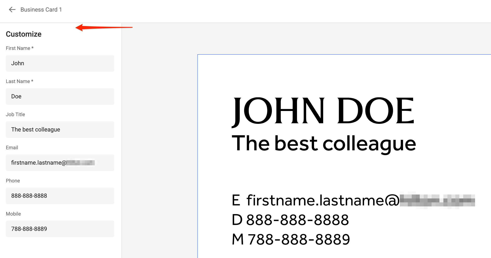{.screenshot-full}

Depending on the User Interface configuration, end users will see more or fewer options when creating a project.

[Template designers](/CHILI-GraFx/users/template-designer/) can toggle the visibility of the following form sections:

- **Data Sources** — show or hide the data source selector
- **Layouts** — show or hide the layout selector and configure related options
- **Variables** — show or hide the variables input panel

| 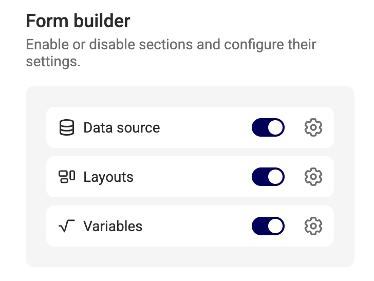{.screenshot-full} | 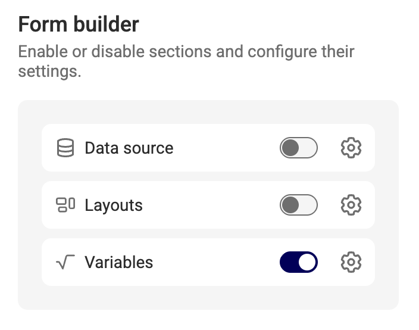{.screenshot-full} |
|:--|:--|
| *All sections visible* | *Only Variables visible* |

For each section, you can:

- Set a **Section heading**
- Add optional **help text**

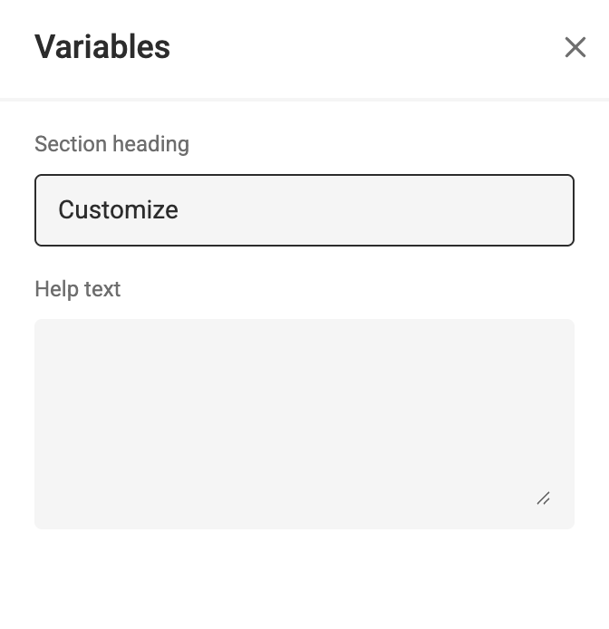{.screenshot}

### Layout-specific options

If the **Layouts** section is enabled, you can configure two additional options:

- **Layout selector** — toggles whether the layout dropdown appears
- **Layout resizing** — toggles whether the layout resizing option is available

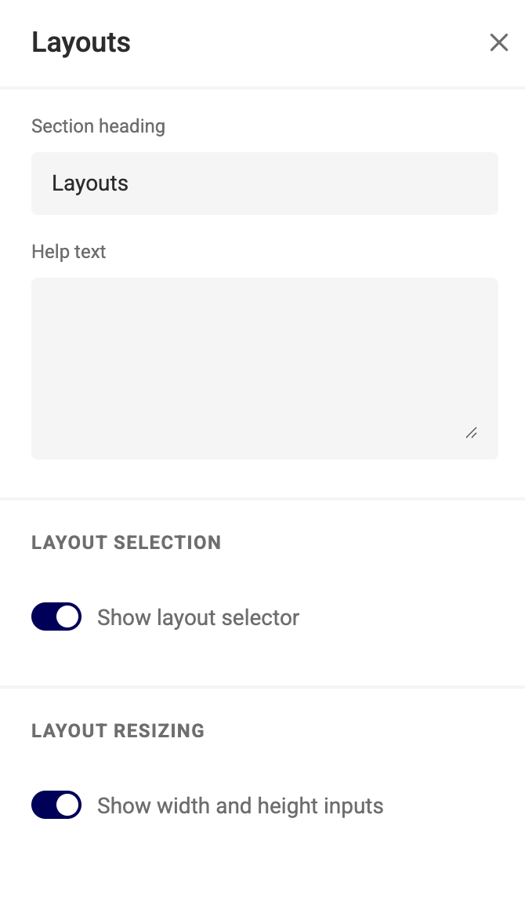{.screenshot}

!!! info
    For layouts to appear in the selector, they must be marked as **available** in the Smart Template.  
    Similarly, layout resizing must be enabled in the template before it can be used.

    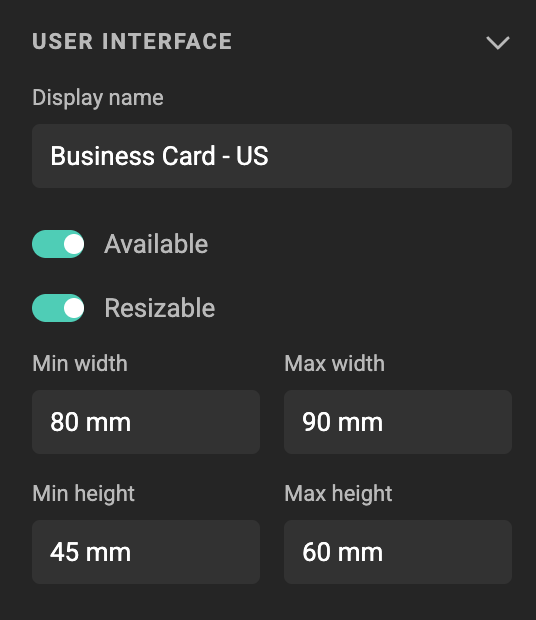{.screenshot}

    [See also: Layouts in GraFx Studio](/GraFx-Studio/guides/layouts/#layouts-in-the-studio-ui)

The result: the User Interface settings determine what is shown in **My Projects**, as long as the Smart Template supports those features.

### Variable-specific options

If the **Variables** section is enabled, one additional option is available:

- **Show variable groups** — toggles whether variables are displayed in their defined groups or as a flat list

Click the settings icon next to **Variables** to open the variables panel.

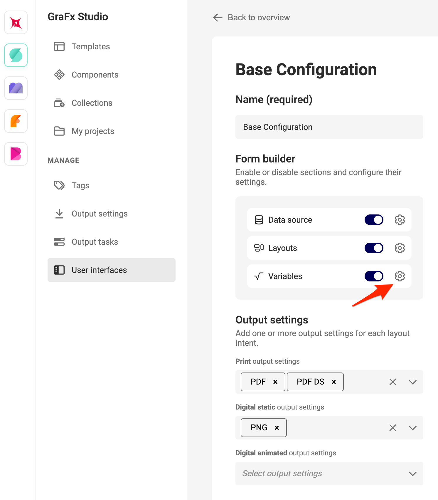{.screenshot}

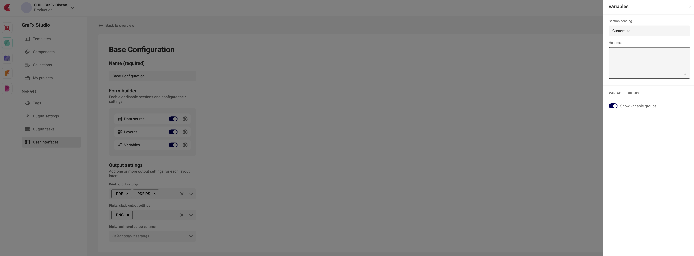{.screenshot}

When enabled, end users see variables organized by the groups defined in the Smart Template. When disabled, all variables appear as a single flat list, regardless of how they are grouped in the template.

!!! info
    Variable groups are defined in the **Variables** panel of the Template Designer Workspace. If no groups are defined in the template, this setting has no visible effect.

### Preview in Run Mode

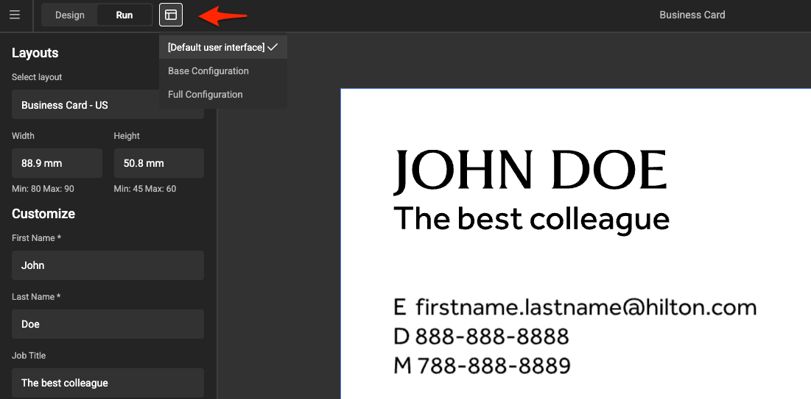{.screenshot-full}

You preview the behavior in [Run Mode](/GraFx-Studio/concepts/design-run/?h=run+mode) and test the different User Interfaces.

## Access

User Interfaces are only accessible to users with one of these roles:

- Subscription admins
- Environment admins
- Template designers

See also [Roles](/CHILI-GraFx/users/roles/#roles)