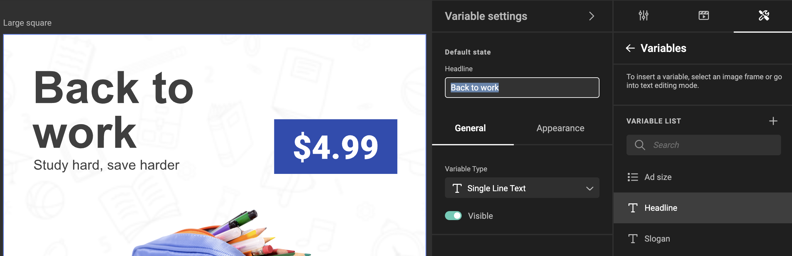

# Understanding Variables in GraFx Studio

In GraFx Studio, we utilize the concept of variables in two distinct contexts to enhance automation and flexibility in document creation. This page aims to clarify the differences and uses of "**JavaScript variables**" and "**Template variables**".

## JavaScript Variables

### Definition and Purpose

**JavaScript Variables** are used within Actions to automate the document.

These variables are integral in scripting custom behaviors, controlling document flow, and manipulating data in real-time.

### Example Use-Case

Suppose you need to calculate a total based on other parameters. A **JavaScript variable** can be used to store the total and update it in the Actions script.

```javascript
var firstvalue = 10; // JavaScript Variable
var secondvalue = 20; // JavaScript Variable
var total = firstvalue + secondvalue; // total will hold the value 30
```

## Template Variables

### Definition and Purpose

**Template Variables**, are used within a GraFx Studio template to store variable content. They allow end users to customize and change elements like text and images in a predefined template. These variables make templates flexible and adaptable to different needs and scenarios.

### Example Use-Cases





## Bridging Actions and Templates

Now, how do these two types of variables interact? Let's use a simple example to explain:

As in the screenshot above, we have a Template variable named "headline", and you want to use this headline in an action. Here's how you can do it:

Imagine this Action in your template

```javascript
let a = getVariableValue('headline');
let newheadline = a + " Now";
setVariableValue('headline', newheadline);
```

### Getting the Template Variable Value

There is a [helper function](/GraFx-Studio/concepts/helper-functions/#get) called `getVariableValue()`. This function acts like a question you ask to your template: "Hey, what's the current value of this Template Variable?"

You can then store this value in a JavaScript Variable. For example
   
```javascript
var a = getVariableValue('headline');
```

This line says: "Store the headline's content in a container named 'a'."

### Using the Value

Once the value from the Template Variable is stored in the JavaScript Variable 'a', you can use it or manipulate it in your script.
    
```javascript
var newheadline = a + " Now";
```

### Going back to the Template

Once the Javascript action has done its magic, you can use the new contents of the JavaScript variable, to store it back into the Template variable.
	
```javascript
setVariableValue("headline", a);
```

This allows a seamless interaction between the content in your template and the actions you can script using JavaScript.
