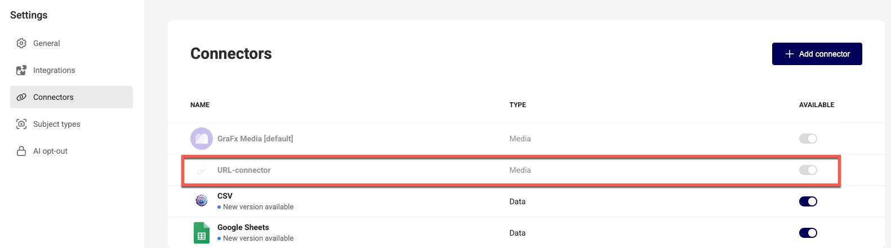
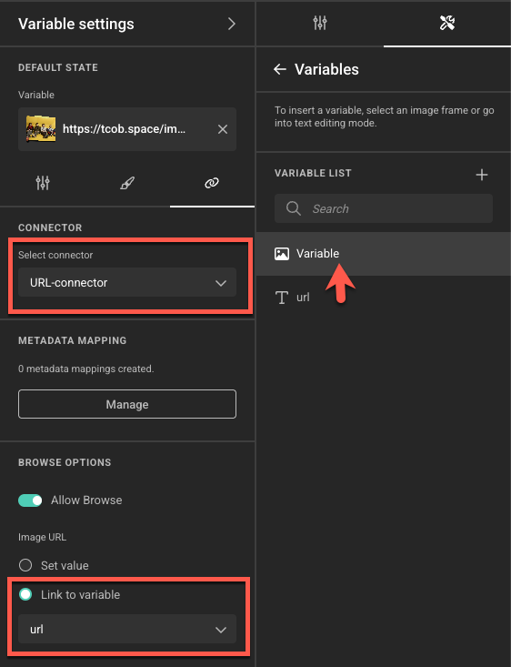
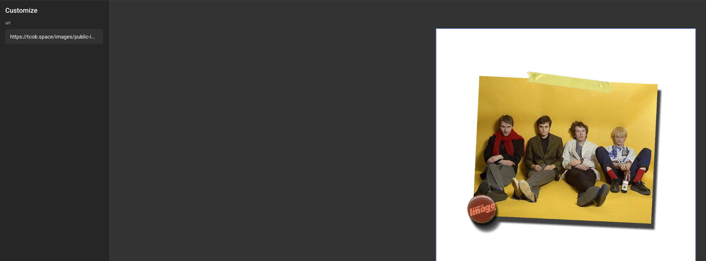

# URL Connector

:fontawesome-regular-square: Built-in  
:fontawesome-regular-square: Built by CHILI publish  
:fontawesome-regular-square-check: Third Party

[See Connector types](/GraFx-Studio/concepts/connectors/#types-of-connectors)

## Introduction

The URL Connector is a media connector for accessing public URLs for images.

For example: `https://tcob.space/images/public-image.png`

## Installation

The installation is done by enabling the URL Connector in your environment.

[See installation through Connector Hub](/GraFx-Studio/guides/connector-hub/)

Once installed, the connector appears in your connector list. There is no configuration on the connector page.

{.screenshot-full}

## How to use

It's very simple to implement:

- Create a text variable and an image variable
- Link the text variable to the image variable and select the **URL Connector** type

{.screenshot-full}

- Create an image frame and insert the image variable to that frame

In the end user view, when a URL of an image is pasted into the text variable, the image will appear.

{.screenshot-full}
