# Media Connector for Acquia DAM

:fontawesome-regular-square: Built-in  
:fontawesome-regular-square-check: Built by CHILI publish  
:fontawesome-regular-square: Third Party

[See Connector types](/GraFx-Studio/concepts/connectors/#types-of-connectors)

## Solution vendor website

See [Acquia's website](https://www.acquia.com/products/acquia-dam).

## Installation

[See installation through Connector Hub](/GraFx-Studio/guides/connector-hub/)

## Configuration

### Base Configuration

Your instance of the Connector needs to know which Acquia DAM instance it should communicate with and how to authenticate.

Once installed, navigate to the Connector overview, and select **Acquia DAM**. Start with **Configuration**.

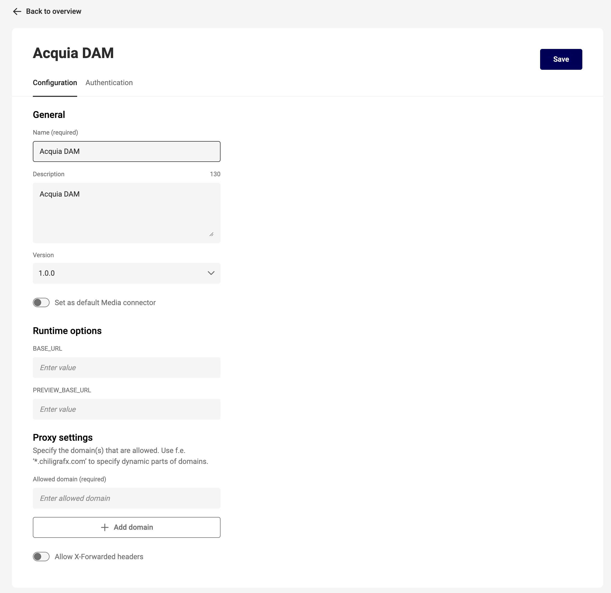{.screenshot-full}

Consult your Acquia System Admin to get the correct values for the fields.

### Authentication

An important part of managing digital assets is governance—determining when and where assets can be used, and who has access to them.

You will need specific credentials from your Acquia DAM installation to set up the connector:

- **Client ID** and **Client Secret**: These are customer-specific credentials provided by the Acquia Admin when creating integrations within Acquia.
- **Token URL** and **Authorization URL**: These are more developer-oriented settings but can also be retrieved from Acquia documentation. While they are publicly available, they are generic for all Acquia clients.

You can set the authentication for machine-to-machine and browser separately or use the same setup for both.

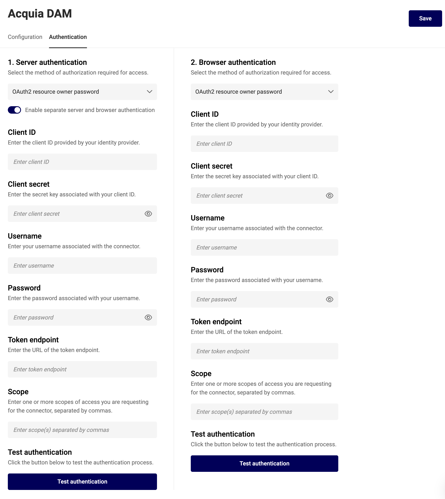{.screenshot-full}

Consult your Acquia System Admin to get the correct values for the fields.

### Browser Authentication or Impersonation

GraFx Studio consumes assets available in the DAM. Therefore, the user impersonating access to the DAM system will dictate which assets are available in the template.

**Impersonation** refers to the process of granting a user access to an external system, such as a Digital Asset Management (DAM) platform, by using pre-configured credentials. This approach ensures seamless integration while respecting the security and governance rules of the connected system.

Imagine a marketing team using GraFx Studio connected to a DAM system. The administrator configures the connector with specific credentials:

By leveraging impersonation, GraFx Studio ensures that users see only the assets and data they are authorized to access, in compliance with the DAM system's governance.

### Server Authentication

The credentials used to set up machine-to-machine authentication will determine the governance on the assets in the automation setup.

This means if the credentials only allow access to certain assets, only those assets will be available when batch processing requests access to place assets in the output.

## Using Assets from Your Acquia DAM System

### Place Assets in Your Template

- Select the Acquia DAM Connector.
- Double-click the asset to assign it to the image frame.

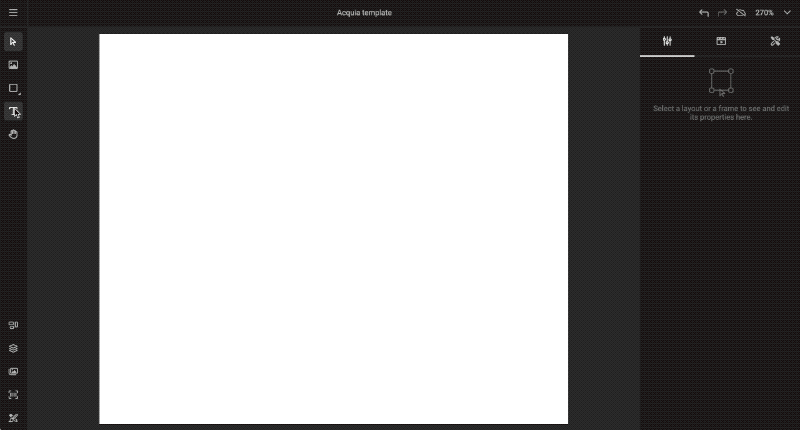{.screenshot-full}

### Image Variables

When using [image variables](/GraFx-Studio/guides/template-variables/assign/#assign-template-variable-to-image-frame), you will get the same list of assets when you select an image.

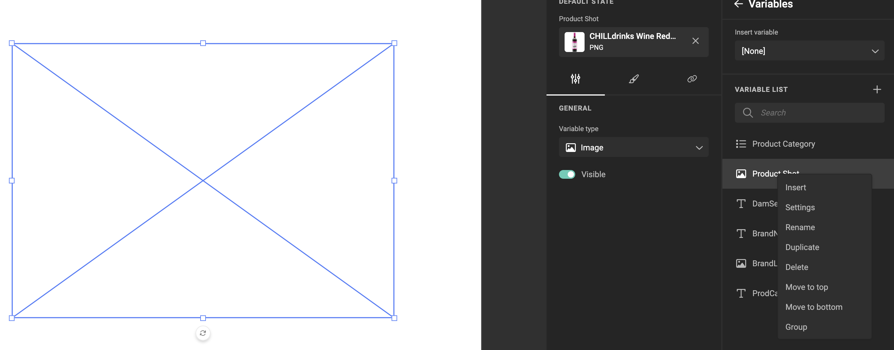{.screenshot-full}

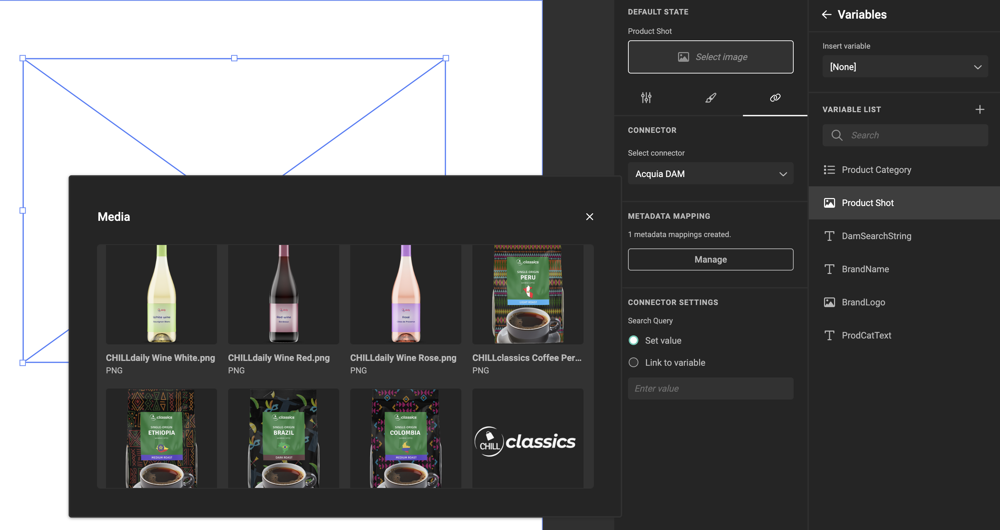{.screenshot-full}

### DAM Queries & Variables

#### Introduction

You may want to filter the assets suggested to the template user by using categories, keywords, etc.

In the Acquia DAM solution, you can use a query language.

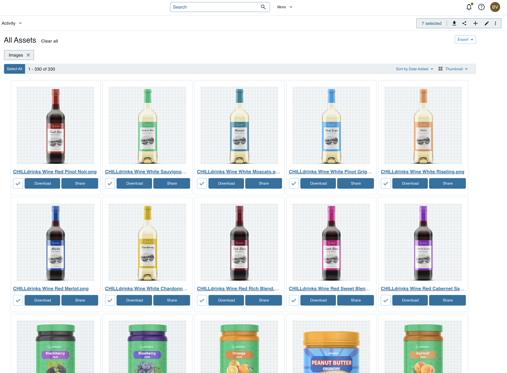{.screenshot-full}

By using the query language, you can filter down to the right selection of assets.

!!! tip "Category"

    Use `cat:{wine}` to filter down to only wines.

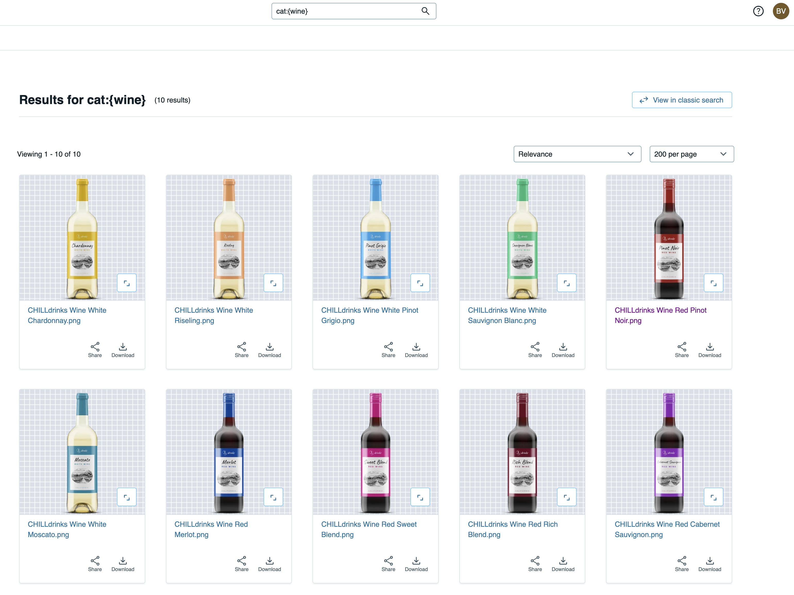{.screenshot-full}

!!! tip "Description"

    Add `cat:{wine} des:{white}` to further filter to only wines with the word "white" in the description.
    
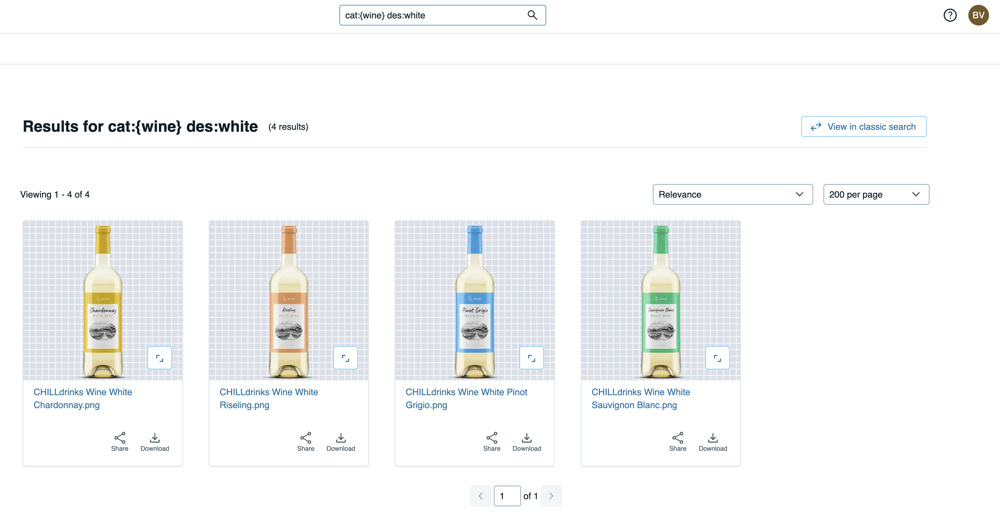{.screenshot-full}

#### How To

DAM queries are set at the connector level for a specific frame.

Set the value of the query in the connector settings.

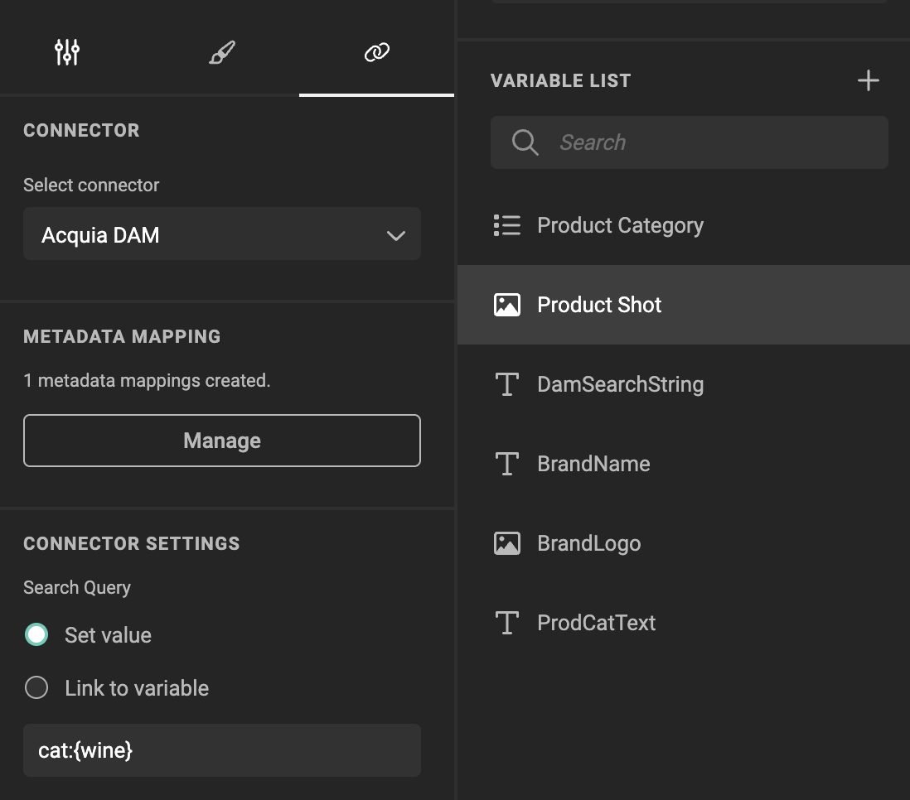{.screenshot-full}

If a fixed query is not sufficient, you can use a variable.

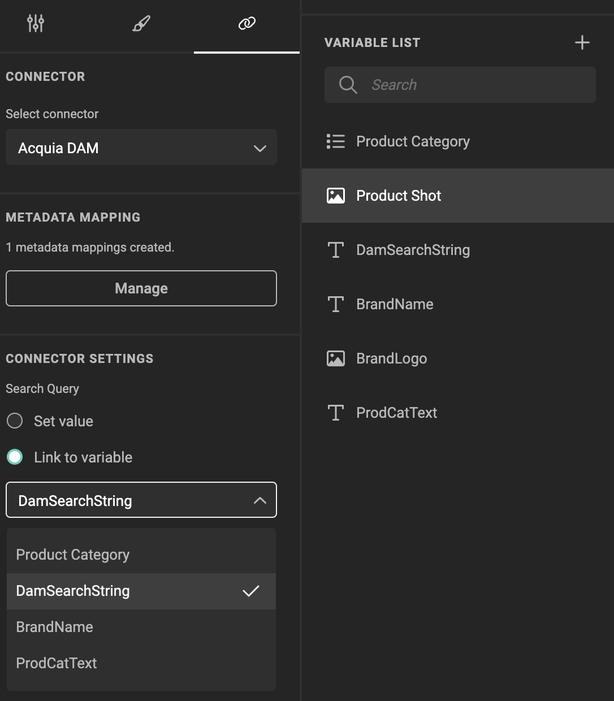{.screenshot-full}

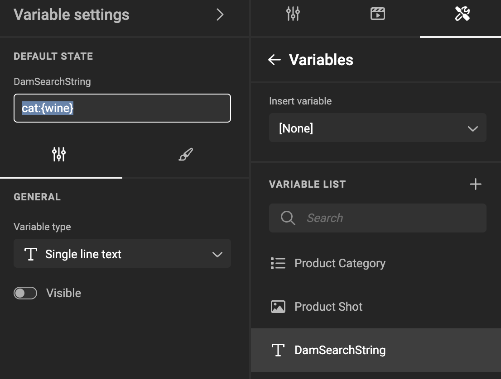{.screenshot-full}

To further automate, you can use [Actions](/GraFx-Studio/guides/actions/create/) to influence and set the query according to other variables or inputs the Smart Template receives.

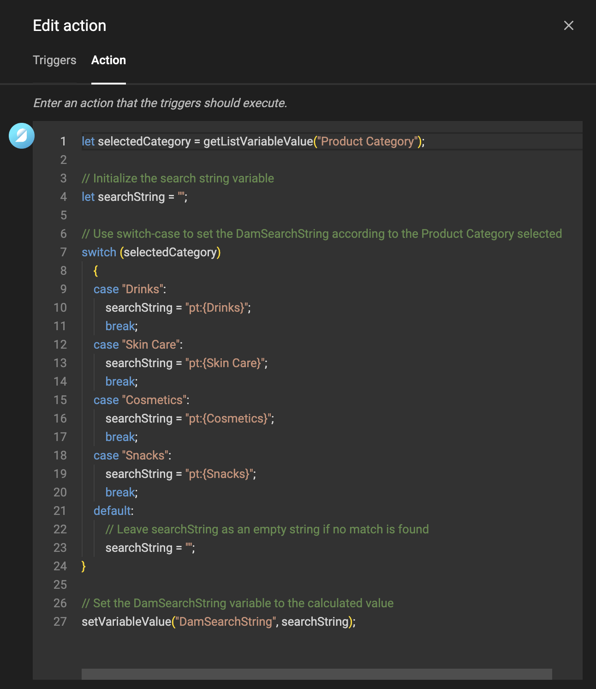{.screenshot-full}

In the image above, the action sets the `DamSearchString` to have different DAM queries depending on a chosen category. That text variable is then used in the image variable (see image above).