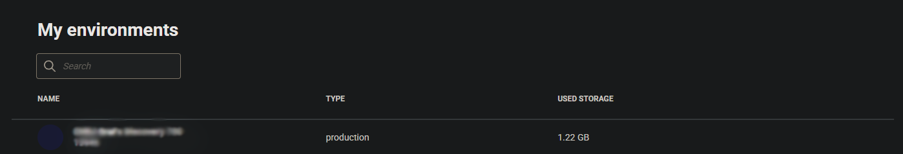
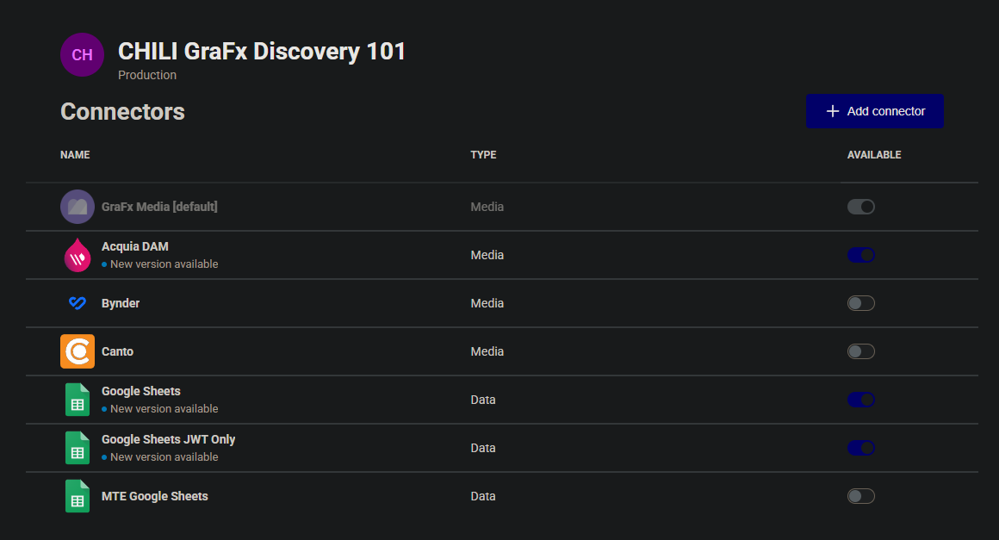
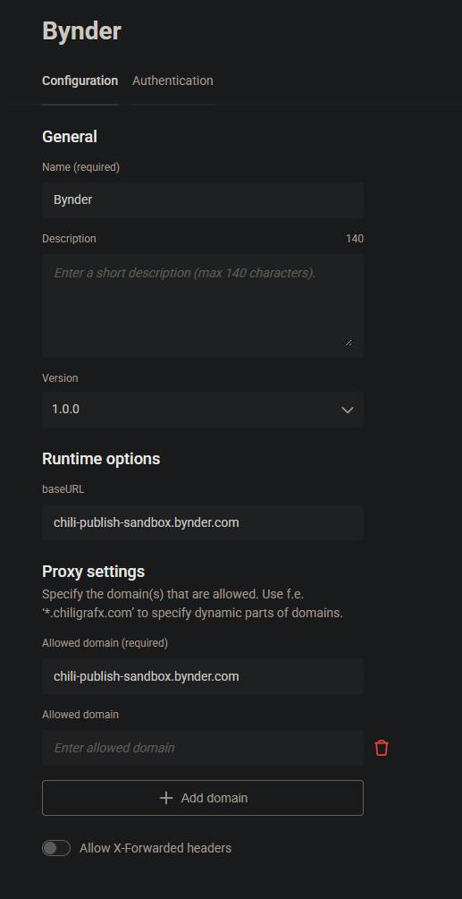
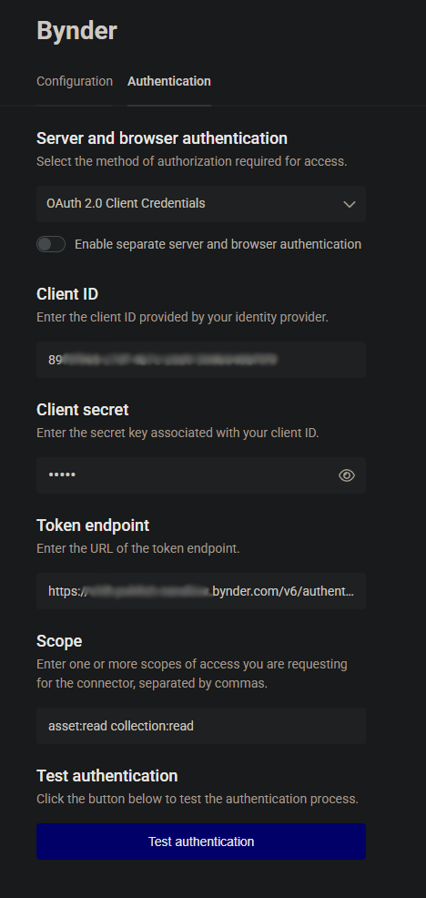
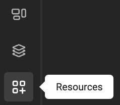
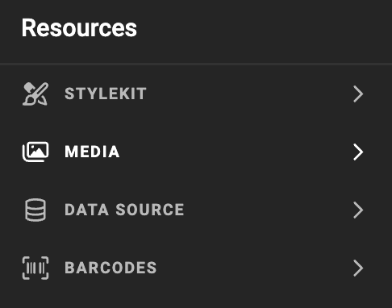

#WORK IN PROGRESS - DRAFT

# Media Connector for Bynder

:fontawesome-regular-square: Built-in  
:fontawesome-regular-square: Built by CHILI publish  
:fontawesome-regular-square-check: Third Party

[See Connector Types](/GraFx-Studio/concepts/connectors/#types-of-connectors)

## Solution vendor website

See [Bynder's website](https://www.bynder.com/en/products/digital-asset-management/)

## Installation

The installation is done by enabling the Bynder connector on the environment.

[See Installation Through Connector Hub](/GraFx-Studio/guides/connector-hub/)

## Bynder Configuration 

Consult your [Bynder documentation](https://support.bynder.com/hc/en-us/articles/360013875180-How-To-Create-And-Manage-OAuth2-Apps) or Bynder System Admin to obtain the correct values for the fields.

## CHILI GraFx Connector Configuration 

From the overview of Environments, click on "Settings" on the right to your environment, where you want to install or configure the Connector.



Then click the installed Connector to access the configuration.



### Configuration

Your instance of the Connector needs to know which Canto instance it should communicate with and how to authenticate.



**baseURL**

Your Canto System Administrator will provide you with this information.

For example

```html
https://[your-domain].bynder.com
```

**Proxy settings**

CHILI GraFx needs to know what domains are allowed to process

For example

```html
*.bynder.com
```

### Authentication



Select your type of authentication:

**Server and Browser:** OAuth 2.0 Client Credentials

- **Client ID** and **Client Secret**: These are [customer-specific credentials](https://support.bynder.com/hc/en-us/articles/360013875180-How-To-Create-And-Manage-OAuth2-Apps) provided by the Bynder Admin.
- **Token Endpoint**:  
```html
https://[your-domain].bynder.com/v6/authentication/oauth2/token
```

- **Scope**: Consult your Canto Admin to determine the appropriate scope. Asset:read and collection:read are minumum requirements.

Consult your Bynder System Admin for assistance in configuring these fields.

## Using Assets from Your Bynder Dam

### Place Assets in Your Template

- Select the Bynder Connector.






### Image Variables

When using [image variables](/GraFx-Studio/guides/template-variables/assign/#assign-template-variable-to-image-frame), you will see the same grid of assets when selecting an image, except is you have set configuration options (see below).

-- Add Screenshot

### Metadata mapping

See [Concept of metadata mapping](/GraFx-Studio/concepts/connectors-media/#concept-2-making-assets-available-and-exposing-metadata) for more details

-- Add Screenshot

### Configuration Options

-- Add Screenshot

To filter the assets suggested to template users, you can use several methods.

#### Collection Name

When entered, only the assets housed in that collection will be shown.

#### View as collections

Enable collections or folder view for browsing. This voids the collection name configuration.
