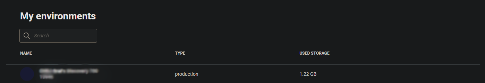
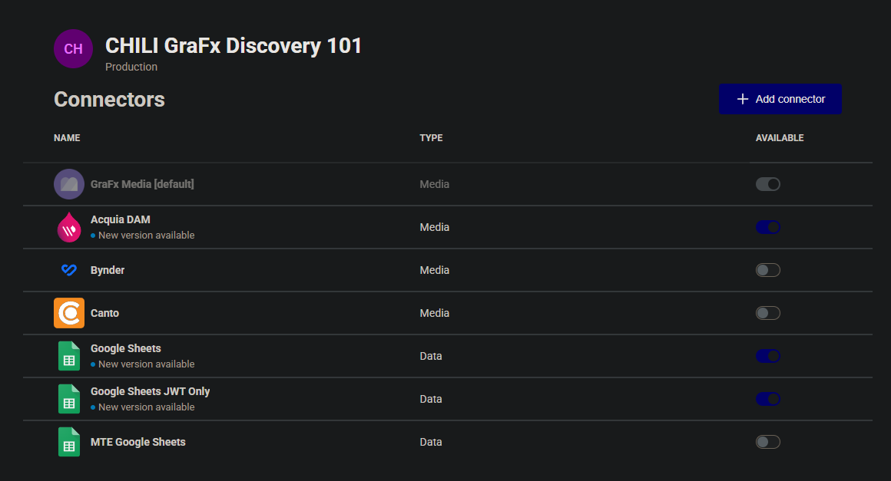
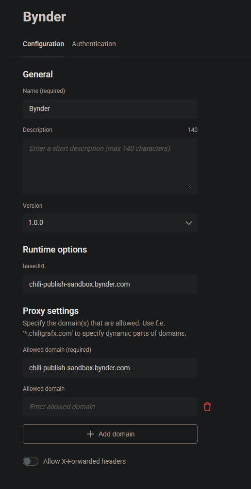
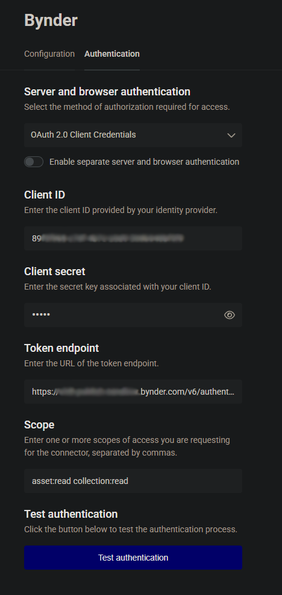
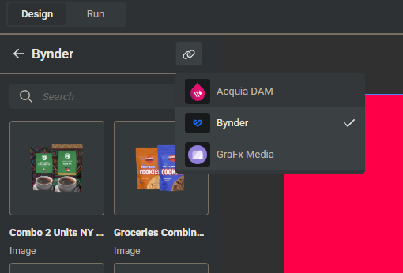
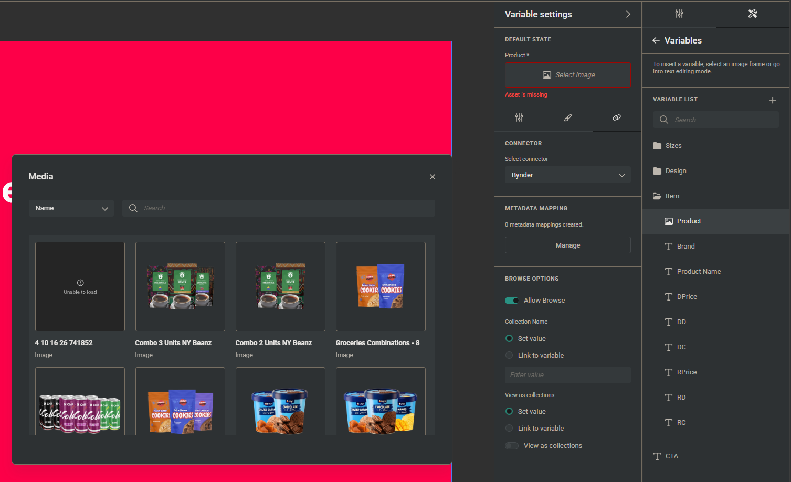
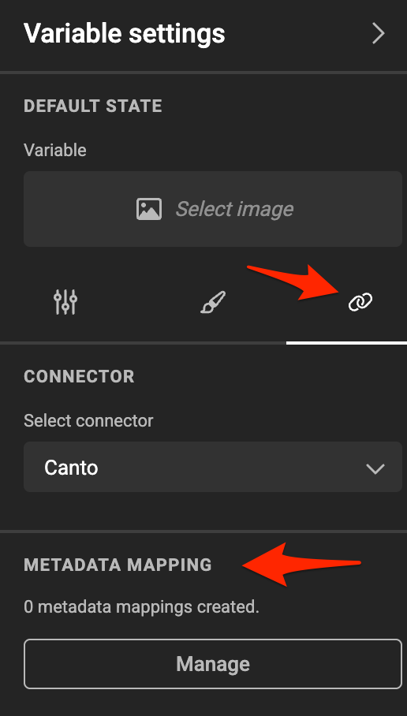
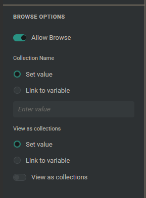

# Media Connector for Bynder

:fontawesome-regular-square: Built-in  
:fontawesome-regular-square: Built by CHILI publish  
:fontawesome-regular-square-check: Third Party

[See Connector Types](/GraFx-Studio/concepts/connectors/#types-of-connectors)

## Solution vendor website

See [Bynder's website](https://www.bynder.com/en/products/digital-asset-management/)

## Installation

<iframe width="690" height="388" src="https://www.youtube.com/embed/Cj4gMex9cJ4?controls=1&mute=0&showinfo=0&rel=0&autoplay=0&loop=0" title="Add the Bynder DAM connector to CHILI GraFx" frameborder="0" allow="accelerometer; autoplay; clipboard-write; encrypted-media; gyroscope; picture-in-picture; web-share" referrerpolicy="strict-origin-when-cross-origin" allowfullscreen></iframe>

[Getting Started with GraFx Studio — full course](https://www.youtube.com/playlist?list=PLOzpLl2aXHcM)

The installation is done by enabling the Bynder connector on the environment.

[See Installation Through Connector Hub](/GraFx-Studio/guides/connector-hub/)

## Bynder Configuration 

Consult your [Bynder documentation](https://support.bynder.com/hc/en-us/articles/360013875180-How-To-Create-And-Manage-OAuth2-Apps) or Bynder System Admin to obtain the correct values for the fields.

## CHILI GraFx Connector Configuration 

From the overview of Environments, click on "Settings" on the right to your environment, where you want to install or configure the Connector.

{.screenshot-full}

Then click the installed Connector to access the configuration.

{.screenshot-full}

### Configuration

Your instance of the Connector needs to know which Bynder instance it should communicate with and how to authenticate.

{.screenshot-full}

**baseURL**

Your Bynder System Administrator will provide you with this information.

For example

```html
https://[your-domain].bynder.com
```

**Proxy settings**

CHILI GraFx needs to know what domains are allowed to process

For example

```html
*.bynder.com
```

### Authentication

{.screenshot-full}

Select your type of authentication:

**Server and Browser:** OAuth 2.0 Client Credentials

- **Client ID** and **Client Secret**: These are [customer-specific credentials](https://support.bynder.com/hc/en-us/articles/360013875180-How-To-Create-And-Manage-OAuth2-Apps) provided by the Bynder Admin.
- **Token Endpoint**:  
```html
https://[your-domain].bynder.com/v6/authentication/oauth2/token
```

- **Scope**: Consult your Bynder Admin to determine the appropriate scope. asset:read and collection:read are minimum requirements.

Consult your Bynder System Admin for assistance in configuring these fields.

## Using Assets from Your Bynder Dam

<iframe width="690" height="388" src="https://www.youtube.com/embed/uP1h1m8xdic?controls=1&mute=0&showinfo=0&rel=0&autoplay=0&loop=0" title="Access your Bynder DAM library from GraFx Studio" frameborder="0" allow="accelerometer; autoplay; clipboard-write; encrypted-media; gyroscope; picture-in-picture; web-share" referrerpolicy="strict-origin-when-cross-origin" allowfullscreen></iframe>

[Getting Started with GraFx Studio — full course](https://www.youtube.com/playlist?list=PLOzpLl2aXHcM)

### Place Assets in Your Template

- Select the Bynder Connector.

{.screenshot-full}

{.screenshot-full}

{.screenshot-full}

### Image Variables

When using [image variables](/GraFx-Studio/guides/template-variables/assign/#assign-template-variable-to-image-frame), you will see the same grid of assets when selecting an image, except if you have set configuration options (see below).

{.screenshot-full}

### Metadata mapping

See [Concept of metadata mapping](/GraFx-Studio/concepts/connectors-media/#concept-2-making-assets-available-and-exposing-metadata) for more details

{.screenshot-full}

### Configuration Options

{.screenshot-full}

To filter the assets suggested to template users, you can use several methods.

#### Collection Name

When entered, only the assets housed in that collection will be shown.

#### View as collections

Enable collections or folder view for browsing. This voids the collection name configuration.
