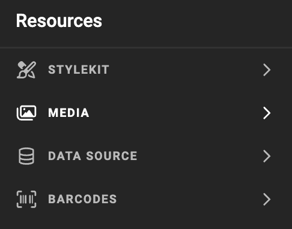

# Media Connector for Canto

:fontawesome-regular-square: Built-in  
:fontawesome-regular-square: Built by CHILI publish  
:fontawesome-regular-square-check: Third Party

[See Connector Types](/GraFx-Studio/concepts/connectors/#types-of-connectors)

## Solution vendor website

See [Canto's website](https://www.canto.com/product/)

## Installation

As no "installation" happens, you could also talk about deployment of a connector on your environment.

[See Installation Through Connector Hub](/GraFx-Studio/guides/connector-hub/)

## Canto Configuration 

Consult your [Canto documentation](https://support.canto.com/hc/en-us/articles/23002535539601-Generating-API-Keys) or Canto System Admin to obtain the correct values for the fields.

## CHILI GraFx Connector Configuration 

From the overview of Environments, click on "Settings" on the right to your environment, where you want to install or configure the Connector.


Then click the installed Connector to access the configuration.


### Configuration

Your instance of the Connector needs to know which Canto instance it should communicate with and how to authenticate.


**baseURL**

Your Canto System Administrator will provide you with this information.

For example

```html
https://[your-domain].canto.global
```

**Proxy settings**

CHILI GraFx needs to know what domains are allowed to process

For example

```html
*.canto.global
```

### Authentication


Select your type of authentication:

**Server and Browser:** OAuth 2.0 Client Credentials

- **Client ID** and **Client Secret**: These are [customer-specific credentials](https://support.canto.com/hc/en-us/articles/23002535539601-Generating-API-Keys#How-to-generate-API-keys) provided by the Canto Admin.
- **Token Endpoint**:  
```html
https://oauth.canto.global/oauth/api/oauth2/compatible/token
```

- **Scope**: Consult your Canto Admin to determine the appropriate scope.

Consult your Canto System Admin for assistance in configuring these fields.

## Using Assets from Your Canto Dam

### Place Assets in Your Template

- Select the Canto Connector.





### Image Variables

When using [image variables](/GraFx-Studio/guides/template-variables/assign/#assign-template-variable-to-image-frame), you will see the same grid of assets when selecting an image, except is you have set configuration options (see below).


### Metadata mapping

See [Concept of metadata mapping](/GraFx-Studio/concepts/connectors-media/#concept-2-making-assets-available-and-exposing-metadata) for more details


### Configuration Options


To filter the assets suggested to template users, you can use several methods.

#### Folder View

When set to True, Keyword and tag will be ignored, and you'll be able to browse through the assets as you would browse through folders.

#### Keyword filter

When set, this keyword will be used to filte matching assets.

#### Tag filter

When set, this tag will be used to filte matching assets.

#### Album filter

When set, only assets from that album will be presented. 

!!! important "Use the ID"
    For the Album filter, you need to set the album ID.  
    You'll find the ID in the URL when browsing your albums in Canto.  
    
    

#### Only show approved

When set to True, this will filter out all the non-approved assets.

#### Fail Loading and Output if not approved

Imagine the scenario where you used an approved asset before. And since the last use of the template, the used asset has been set to "not approved".

When this option is set, the loading, and also the output from GraFx Studio will fail. This helps to avoid outputting non approved assets.