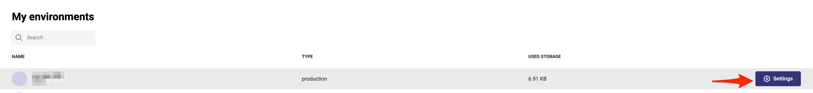
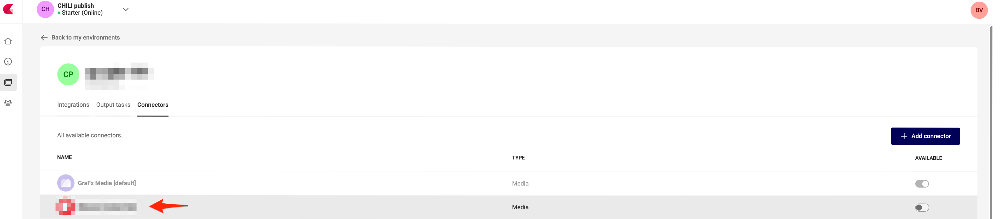
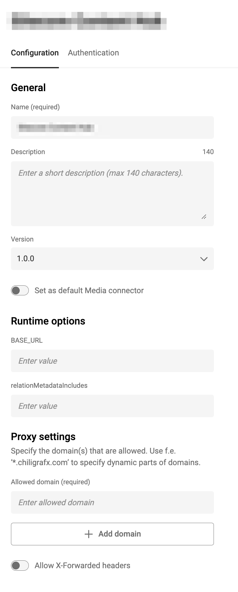
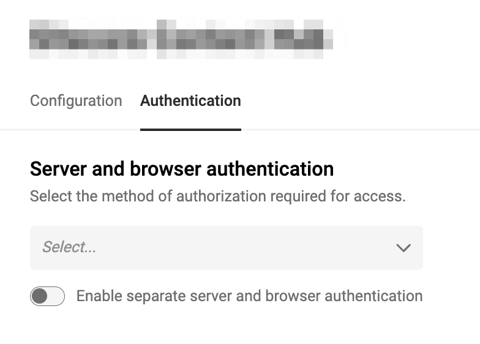
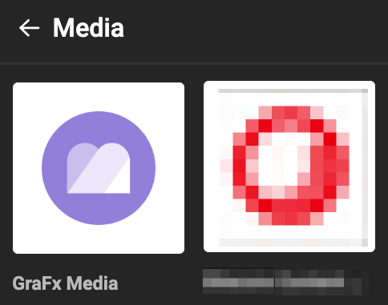
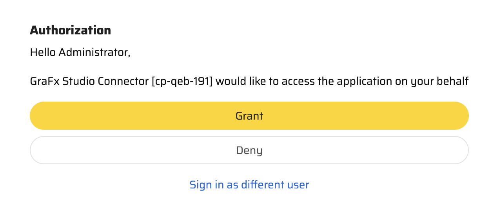
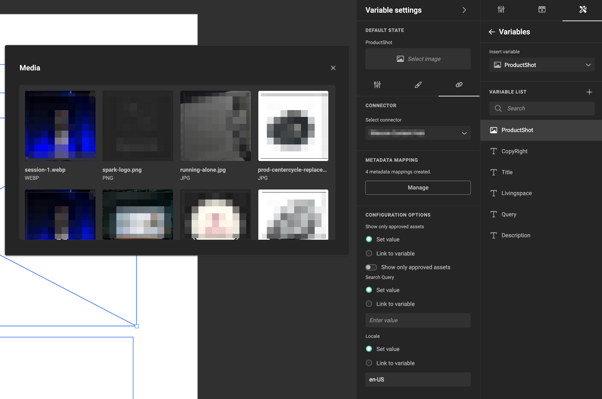
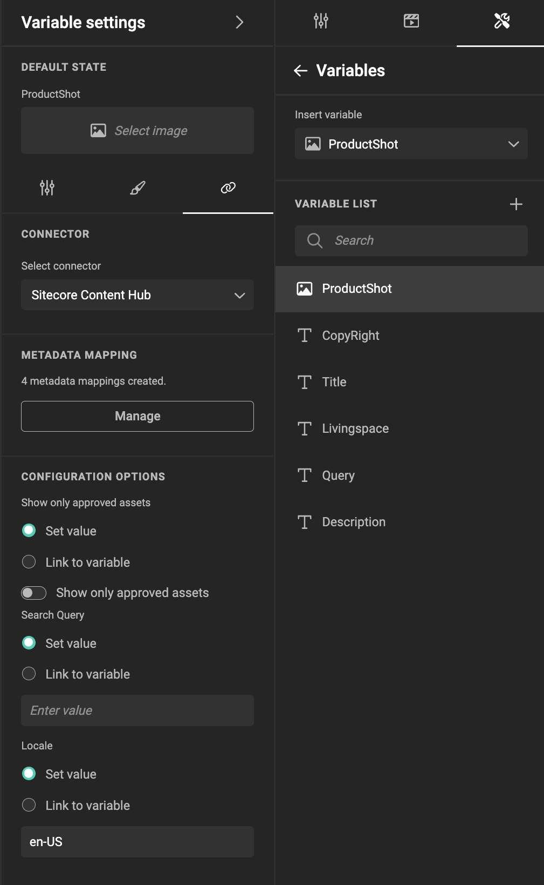

!!! info
    This markdown document serves as a template or example. We will refer to X-Y-Z as a Media provider solution.
    Use this document as a template, add / change to the needs for your connector.
    
    We added info in this document, please remove the info boxes before you make a pull request.
    
# Media Connector for **X-Y-Z**

|  | Connector Type |
| --- | --- |
|  | Built-in |
| | Built by CHILI publish |
| :fontawesome-regular-square-check:  | Third party |

!!! info
    Unless the connector is made by CHILI publish, it will be a third party connector

[See Connector Types](/GraFx-Studio/concepts/connectors/#types-of-connectors)

## Support

Where and how should users go for support inqueries.

## Installation

How to deploy or install a connector to your environment?

[See Installation Through Connector Hub](/GraFx-Studio/guides/connector-hub/)

## X-Y-Z Configuration 

!!! info
    Add the necessary references to settings that need to be made on the X-Y-Z side

Consult your [X-Y-Z documentation](https://example.com) or X-Y-Z System Admin to obtain the correct values for the fields.

- **OAuth settings**
``` html
https://<X-Y-Z-path>/en-us/admin/oauthclients
```

- **Redirect URL** (only used if grafx config is Authorization Code):
``` html
https://<env-name>.chili-publish.online/grafx/api/v1/environment/<env-name>/connectors/<connector-id>/auth/oauth-authorization-code/redirect
```
- **Any Other Setting** on your side
```html
Add info to the setting
```

## CHILI GraFx Connector Configuration 

From the overview of Environments, click on "Settings" on the right to your environment, where you want to install or configure the Connector.



Then click the installed Connector to access the configuration.



### Base Configuration

Your instance of the Connector needs to know which **X-Y-Z** instance it should communicate with and how to authenticate.



### Authentication

Select your type of authentication:

**Supported on Server:** OAuth 2.0 Resource Owner Password  
This is the flow where username and password are needed. It makes all requests as that specific user.

**Supported on Browser:** OAuth 2.0 Authorization Code (Browser only)



- **Client ID** and **Client Secret**: These are [customer-specific credentials](https://example.com) provided by the **X-Y-Z** Admin when creating integrations within **X-Y-Z**.
- **Username** and **Password**: User-specific credentials for authentication.
- **Token Endpoint**: Developer-oriented settings available in **X-Y-Z** documentation. These settings are generic for all **X-Y-Z** clients.
- **Scope**: Consult your **X-Y-Z** Admin to determine the appropriate scope.

You can configure separate authentication for machine-to-machine and browser use cases or use the same setup for both.


- **Authorization Endpoint** https://example.com/oauth/authorize
- **Token Endpoint** https://example.com/oauth/token

!!! info
    For **X-Y-Z** different values and settings might be required

Consult your **X-Y-Z** System Admin for assistance in configuring these fields.

### Server Authentication

The credentials used for machine-to-machine authentication determine the governance on assets in automation workflows. 

This means that if the credentials restrict access to specific assets, only those assets will be available during batch processing.

### Browser Authentication or Impersonation

GraFx Studio accesses assets available in your Media Provider via impersonation, where the credentials configured for the connector determine which assets are visible to the user in the template.

**Impersonation** is the process of granting GraFx Studio users access to the DAM system using pre-configured credentials. This ensures seamless integration while respecting the DAM's security and governance rules.

## Using Assets from Your **X-Y-Z** System

### Place Assets in Your Template

- Select the **X-Y-Z** Connector.




Depending on the configuration, you may need to authenticate.



- Once authenticated, **X-Y-Z** assets behave like any other asset in GraFx Studio.

### Image Variables

When using [image variables](/GraFx-Studio/guides/template-variables/assign/#assign-template-variable-to-image-frame), you will see the same list of assets when selecting an image.



### Configuration Options

#### Introduction

To filter the assets suggested to template users, you can use categories, keywords, or other search parameters.

**X-Y-Z** supports search queries through its query language. Consult the [**X-Y-Z** Documentation](https://example.com) or your **X-Y-Z** Administrator for guidance.

#### How To

Queries are set at the variable level.

Set the query value in the connector settings.



For more dynamic queries, you can use [variables](/GraFx-Studio/concepts/variables/), [actions](/GraFx-Studio/concepts/actions/), and [GraFx Genie](/GraFx-Studio/concepts/grafx-genie/) to automate and refine your queries.

#### Other Configuration Options

- **Show Only Approved Assets**: Displays only assets that have been approved in **X-Y-Z**.
- **Locale**: Filters assets by region or language.

!!! info
    These settings will vary, depending on what you added in your connector