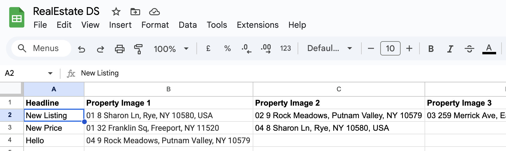
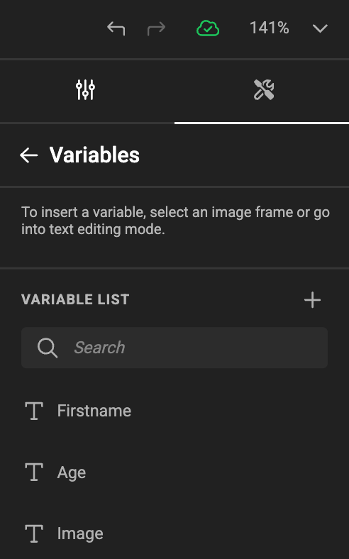
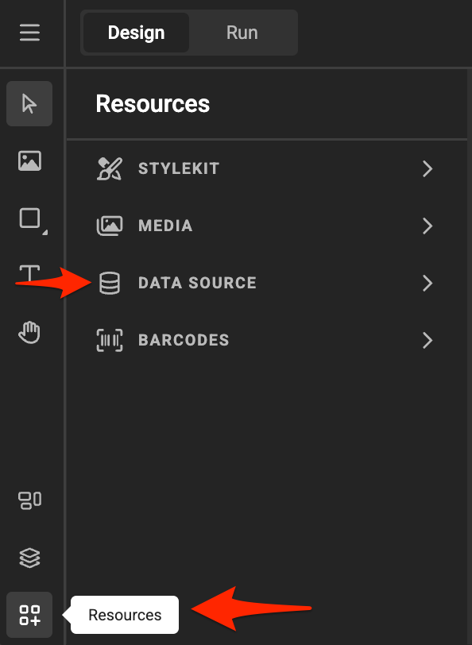
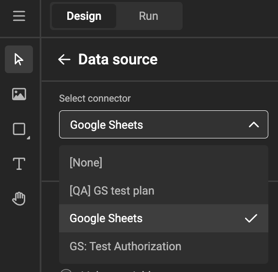
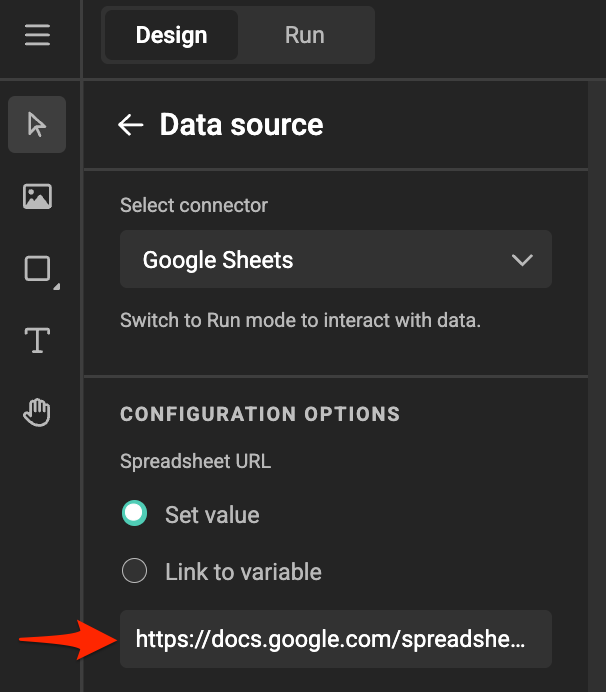
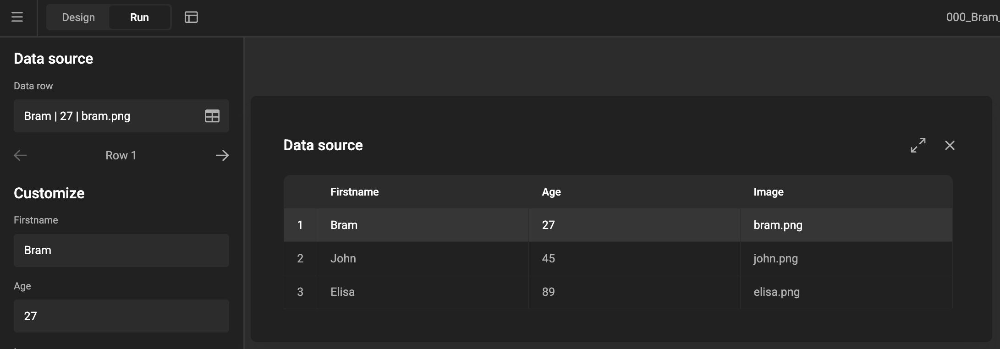
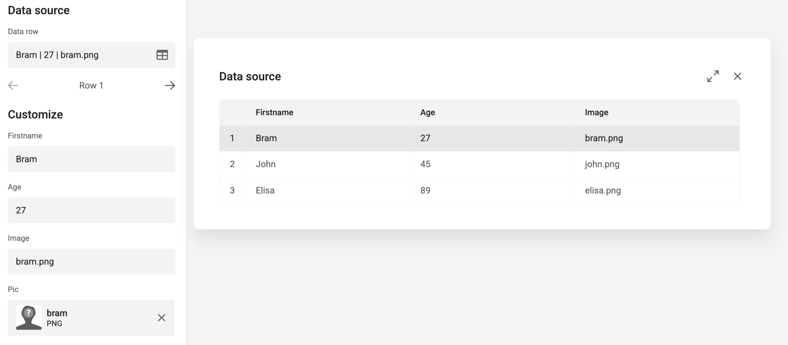
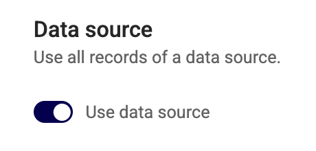

# How to Use Google Sheets Data

For this example, we'll use a [publicly available Google sheet](https://docs.google.com/spreadsheets/d/1ApwDcYH6CK5pXjKEbTe5Ie-Y2wVsrHxJoKKN8x4Xd_w/edit?usp=sharing).

#### Create Variables

- In your template, create variables corresponding to the column names in Google Sheets.
- As long as the names match and a data source is connected, the values will be populated automatically.

#### Link the Google Sheet

- Select the Connector Instance (for the right Authentication method)

- Copy the link of the [public document](https://docs.google.com/spreadsheets/d/1ApwDcYH6CK5pXjKEbTe5Ie-Y2wVsrHxJoKKN8x4Xd_w/edit?usp=sharing).
- Paste it into the data source field.

#### Preview in Run Mode or Studio UI

- In [Run mode](/GraFx-Studio/concepts/design-run/#run-mode) or the [Studio UI](/GraFx-Studio/concepts/template-management/#studio-ui), you can browse records to preview how content changes.

#### Run Mode (in Studio Workspace)

#### Studio UI

## Output

To generate output with dynamic data, create an [output setting](../../../guides/output/settings/#data-source).

Ensure the **Data source** is enabled for batch processing.

!!! note "PDF only"
    Only PDF output will use the data source. Soon the other formats will support batch output too.

When set to "Use data source", your output will have a page for each record in the data source.

