# How to Use Google Sheets Data

In the example below, we'll use a [publicly available read-only Google sheet](https://docs.google.com/spreadsheets/d/1ApwDcYH6CK5pXjKEbTe5Ie-Y2wVsrHxJoKKN8x4Xd_w/edit?usp=sharing).

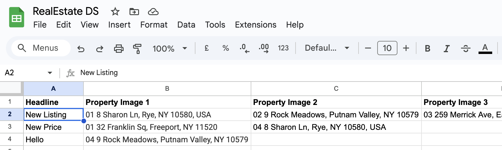{.screenshot-full}

## Create Variables in GraFx Studio

- In your template, create variables corresponding to the column names in Google Sheets.
- As long as the names match and a data source is connected, the values will be populated automatically.

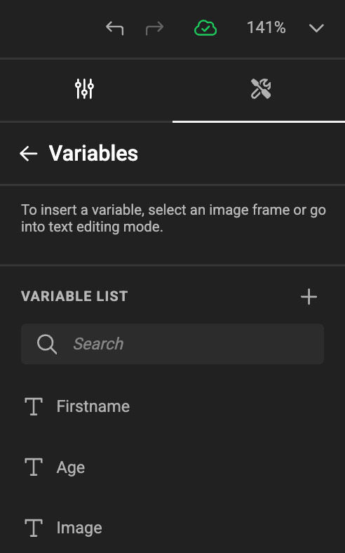{.screenshot}

## Link the Google Sheet

- Select the Connector Instance (for the right Authentication method)

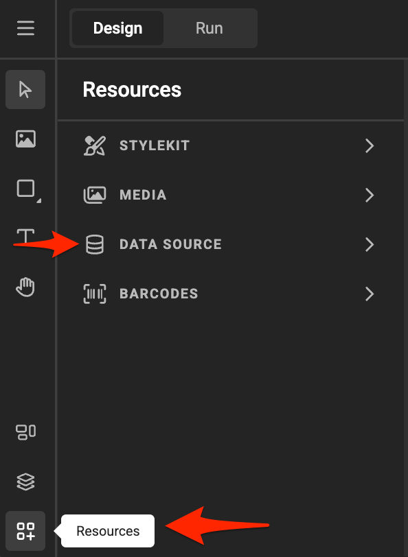{.screenshot}

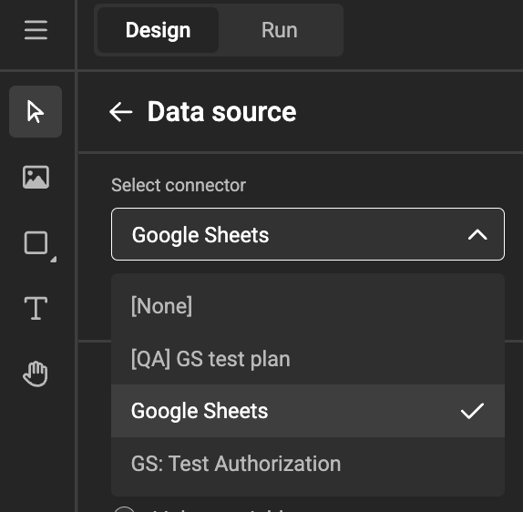{.screenshot}

- Copy the link of the [public document](https://docs.google.com/spreadsheets/d/1ApwDcYH6CK5pXjKEbTe5Ie-Y2wVsrHxJoKKN8x4Xd_w/edit?usp=sharing).
- Paste it into the data source field.

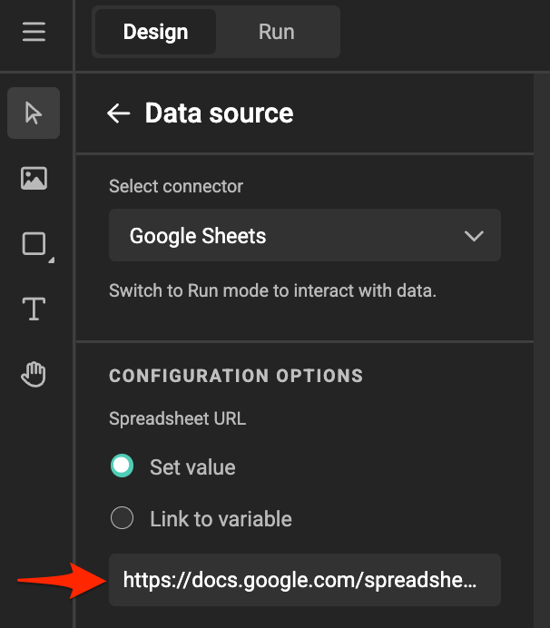{.screenshot}

## Preview in Run Mode or Studio UI

- In [Run mode](/GraFx-Studio/concepts/design-run/#run-mode) or the [Studio UI](/GraFx-Studio/concepts/template-management/#studio-ui), you can browse records to preview how content changes.

## Run Mode (in Studio Workspace)

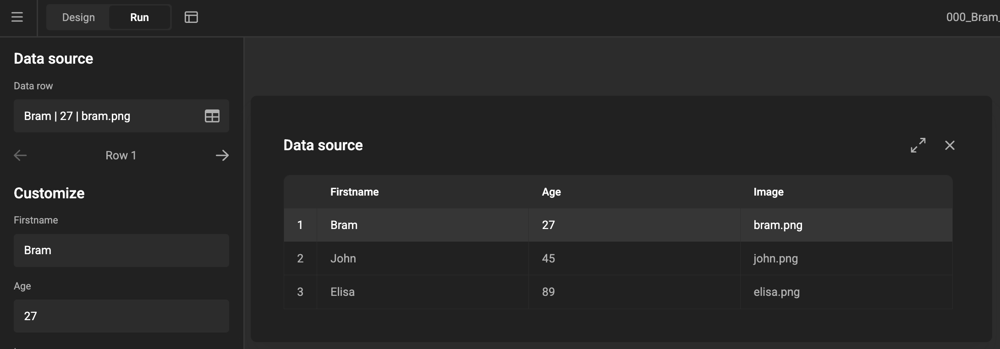{.screenshot-full}

## Studio UI

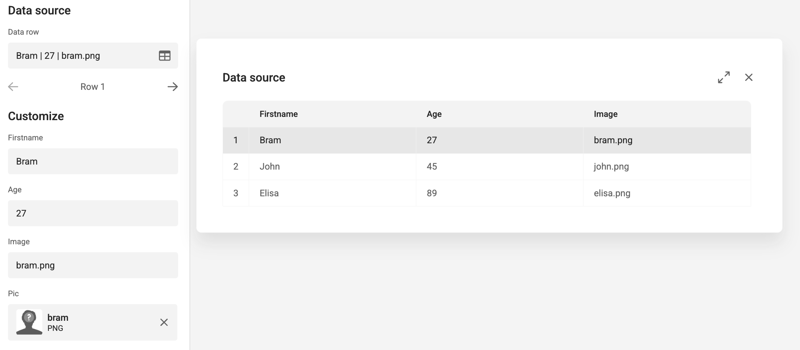{.screenshot-full}

## Output

To generate output with dynamic data, create an [output setting](../../../guides/output/settings/#data-source).

Ensure the **Data source** is enabled for batch processing.

{.screenshot}

!!! note "PDF only"
    Only PDF output will use the data source. Soon the other formats will support batch output too.

When set to "Use data source", your output will have a page for each record in the data source.

{.screenshot-full}

## Google Sheet Setup guidelines

- **Column Range**: Values from all columns will be read[^1].
[^1]: Although all columns from the Google Sheet will be read, relying on too many variables may significantly slow down performance.
- **Header**: Your Google Sheet column names must match the Smart Template variable names
- **Column Data Type**
    - All values are considered: "Single Line Text"
    - Format Numbers as Numbers  
    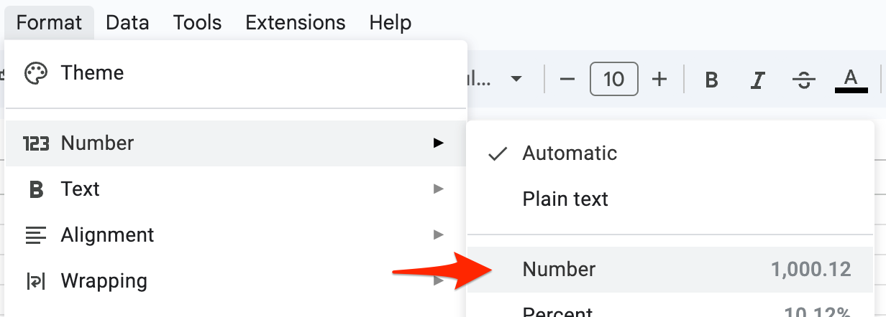{.screenshot}
    - Format Date as "Date" or "Date Time"  
    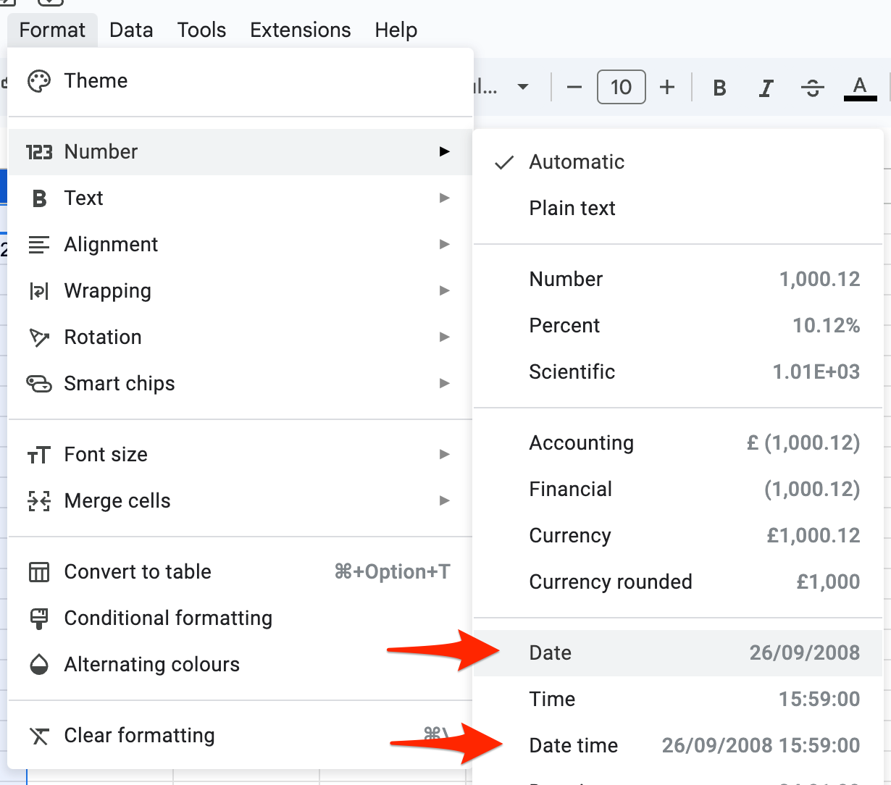{.screenshot}
    - Booleans: Boolean columns must always have a value (cells cannot be empty)
    - Booleans: Define boolean columns using checkboxes  
    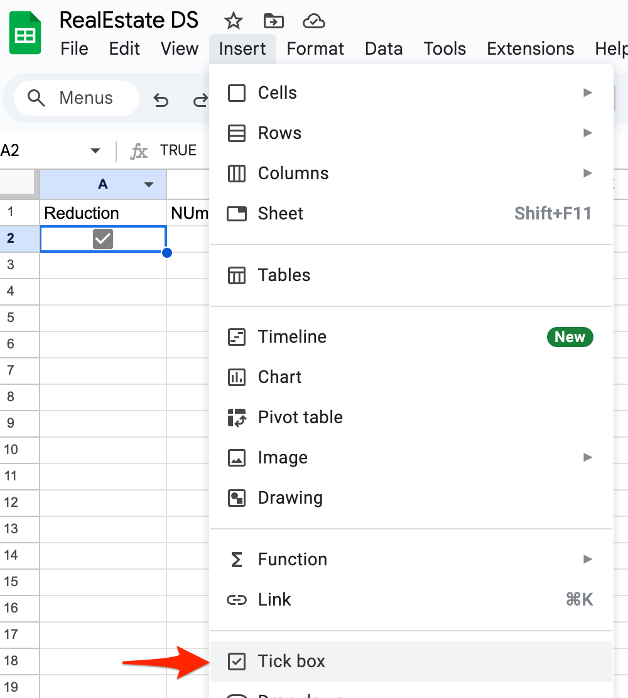{.screenshot}
- **Row Structure**: The sheet must **NOT** contain empty rows between rows with data  
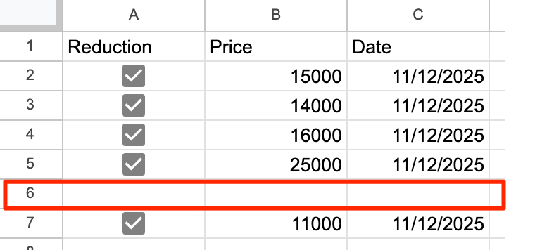{.screenshot}
- **Sharing**  
**OAuth2.0 JWT Bearer authentication**: Share it with the service account setup during configuration of the Connector.  
**OAuth2.0 Authorisation Code**: share with the user who is authorising.  
**Public**: All people with the link can access your document. You can set it to read-only or editable. 