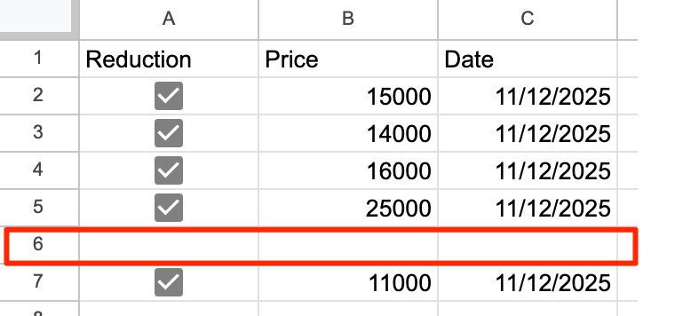

# How to Use Google Sheets Data

In the example below, we'll use a [publicly available read-only Google sheet](https://docs.google.com/spreadsheets/d/1ApwDcYH6CK5pXjKEbTe5Ie-Y2wVsrHxJoKKN8x4Xd_w/edit?usp=sharing).

## Create Variables in GraFx Studio

- In your template, create variables corresponding to the column names in Google Sheets.
- As long as the names match and a data source is connected, the values will be populated automatically.

## Link the Google Sheet

- Select the Connector Instance (for the right Authentication method)

- Copy the link of the [public document](https://docs.google.com/spreadsheets/d/1ApwDcYH6CK5pXjKEbTe5Ie-Y2wVsrHxJoKKN8x4Xd_w/edit?usp=sharing).
- Paste it into the data source field.

## Preview in Run Mode or Studio UI

- In [Run mode](/GraFx-Studio/concepts/design-run/#run-mode) or the [Studio UI](/GraFx-Studio/concepts/template-management/#studio-ui), you can browse records to preview how content changes.

## Run Mode (in Studio Workspace)

## Studio UI

## Output

To generate output with dynamic data, create an [output setting](../../../guides/output/settings/#data-source).

Ensure the **Data source** is enabled for batch processing.

!!! note "PDF only"
    Only PDF output will use the data source. Soon the other formats will support batch output too.

When set to "Use data source", your output will have a page for each record in the data source.

## Google Sheet Setup guidelines

- **Column Range**: Values from all columns will be read[^1].
[^1]: Although all columns from the Google Sheet will be read, relying on too many variables may significantly slow down performance.
- **Header**: Your Google Sheet column names must match the Smart Template variable names
- **Column Data Type**
    - All values are considered: "Single Line Text"
    - Format Numbers as Numbers  
    
    - Format Date as "Date" or "Date Time"  
    
    - Booleans: Boolean columns must always have a value (cells cannot be empty)
    - Booleans: Define boolean columns using checkboxes  
    
- **Row Structure**: The sheet must **NOT** contain empty rows between rows with data  

- **Sharing**  
**OAuth2.0 JWT Bearer authentication**: Share it with the service account setup during configuration of the Connector.  
**OAuth2.0 Authorisation Code**: share with the user who is authorising.  
**Public**: All people with the link can access your document. You can set it to read-only or editable. 