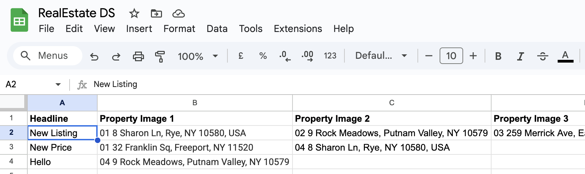

# Google Sheets Data Connector

|  | Connector type |
| --- | --- |
|  | Built-in |
| :fontawesome-regular-square-check: | Built by CHILI publish |
|  | Third party |

[See Connector types](/GraFx-Studio/concepts/connectors/#types-of-connectors)

## Installation

[See installation through Connector Hub](/GraFx-Studio/guides/connector-hub/)

You can deploy multiple instances of the connector, each with different settings.

## Configuration

### Base Configuration

Once installed, navigate to the **Connector overview**, and select your deployed **Google Sheets** connector. Start with **Configuration**.

Consult your IT Admin who manages your Google Workspace to obtain the correct values for the fields.

### Authentication

To authenticate with Google Sheets, you need to provide credentials.

You can configure **Server Authentication** and **Browser Authentication** separately or use a single setup for both.

- **Server Authentication** Always required: defines the method on how the CHILI GraFx Server will talk to the Google Sheets server
- **Browser Authentication** Optionally, you can define how the browser needs to talk to Google Sheets, to pull data in

### 1. Server Authentication

Server authentication is Always required.

- **Authorization method**: Select the required authentication method.
- **Separate or same method**: Enable to configure different methods for Server and Browser authentication.

- **Token endpoint**: https://oauth2.googleapis.com/token
- **Issuer**: Provide the email address of the service account.
- **Signing algorithm**: Specify the algorithm to sign the JWT token.
- **Private Key**: If applicable, provide the PEM-formatted private key.

### 2. Browser Authentication or Impersonation

- **Authorization method**: Select the required authentication method.
- **Client ID** and **Client Secret**: In your Google API console, create an application and use the provided Client ID and Secret.
- **Authorization endpoint**: Provide the Google Authorization URL.
- **Token endpoint**: Provide the Google token endpoint.
- **Scope**: Enter one or more scopes required for authentication.

For more details, refer to [Google Developers](https://developers.google.com/identity/protocols/oauth2).

## Using Data from Your Google Sheet in a Smart Template

### Different Sheet per Template

Each Smart Template can link to a different Google Sheet. You can even make the link dynamic using variables.

This setup allows you to configure authentication at the instance level while linking to different sheets per template.

### How to Use Google Sheets Data

#### Sheet Setup guidelines

- **Column Range**: Only columns from A to Z are used.
- **Header**: Your Google Sheet column names must match the Smart Template variable names
- **Column Data Type**
    - All values are considered: "Single Line Text"
    - Format Numbers as Numbers  
    
    - Format Date as Date or Data Time  
    
    - Booleans: Boolean columns must always have a value (cells cannot be empty)
    - Booleans: Define boolean columns using checkboxes  
    
- **Row Structure**: The sheet must **NOT** contain empty rows between rows with data  

For this example, we'll use a [publicly available document](https://docs.google.com/spreadsheets/d/1cJDWEjmP76YVEA31Ir4n8usVDc1ytYBav6w4a9p4TBM/edit?usp=sharing).

#### Create Variables

- In your template, create variables corresponding to the column names in Google Sheets.
- As long as the names match and a data source is connected, the values will be populated automatically.

#### Link the Google Sheet

- Copy the link of the [public document](https://docs.google.com/spreadsheets/d/1cJDWEjmP76YVEA31Ir4n8usVDc1ytYBav6w4a9p4TBM/edit?usp=sharing).
- Paste it into the data source field.

#### Preview in Run Mode or Studio UI

- In [Run mode](/GraFx-Studio/concepts/design-run/#run-mode) or the [Studio UI](/GraFx-Studio/concepts/template-management/#studio-ui), you can browse records to preview how content changes.

#### Run Mode (in Studio Workspace)

#### Studio UI

## Output

To generate output with dynamic data, create an [output setting](../../guides/output/settings/#data-source).

Ensure the **Data source** is enable for batch processing.

To process the Google Sheets data via the [API](https://sandbox1.chili-publish-sandbox.online/grafx/swagger/index.html#/Output/post_api_v1_environment__environment__output_settings_pdf), set `"dataSourceEnabled": true`.

## Supported Variable Types

Currently, the Google Sheets connector supports:

- **Text variables**[^1]

[^1]: Using a simple action, you can assign the text variable (containing an image name) to an image variable. **GraFx Genie** can assist in automating this.  

## Known Limitations

### Column range

Only columns A through Z are used